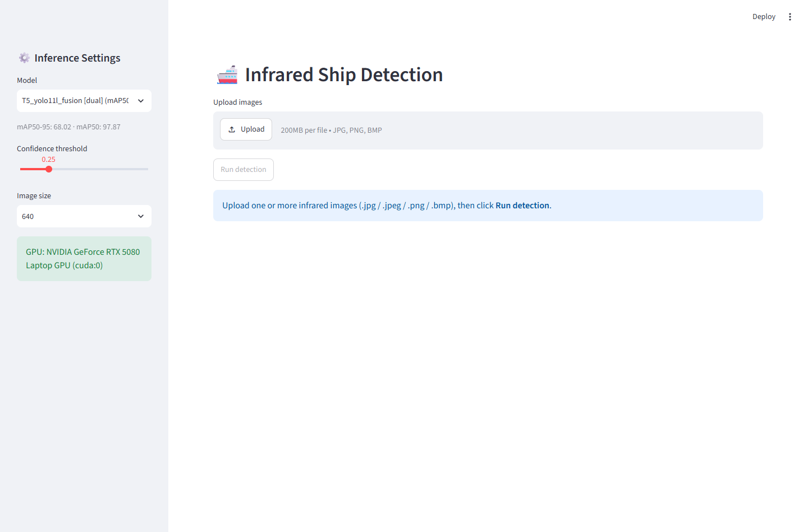
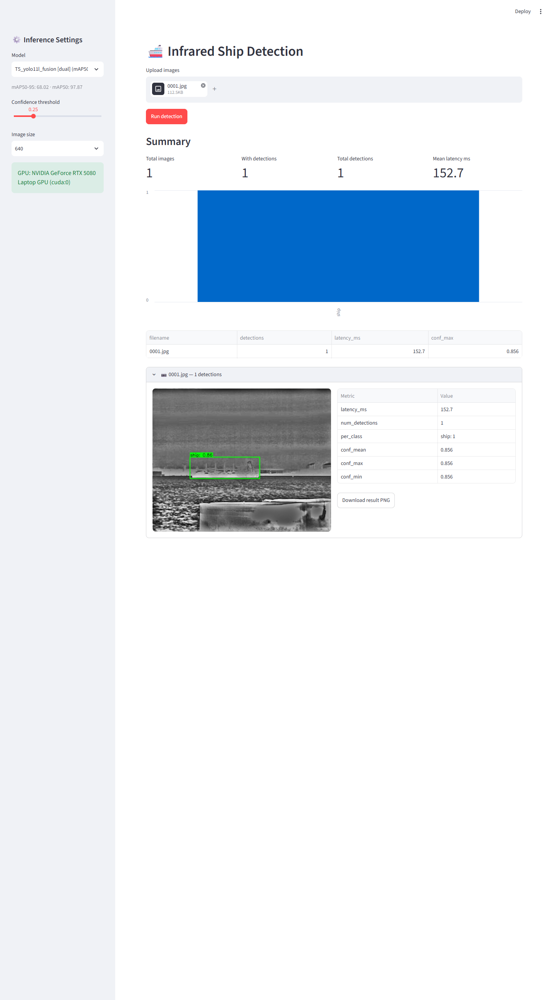

# 红外船舶检测 Streamlit 工具

基于 YOLO11 的红外图像船舶检测可视化工具：上传一张或多张图片，选择模型（默认自动加载效果最好的模型），在 GPU 上运行检测，逐图查看标注结果与统计指标。

## 功能特性

- **多图上传** — 支持 `.jpg / .jpeg / .png / .bmp`，一次可上传多张批量推理
- **模型选择** — 自动扫描 `runs/detect/ship-detection/*/weights/best.pt`，按测试集 mAP50-95 降序排列，**默认选中效果最好的模型**
- **按模型自动预处理** — 从每个训练运行的 `args.yaml` 读取数据配置，自动路由到对应的输入预处理流水线（详见下表）
- **GPU 推理** — 自动检测 CUDA，侧边栏显示 GPU 型号；不可用时降级 CPU 并给出警告
- **结果展示** — 每张图的标注图（绿色框 + 置信度标签，可下载 PNG）、逐图指标表、汇总指标与类别分布柱状图

## 界面预览

**初始界面**（左侧：模型选择 / 置信度 / 输入尺寸 / GPU 状态；右侧：图片上传）：



**检测结果**（汇总指标、类别分布、逐图标注结果与指标）：



## 快速开始

```powershell
# 安装依赖（需要 uv）
uv sync

# 启动应用
uv run streamlit run app.py
```

浏览器访问 <http://localhost:8501>。

## 使用指南

1. **选择模型** — 左侧边栏下拉框列出所有已训练模型及其测试集指标，格式为 `名称 [预处理类型] (mAP50-95=… | mAP50=…)`。默认即为效果最好的 `T5_yolo11l_fusion`。
2. **调整参数**（可选）— 置信度阈值滑块（默认 0.25）、输入尺寸（默认 640）。
3. **上传图片** — 拖拽或点击上传区域，支持多选。
4. **点击 "Run detection"** — 首次运行需加载权重（数秒），完成后页面显示：
   - **Summary**：总图片数、有检出图片数、总检出框数、平均耗时、类别分布柱状图、逐图指标表
   - **逐图结果**：展开每张图查看标注图（可下载）与该图的检出数 / 耗时 / 置信度统计
5. 单张图片解码失败不会影响批内其他图片，错误会在对应卡片中单独提示。

## 模型与预处理

不同实验使用了不同的训练输入分布。工具从每个运行目录下的 `args.yaml` 的 `data:` 字段自动判断，并在推理前施加相同预处理，保证输入分布与训练一致：

| 预处理类型 `[tag]` | 匹配关键字 | 流水线 |
|---|---|---|
| `dual` | `dual_fusion` | 双流融合：AWB → tophat+CLAHE ⊕ AWB → Butterworth BPF+CLAHE |
| `wavelet` | `wavelet_dual_fusion` | 双流融合（频域流替换为小波 DWT） |
| `rpca` | `rpca_dual_fusion` | 双流融合（频域流替换为 RPCA 前景提取） |
| `tophat` | `tophat_clahe` | 单流：AWB → top-hat(k=31) → CLAHE → unsharp |
| `butterworth` | `butterworth_clahe` | 单流：AWB → Butterworth BPF(8/80) → CLAHE → unsharp |
| `raw` | 其他 | 原图直接送入网络 |

所有输入图像统一按参考脚本约定做灰度归一化（BGR→灰度→BGR），与单波段红外训练域保持一致。

## 运行测试

```powershell
uv run pytest tests/ -v
```

共 23 个用例：模型注册表与预处理路由单元测试、指标计算测试、5 个 Streamlit AppTest 集成测试，以及 1 个真实 GPU 推理冒烟测试。

## 目录结构

```
ship/
├── app.py                  # Streamlit 界面层
├── detector.py             # 无框架依赖的检测核心（注册表/加载/预处理/推理/绘图/指标）
├── tests/                  # pytest + AppTest 测试
├── docs/images/            # 本 README 截图
├── runs/detect/ship-detection/*/weights/best.pt   # 模型权重（自动扫描）
└── yolo-training/
    ├── preprocessing_module.py                    # 预处理流水线实现
    └── test_set_results.json                      # 测试集指标来源
```

## 已知说明

- 所有模型均在 NSLSR / 合成渲染域上训练；跨域图像（如 `datasets/customn` 实拍数据）可能检出偏少甚至为零，属于正常的域差现象，并非工具故障。
- 若未找到任何权重文件，应用会提示预期的目录结构并停止。
