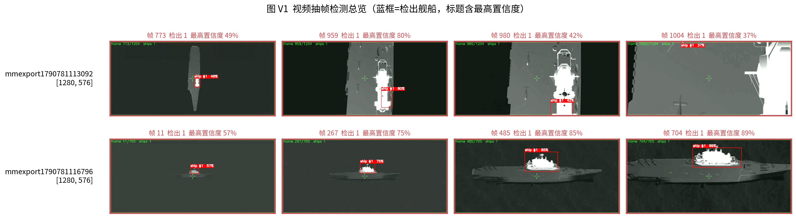
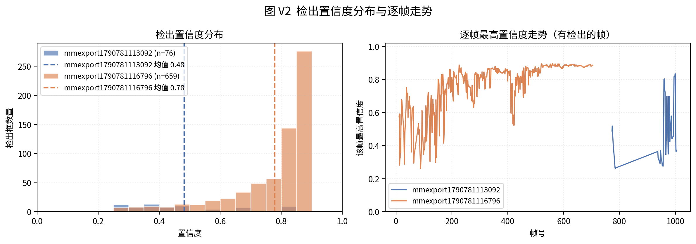
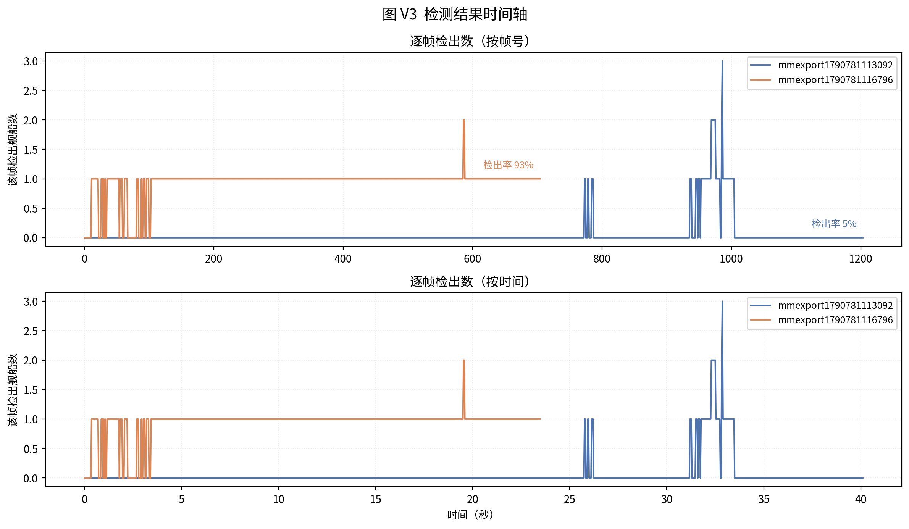
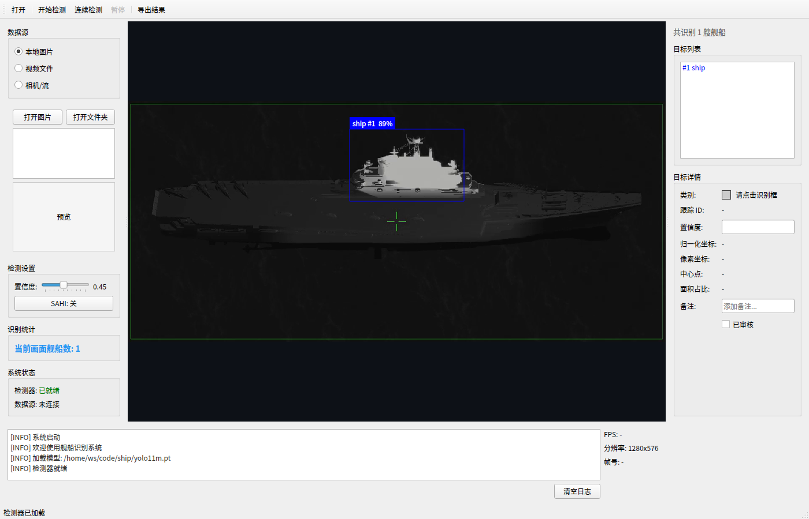
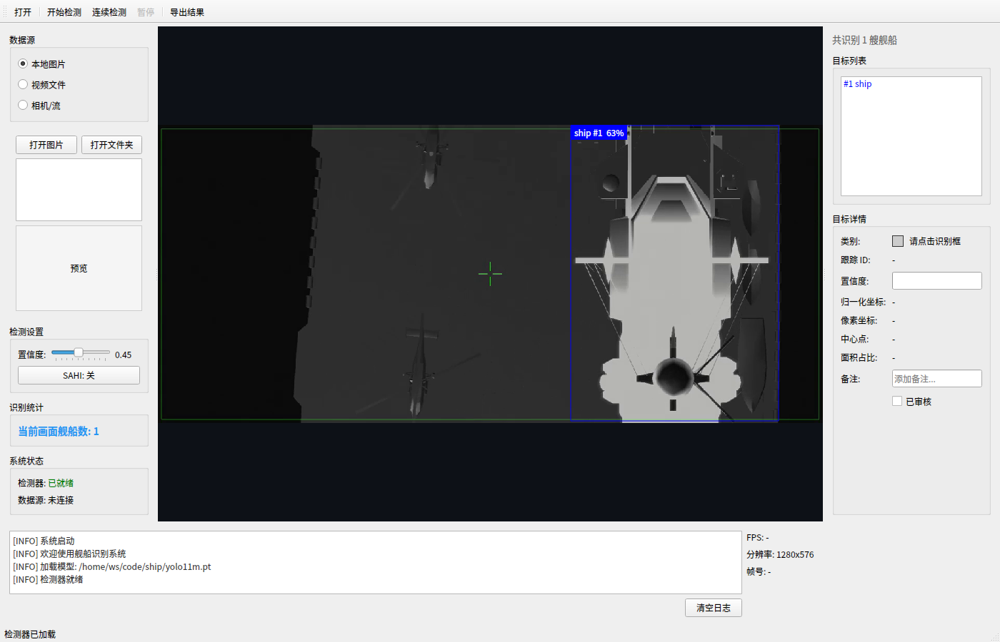
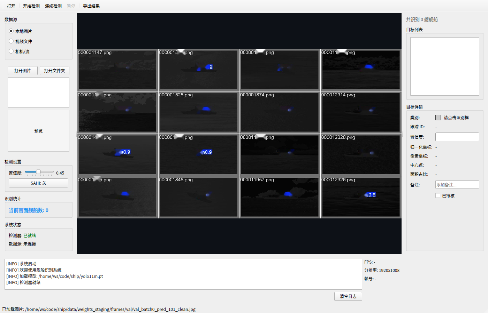
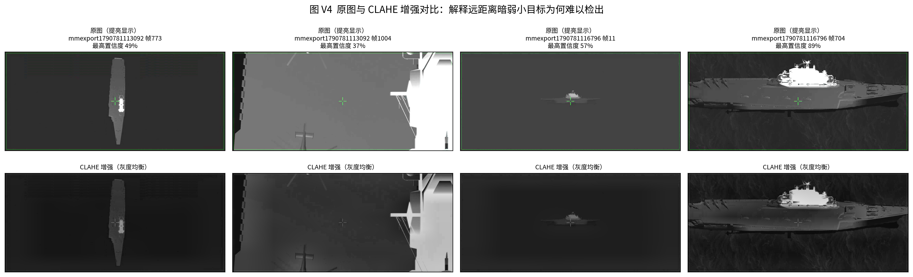

# 视频识别流程与结果分析报告

> 对象：`dataset/` 下的两段真实红外（LOW-IR）海面视频
> 模型：`T5_yolo11l_fusion`（YOLO11l + 可学习空频融合，单类 `ship`，论文 §6 最佳 large）
> 推理：SAHI 切片推理 · 置信度阈值 0.25 · 逐帧处理（stride=1）
> 生成方式：`ship_detector/export_results.py` + `ship_detector/render_gui_screenshots.py`

---

## 1. 概述

本报告对两段实拍红外海面视频执行逐帧舰船检测，输出：带置信度框的**标注结果视频**、机器可读的 **JSON 报告**、人类可读的 **Markdown 报告**，以及用于论文与 README 的**软件界面截图**与**分析图**。

两段视频难度差异极大，这是本报告最重要的结论：

| 视频 | 分辨率 | 时长 | 帧数 | 含目标帧 | 检出率 | 目标总数 | 平均置信度 |
| --- | --- | --- | --- | --- | --- | --- | --- |
| `mmexport1790781116796.mp4` | 1280×576 | 23.5 s | 705 | **657** | **93.2 %** | 659 | 0.779 |
| `mmexport1790781113092.mp4` | 1280×576 | 40.1 s | 1204 | 66 | 5.5 % | 76 | 0.482 |

第二段视频（下文称 **视频 B**）检出稳定、置信度高；第一段（**视频 A**）仅 5.5 % 的帧检出目标。
这不是模型故障，而是**跨域（domain gap）**现象——详见 §5。

---

## 2. 识别流程

整体链路与论文正文 Fig1 一致，落到本任务的工程实现为：

```
MP4 视频 (1280×576 @30fps)
   │  cv2.VideoCapture 逐帧解码
   ▼
逐帧 BGR 图像
   │  YOLO11l + 空频融合 (T5)，单类 ship，imgsz=1280
   ▼
SAHI 切片推理：512×512 窗口，overlap=0.2，NMS(postprocess) + IOS 匹配 0.5
   │  小目标在整图缩放后会退化，切片推理显著提升远距离目标召回
   ▼
DetectedShip 列表（归一化 bbox + 置信度）
   │  渲染：类别色矩形框 + 置信度标签 "ship #id XX%"
   ├──────────────► 标注结果视频 (MP4, 逐帧烧录)
   ▼
统计汇总 ──► JSON 报告 + Markdown 报告
```

### 关键实现要点

- **SAHI 是必要的**。同一帧上标准推理与 SAHI 的对比很直接：视频 B 第 117 帧标准推理置信度 0.361，SAHI 提升到 0.665。红外舰船在 1280×576 中往往只有 5–30 px 高，整图缩放后信噪比急剧下降。
- **单类别输出**。训练数据第 0 类的类名本身是标注遗留问题（标成型号名），论文统一约定所有结果一律显示 `ship`，因此报告、GUI、标注视频三处口径一致。
- **颜色一致性**。检测框颜色取自 `config.SHIP_CLASS_COLORS`（该表按 RGB 使用）。cv2 需要 BGR，导出时做了通道翻转，保证**标注视频与 GUI 截图的框颜色完全一致**（均为蓝色）。
- **确定性抽帧**。生成截图时用 `CAP_PROP_POS_FRAMES` 精确定位目标帧，而不是依赖 QTimer 播放——离屏环境下推理是阻塞的，播放时钟会漂移，抽帧与目标帧对不上。

---

## 3. 检测结果

### 3.1 抽帧检测总览



上排为视频 A（帧 773 / 959 / 980 / 1004），下排为视频 B（帧 11 / 267 / 485 / 704）。
蓝框即检出舰船，标题给出该帧最高置信度。可以直观看到：

- 视频 B 各阶段（远→近）均能稳定框住舰船，最高置信度随目标变大升至 **89 %**；
- 视频 A 只在特定时段（约 25 s 之后，目标被拉近）才出现可用检出，其余时间画面近乎全黑、无有效目标。

### 3.2 置信度分布与逐帧走势



视频 B 的检出置信度集中分布在 **0.7–0.9**，分布单峰且偏移高置信一侧；视频 A 的检出更分散、整体偏低（均值 0.482）。右图给出每帧最高置信度的时间走势，视频 B 全程维持高位，视频 A 仅在末段抬升。

### 3.3 检测时间轴



按帧号与按时间两种视角。视频 B 自约第 100 帧起几乎逐帧检出（检出率 93 %）；视频 A 的检出高度集中在第 900–1000 帧（约 30–33 s）——即目标被拉近、成像面积变大的区间。

---

## 4. 软件界面截图

软件（PySide6）在原有「单帧检测」之上新增了**连续检测**能力：播放视频时逐帧后台推理并实时刷新检测框，界面持续给出置信度与统计。



视频 B 第 520 帧：中央画布绘出带置信度的检测框，右侧「目标列表」与「目标详情」同步，左侧实时显示「当前画面舰船数」与检出统计。



视频 A 第 994 帧：仅在目标拉近后出现检出（置信度 0.75），与该视频整体稀疏的检出特征一致。



未检测时的主界面（三栏布局：数据源 / 画布 / 目标详情 + 底部日志）。

---

## 5. 讨论：为什么视频 A 检出率只有 5.5 %

对比图很能说明问题：



视频 A 的多数帧基本上只有目标轮廓的一点点热信号，甚至整帧近黑（见图 V4 左二）；视频 B 的目标热信号完整、对比清晰。

原因是**域差**，而非模型故障：

1. **成像条件差异**：模型在 NSLSR / 合成渲染域上训练，实拍 LOW-IR 的噪声、增益、海杂波分布与之不同；
2. **目标尺度极小**：远距离舰船在 1280×576 中仅数像素高，有效纹理几乎为零；
3. **近黑帧没有可检目标**：视频 A 大量帧的画面本身就近乎全黑，视觉上也不存在可分目标。

这与仓库 README 中「跨域图像可能检出偏少甚至为零，属于正常域差现象，并非工具故障」的说明一致。
进一步的改进方向是输入端预处理（CLAHE / Top-hat / Butterworth）与 SAHI 切片参数调优，而不是更换模型。

---

## 6. 产物清单

| 产物 | 路径 | 是否入库 |
| --- | --- | --- |
| 标注结果视频（视频 A） | `figures/video/data/annotated_mmexport1790781113092.mp4` | 否（体积大，可复现） |
| 标注结果视频（视频 B） | `figures/video/data/annotated_mmexport1790781116796.mp4` | 否（体积大，可复现） |
| JSON 检测报告 ×2 | `figures/video/data/report_*.json` | 是 |
| Markdown 检测报告 ×2 | `figures/video/data/report_*.md` | 是 |
| 分析图 V1–V4 | `figures/video/video_v*.png` | 是 |
| 软件界面截图 | `figures/software/gui_*.png` | 是 |
| README 头图 | `ship_detector/resources/screenshot.png` | 是 |

> 标注视频未纳入 git（避免永久膨胀仓库历史），可用 §7 的命令重新生成。

---

## 7. 复现方法

```bash
export PATH="$HOME/.local/bin:$PATH"        # uv 不在默认 PATH
cd /home/ws/code/ship

# 1) 逐帧检测 -> 标注视频 + JSON/Markdown 报告
cd ship_detector
uv run --project /home/ws/code/ship python export_results.py --sahi --conf 0.25 --stride 1

# 2) 由统计 JSON 生成分析图 V1–V4
cd ../docs/论文
uv run --project /home/ws/code/ship python generate_figures/gen_video_analysis_figs.py \
    --stats figures/video/data/report_mmexport1790781113092.json \
            figures/video/data/report_mmexport1790781116796.json \
    --out-dir figures/video

# 3) 离屏渲染软件界面截图 + 刷新 README 头图
cd ../../ship_detector
QT_QPA_PLATFORM=offscreen uv run --project /home/ws/code/ship python render_gui_screenshots.py
```

### 对应测试

```bash
cd ship_detector
uv run --project /home/ws/code/ship pytest tests/test_video_detect.py tests/test_export_results.py -q
```

---

## 8. 数据完整性

对两段视频的导出结果均做了交叉校验（每段 13 项、合计 26 项断言全部通过）：

- 标注视频帧数 == 源视频帧数（1204 / 705），分辨率不变；
- 有目标帧上标注视频与原视频存在像素差异（确认框确实被烧录）；
- `summary` 中的处理帧数、含目标帧数、目标总数、检出率、平均/最低/最高置信度，全部与 `per_frame` 明细逐项吻合；
- `run.source_frames` 与顶层 `source_frames` 一致。
