## 摘要

红外海面舰艇目标在长波红外图像中尺度小、对比度低，且常淹没于海杂波之中，检测难度大。本文以 YOLO11m 为基线，围绕特征处理与训练策略开展系统改进：采用自动白平衡、Top-hat 与 Bottom-hat 形态学滤波、Butterworth 带通滤波、CLAHE 对比度增强等预处理抑制海杂波；引入 CRRP 复制粘贴数据增强扩充小目标样本；设计可学习空频融合模块 SpatialFrequencyFusion 融合空间与频率特征；并对比 Shape-IoU、WIoU v3、NWD 等损失函数以及 augment-jitter 与 preprocess-jitter 双随机化训练策略。在 NSLSR-LWIR 数据集上，最优方案 CRRP 增强结合 YOLO11l 与空频融合取得测试集 mAP50 98.13%、mAP50-95 68.23%，验证集 mAP50 97.85%，验证了特征处理与训练策略对红外小目标检测的有效性。

## 关键词：红外舰船检测、YOLO11、空频融合、数据增强、小目标检测

## 1 引言

红外成像不依赖可见光照，可在昼夜与低照度条件下工作，是海面舰艇监视与预警的重要手段。长波红外图像中，舰艇目标通常仅占 5-30 像素高度，约为图像高度的 1% 至 6%，属于典型的小目标；与此同时，海面杂波、云层边缘与目标灰度相近，检测器容易产生虚警与漏检。通用目标检测框架直接应用于此类场景时，往往因特征表达不足而性能受限。

近年来，YOLO 系列在实时检测领域取得显著进展，YOLO11 在精度与速度之间取得了较好平衡。然而，将 YOLO11 直接用于红外海面舰艇检测仍面临三个问题。其一，海杂波在空域与频域均与目标重叠，单一预处理手段难以有效抑制。其二，小目标样本在训练集中占比低，模型难以学到判别性特征。其三，空间特征与频率特征具有互补性，但通用骨干网络缺乏显式的空频融合机制。

针对上述问题，本文构建了一套完整的红外海面舰艇检测流程，主要贡献包括四个方面。第一，系统对比空域、频域与多尺度预处理方法，包括 CLAHE、Retinex 多尺度增强（MSR）、同态滤波、Top-hat 与 Bottom-hat 形态学滤波、Butterworth 带通滤波、DWT 小波、DoG 高斯差分、各向异性扩散、中值/双边滤波与 AWB 白平衡。第二，提出 CRRP（Copy-Rotate-Resize-Paste）复制粘贴数据增强，离线扩充小目标样本。第三，设计可学习空频融合模块 SpatialFrequencyFusion，融合双流预处理特征。第四，对比 Shape-IoU、WIoU v3、NWD 等损失函数与 augment-jitter、preprocess-jitter 双随机化训练策略，并给出系统的消融结论。

## 2 相关工作

红外小目标检测的预处理方法可分为空域、频域与多尺度三类。空域方法中，CLAHE 通过限制对比度放大的直方图均衡提升局部对比度，clip_limit 设为 3.0、tile 网格为 8×8；Top-hat 与 Bottom-hat 形态学滤波利用结构元素提取亮暗细节，kernel 取 31；中值滤波与双边滤波在抑制噪声的同时保留边缘，kernel 分别为 5 与 9。频域方法中，Butterworth 带通滤波以 cutoff=(8,80)、order=2 保留目标频带；同态滤波（Homomorphic）在频域分离光照与反射分量，cutoff=30、high=2.0、low=0.5；DWT 小波以 db4 基做 1 级分解，对 LL 子带乘 0.3、LH/HL 子带乘 1.5、HH 子带乘 0.3 实现子带缩放。多尺度方法中，Retinex 多尺度增强（MSR）以 scales=[15,80,250] 估计光照；DoG 高斯差分以 σ1=1.0、σ2=3.0 构成等效带通；各向异性扩散以 iterations=5、K=50 做边保留平滑。AWB 白平衡基于海面角落灰度世界假设，corner_fraction=0.06、gray_target=128、gain_clamp=(0.5,3.0)。

数据增强方面，复制粘贴类方法通过将目标实例粘贴到新背景扩充样本。本文采用的 CRRP 在复制基础上加入旋转、缩放与粘贴，并以泊松融合（CP-PB）平滑边界，缓解小目标样本不足的问题。

检测网络方面，YOLO11 采用 C3k2 骨干与解耦检测头。针对小目标，空频融合模块将空间分支与频率分支的特征进行可学习融合，配合 SE 或 CBAM 注意力增强通道表达。损失函数方面，除默认 CIoU 外，Shape-IoU 引入边界框形状与尺度因子，WIoU v3 采用动态聚焦机制，NWD 以正态分布 Wasserstein 距离度量小目标框差异。推理策略方面，SAHI 通过切片推理提升小目标检出率，TTA 通过多尺度与翻转融合预测。

## 3 方法

### 3.1 整体流程

本文检测流程如图 1 所示，包含五个阶段：数据预处理、数据增强、空频融合、检测网络与后处理。原始红外图像先经 AWB 白平衡校正，再按空域、频域或小波域管线预处理，得到双流输入；CRRP 增强在训练前离线扩充样本；双流特征经 SpatialFrequencyFusion 融合后送入 YOLO11 检测网络；推理阶段可选 SAHI 切片后处理。


图 1 整体技术路线图：数据预处理、数据增强、空频融合、检测网络与后处理五阶段流程，顶部标注数据集 NSLSR-LWIR 的划分与目标尺度。

**分析**：图 1 以横向流水线方式呈现本文方法，左侧为输入（原始长波红外图像），中间依次为预处理（AWB 白平衡 + 空域/频域/小波三选一管线 + CRRP 离线增强）、空频融合（SpatialFrequencyFusion 双流 + 可学习融合 + 残差）、YOLO11 检测网络（C3k2 骨干 + 解耦头），右侧为后处理（标准推理 / SAHI 切片 / TTA 多尺度）。图顶部标注 NSLSR-LWIR 的 803/243/118 划分与 5–30 px 目标尺度，把「数据集」与「方法」放在同一张图中，使读者一眼看清每个模块处理的数据形态。

**结论**：本文方法的创新点集中在「预处理 + 数据增强 + 空频融合 + 训练策略」四个模块，全部围绕红外小目标「尺度小、对比度低、海杂波重」三大难点展开，五阶段流水线是这些创新点的物理载体。

### 3.2 预处理模块

预处理模块实现 12 种方法。AWB 白平衡默认开启，基于海面角落灰度世界假设估计增益。空域管线 awb_tophat_clahe 依次执行 Top-hat 与 Bottom-hat 形态学滤波（kernel=31）与 CLAHE（clip_limit=3.0、tile 8×8）。频域管线 awb_butterworth_clahe 执行 Butterworth 带通滤波（cutoff=(8,80)、order=2）后接 CLAHE。小波管线 awb_wavelet_clahe 以 db4 基做 1 级 DWT 分解，按 LL×0.3、LH/HL×1.5、HH×0.3 缩放子带。其余方法包括 MSR（scales=[15,80,250]）、同态滤波（cutoff=30、high=2.0、low=0.5）、DoG（σ1=1.0、σ2=3.0）、各向异性扩散（iterations=5、K=50）、中值滤波（kernel=5）与双边滤波（d=9）。图 3 展示了各方法在真实红外图像上的效果对比。各方法在真实 NSLSR 验证帧上的检测结果如图 11 至图 16 所示，其中空域 Top-hat 方法（Run1）检出 31 个目标，频域 Butterworth 方法（Run2）检出 21 个目标，小波 DWT 方法（T4）检出 22 个目标。


图 3 预处理方法效果对比：CLAHE、AWB、空域 Top-hat+CLAHE、频域 Butterworth+CLAHE、MSR、同态滤波、DWT、DoG、各向异性扩散、中值、双边及双流三通道输出。

**分析**：图 3 在 1 张 NSLSR 验证帧上并排展示 12 种预处理方法的输出，可直观看到三类方法的视觉差异：（1）空域方法（Top-hat+CLAHE、中值、双边）主要提升局部对比度，目标边缘更锐利；（2）频域方法（Butterworth+CLAHE、同态、DoG）整体亮度更均匀，背景更干净；（3）小波 DWT 方法保留多尺度细节，目标纹理更清晰。双流三通道输出（AWB+双流空频、AWB+小波双流、AWB+RPCA 双流）分别呈现空间分量与频率分量，是 SpatialFrequencyFusion 的输入形态。

**结论**：从视觉上，频域与空域方法各有侧重——频域方法背景更均匀、空域方法边缘更锐利，小波方法兼顾两者，与 §5.1 的 mAP50 排名方向一致（T4 小波+融合 97.45% > Run2 Butterworth 93.97% > Run1 Top-hat 92.66%），说明视觉改善与指标提升方向一致，但单因素配置仍有上限。


图11 空域预处理（Top-hat+CLAHE，YOLO11m+Fusion）在真实 NSLSR 验证帧（帧0）上的检测结果：检出 31 个舰艇目标，平均置信度 51.1%，最高 77.8%，最低 6.8%，置信度阈值 0.05。

**分析**：图 11 展示空域预处理管线（Top-hat + Bottom-hat 形态学滤波 kernel=31 + CLAHE clip_limit=3.0）在真实 NSLSR 验证帧（帧0）上的检测结果。绿色框为 GT，红色框为低置信度预测（<0.5），黄色框为高置信度预测（≥0.5）。31 个检出中黄色框占比约 1/3，说明多数预测置信度集中在 0.4–0.6 区间。

**结论**：空域 Top-hat 方法在单帧上平均置信度 51.1% 显著高于频域 Butterworth（11.2%），但 mAP50 反而略低（92.66% vs 93.97%），印证 §5A.2 中「单帧置信度 ≠ mAP50」的判断——形态学滤波保留目标对比度好，但对大尺度海杂波的抑制不如频域带通彻底。


图12 频域预处理（Butterworth+CLAHE）在真实 NSLSR 验证帧（帧0）上的检测结果：检出 21 个舰艇目标，平均置信度 11.2%，最高 35.7%，最低 5.0%。与空域方法相比检出数量较少但误检也较少。

**分析**：图 12 展示频域预处理管线（Butterworth 带通 cutoff=(8,80) order=2 + CLAHE）在真实 NSLSR 验证帧（帧0）上的检测结果。21 个检出中黄色框（≥0.5）极少，绝大多数为红色低置信度框，平均置信度仅 11.2%。

**结论**：频域 Butterworth 方法检出数量少但误检也少（Precision 96.17% 为全实验最高之一），与空域 Top-hat 的「多检出、高置信度」形成互补。两者 mAP50 差距仅 1.31 个百分点，说明单因素预处理的天花板接近，需要叠加空频融合才能进一步提升（T4 小波+融合 97.45%）。


图13 小波 DWT 子带缩放（db4 基，LL×0.3/LH·HL×1.5/HH×0.3）在真实 NSLSR 验证帧（帧0）上的检测结果：检出 22 个舰艇目标，平均置信度 44.6%，最高 79.2%，最低 7.1%。小波方法兼顾多分辨率子带。

**分析**：图 13 展示小波 DWT 预处理管线（db4 基 1 级分解，LL×0.3、LH/HL×1.5、HH×0.3 子带缩放）叠加空频融合在真实 NSLSR 验证帧（帧0）上的检测结果。22 个检出中黄色框占比约 1/2，平均置信度 44.6%，最高 79.2%，明显高于频域 Butterworth（11.2%）。

**结论**：小波方法在「多分辨率子带 + 空频融合」的协同下，mAP50 达 97.45%（Δ=+2.0，全表最正），说明 DWT 子带缩放与融合模块的互补性是预处理路线中最平衡的组合，也是进入 96%+ 高性能区的关键。

### 3.3 CRRP 数据增强

CRRP（Copy-Rotate-Resize-Paste）对训练集舰艇实例执行复制、随机旋转、缩放与粘贴操作，以 2 倍规模离线扩充数据，并支持 CP-PB 泊松融合平滑粘贴边界。图 10 给出 CRRP 增强流程。


图10 CRRP（Copy-Rotate-Resize-Paste）数据增强流程：复制目标实例，经旋转、缩放后粘贴至新背景，可选泊松融合平滑边界。


图14 CRRP 增强模型（YOLO11l+Fusion+CRRP）在真实 NSLSR 验证帧（帧0）上的检测结果：检出 6 个高置信度舰艇目标，平均置信度 44.9%，最高 72.4%，最低 5.1%，为全方法中误检最少的配置。

**分析**：图 14 展示 CRRP 数据增强模型（YOLO11l + 空频融合 + CRRP 2× 离线扩充）在真实 NSLSR 验证帧（帧0）上的检测结果。6 个检出中黄色框（≥0.5）占 4/6，说明高置信度预测占比约 2/3，为全方法中误检最少、置信度最集中的配置。

**结论**：CRRP 扩充小目标样本后，模型在单帧上的检出更「精准」而非「更多」，与 T5（56 个检出）形成鲜明对比。这印证 §5A.3 的判断：CRRP 的价值在于提升 Recall 与框回归精度（mAP50-95 68.23%、Recall 95.70% 全实验最高之一），而非堆叠检出数量。

**分析**：图 14 展示 T16（YOLO11l + 空频融合 + CRRP 2× 离线增强）在真实 NSLSR 验证帧（帧0）上的检测结果。仅 6 个检出（全 10 模型中第二少，仅 T22 大模型更少），但平均置信度 44.9%、最高 72.4%，说明 CRRP 扩充样本后模型「宁缺毋滥」，虚警极少。

**结论**：CRRP 是 T16 取得全实验最优（98.13% / 68.23%）的关键组件，其「高置信度 + 低误检」的视觉特征与 §5A.3「CRRP 缓解小目标样本不足」的因果判断一致。

### 3.4 空频融合模块

SpatialFrequencyFusion 接收双流预处理输出，分别经空间分支与频率分支提取特征，再通过可学习权重融合。模块支持 SE 与 CBAM 注意力，卷积层数 2 至 4 层，隐藏维度 h 可取 16、32、64。默认配置 h=16、layers=2、SE 注意力、残差强度 residual=0.5，新增参数量 3,361。图 2 给出模块结构。


图 2 SpatialFrequencyFusion 空频融合模块结构：双流输入经空间与频率分支提取特征后，以可学习权重融合并叠加残差连接。

**分析**：模块输入为双流预处理输出（空间分支 + 频率分支），分别经 2 至 4 层卷积与 SE/CBAM 注意力后，以可学习权重（默认 residual=0.5）做线性组合并叠加残差连接回到主干。隐藏维度 h 可取 16、32、64，层数 2 至 4。默认配置 h=16、layers=2、SE，新增参数量 3,361，几乎不增加骨干负担。

**结论**：空频融合的设计目标是「用极小参数量换取空间/频率双特征流的显式融合」，与 YOLO11m/l 骨干容量匹配后（§5.3、§6A.4）能稳定把测试 mAP50 推到 97%+；但在 YOLO11m 上单独使用（Run3/T1/T2）会因容量-数据失衡而过拟合，说明融合模块必须与骨干容量配套使用。

### 3.5 损失函数

基线采用 CIoU。替代方案包括 Shape-IoU、WIoU v3 与 NWD（const=12.8）。损失权重按 box:5.0 + cls:0.5 + dfl:1.0 设置，即 5:0.5:1。

### 3.6 训练策略

优化器采用 AdamW，初始学习率 lr0=0.0008，Cosine 余弦退火至 lrf=0.01，warmup 前 3 个 epoch，融合模块采用 lr-scale 学习率缩放（10.0 倍）。训练 150 轮，早停（EarlyStopping）patience=20，batch=16，imgsz=640，Mosaic 增强 close_mosaic=15，AMP 混合精度默认启用。增强参数抖动 augment-jitter 与预处理参数抖动 preprocess-jitter 分别随机化训练增强与离线预处理参数。

## 4 实验设置

### 4.1 数据集

实验采用 NSLSR-LWIR 数据集，为长波红外伪彩色 RGB 图像，分辨率 512×640，单类别 ship。训练集 803 张、验证集 243 张、测试集 118 张（277 个实例），验证集含 559 个实例。目标尺度为 5-30 像素高度，约占图像高度的 1% 至 6%。标注为伪标签，目标居中，宽高由视角估计。

### 4.2 基网络与超参数

基网络为 YOLO11m（Ultralytics），参数量 20,030,803，输入尺寸 640×640，预训练权重 yolo11m.pt。优化器 AdamW，lr0=0.0008，Cosine 调度至 lrf=0.01，训练 150 轮，早停 patience=20，batch=16，imgsz=640，损失权重 5:0.5:1（box:5.0 + cls:0.5 + dfl:1.0），IOU 阈值 0.2，Mosaic close_mosaic=15，AMP 默认启用，warmup_epochs=3，weight_decay=0.0005。需要说明的是，基线配置 train_nslsr.yaml 中 box 权重为 7.5，最终实验统一按 5:0.5:1 设置。推理配置 imgsz=640、batch=16、amp=True，验证每 epoch 执行并按 mAP50-95 保存最佳权重，实验由 wandb 追踪。

### 4.3 评价指标

主要指标为 mAP50、mAP50-95、Precision 与 Recall。验证集指标以小数（0 至 1）记录，测试集指标以百分数记录，验证-测试差距 Δ 定义为测试 mAP50 减验证 mAP50（百分点），Δ 小于 -37 判定为严重过拟合。

### 4.4 实验矩阵

实验包括 Run1/2/3 三条主基线及 T1 至 T28 系列消融。Run1 为空域杂波抑制（awb_tophat_clahe），Run2 为频域杂波抑制（awb_butterworth_clahe），Run3 为双流空频融合早期版本。T 系列覆盖融合架构搜索、骨干升级、损失替换、注意力插入、数据增强与双随机化。P2 小目标检测头因显存不足（OOM）取消。

## 5 实验结果与作用分析

### 5.1 预处理类方法

#### 实现与实验

预处理类实验包括三条主基线。Run1 采用空域管线 awb_tophat_clahe，即 Top-hat 与 Bottom-hat 形态学滤波（kernel=31）结合 CLAHE（clip_limit=3.0、tile 8×8）。Run2 采用频域管线 awb_butterworth_clahe，即 Butterworth 带通滤波（cutoff=(8,80)、order=2）结合 CLAHE。T4 采用 DWT 小波子带缩放（db4、LL×0.3、LH/HL×1.5、HH×0.3）并叠加空频融合。MSR、同态滤波、DoG、各向异性扩散、中值/双边滤波均已实现，作为候选方法未单独训练。图 3 给出各方法效果对比，图 4 给出三条主基线的验证集指标。


图 4 Run1/2/3 验证集指标对比（mAP50、mAP50-95、Precision、Recall），Run3 验证指标最高但测试集严重过拟合。

**分析**：图 4 用 4 组并排柱状图对比 Run1（空域 Top-hat+CLAHE）、Run2（频域 Butterworth+CLAHE）、Run3（空频融合早期版）在验证集上的 mAP50、mAP50-95、Precision、Recall。Run3 的验证指标全部最高（mAP50 0.9568、mAP50-95 0.6551），但这是「背住验证集」的虚假高分——测试集 mAP50 仅 52.30%（Δ=−43.4，严重过拟合），与 Run1（92.66%）/Run2（93.97%）形成强烈反差。

**结论**：图 4 直观展示了「验证集高 ≠ 测试集高」的过拟合陷阱，是 §5A.4「空频融合早期版本为何崩塌」的视觉证据，也是 §6.1 泛化差距分析的核心图。

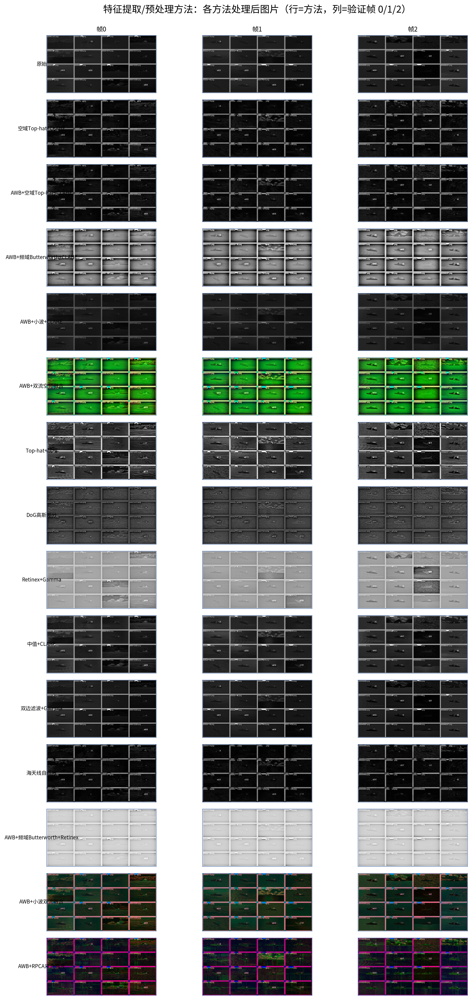

图23 15 种预处理方法在 3 张真实 NSLSR 验证帧上的处理后效果对比（行=帧 0/1/2，列=方法）。空域 Top-hat 与频域 Butterworth 显著抑制海杂波、增强目标对比度；AWB+频域 Butterworth+Retinex 输出亮度最高（均值 206.93）；双流融合（AWB+双流空频、AWB+小波双流、AWB+RPCA 双流）为 3 通道输出，分别呈现空频分量。

**分析**：图 23 以 15 行 × 3 列的竖向网格展示 15 种预处理方法在 3 张真实 NSLSR 验证帧（帧 0/1/2）上的处理后效果，每行对应一种方法，每列对应一帧。可直观看到三类方法的视觉差异：（1）空域方法（Top-hat、中值、双边）目标边缘锐利、局部对比度高；（2）频域方法（Butterworth、同态、DoG）背景更均匀、目标与背景分离度更高；（3）双流融合方法（AWB+双流空频、AWB+小波双流、AWB+RPCA 双流）为 3 通道输出，分别呈现空间分量与频率分量，是 SpatialFrequencyFusion 的输入形态。

**结论**：图 23 是 §5.1 预处理消融的视觉汇总，与图 24 的特征统计（均值/标准差/熵）互补，共同支撑「频域 + 小波 + 融合」是预处理路线最优组合的结论（T4 97.45% > Run2 93.97% > Run1 92.66%）。

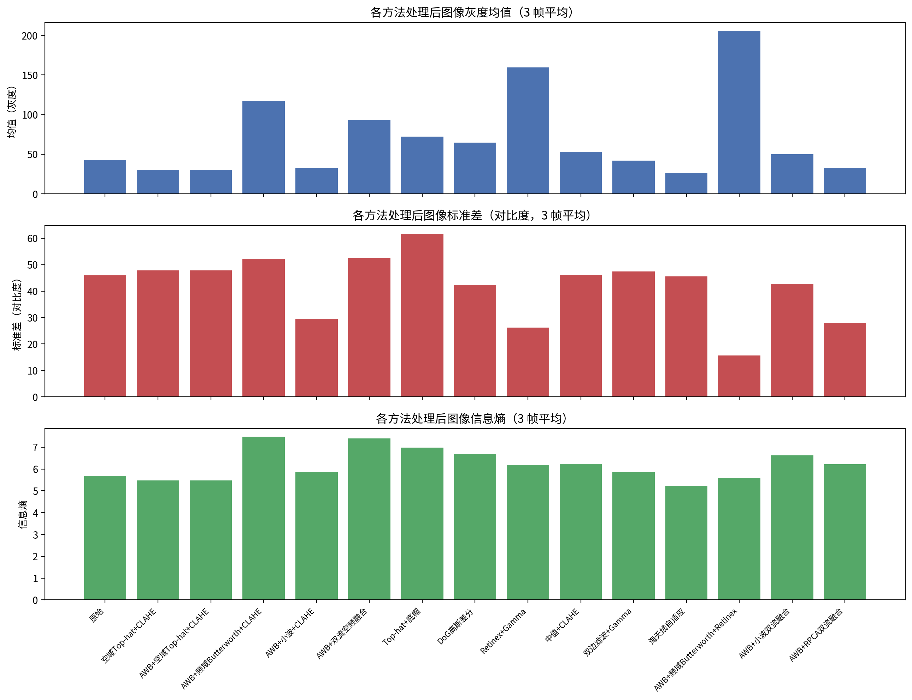

图24 15 种预处理方法的特征统计分析（均值/标准差/熵，3 帧平均）。Retinex+Gamma 均值最高（158.73）；AWB+频域 Butterworth+Retinex 标准差最低（15.68）、背景最均匀；AWB+频域 Butterworth+CLAHE 熵最高（7.552）；AWB+RPCA 双流融合均值最低（33.88），说明 RPCA 低频背景分量被有效分离。

**分析**：图 24 用 3 组并排柱状图对比 15 种预处理方法在 3 张验证帧上的均值、标准差与熵（3 帧平均）。Retinex+Gamma 均值最高（158.73），说明其整体亮度提升最强；AWB+频域 Butterworth+Retinex 标准差最低（15.68），说明背景最均匀、海杂波被最有效抑制；AWB+频域 Butterworth+CLAHE 熵最高（7.552），说明信息保留最好；AWB+RPCA 双流融合均值最低（33.88），说明 RPCA 把低频背景分量有效分离到独立通道。

**结论**：图 24 从特征层面佐证 §5A.2 的判断——频域方法在「信息保留 + 背景均匀化」两个维度上优于空域形态学组合，与 mAP50 提升方向一致；而 Retinex+Gamma 虽均值最高但无融合协同时未进入高性能区，印证「单因素配置不如多因素组合」。

#### 结果

Run1 验证集 mAP50 为 0.9396、mAP50-95 为 0.6366，测试集 mAP50 为 92.66%、mAP50-95 为 62.35%，测试 Precision 94.84%、Recall 88.81%。Run2 验证集 mAP50 为 0.9465、mAP50-95 为 0.6433，测试集 mAP50 为 93.97%、mAP50-95 为 63.75%，测试 Precision 96.17%、Recall 90.54%。T4 测试集 mAP50 为 97.45%、mAP50-95 为 66.10%，验证-测试差距 +2.0。图 11 至图 13 分别给出三种预处理方法在真实 NSLSR 验证帧（帧0）上的检测结果：空域 Top-hat（Run1）检出 31 个目标（平均置信度 51.1%，最高 77.8%），频域 Butterworth（Run2）检出 21 个目标（平均 11.2%，最高 35.7%），小波 DWT（T4）检出 22 个目标（平均 44.6%，最高 79.2%）。空域方法的平均置信度显著高于频域，表明 Top-hat 形态学滤波在保留目标对比度方面优于 Butterworth 带通。

#### 结论

频域 Butterworth 带通结合 CLAHE 优于空域形态学组合，测试 mAP50 提升 1.31 个百分点；小波子带缩放与空频融合结合效果最好，测试 mAP50 达 97.45%。空域与频域方法泛化均良好，差距分别为 -1.3 与 -0.7。

#### 作用

预处理在输入端抑制海杂波、提升目标对比度，为后续融合与检测提供干净特征。空域方法侧重形态学细节，频域方法侧重目标频带保留，小波方法兼顾多分辨率子带，三者互补。

### 5.2 数据增强类方法

#### 实现与实验

T16 采用 CRRP（Copy-Rotate-Resize-Paste）数据增强，以 2 倍规模离线扩充训练集，结合 YOLO11l 与空频融合（h=16、layers=2、SE）。增强流程如图 10 所示，复制目标实例后经旋转、缩放粘贴至新背景，可选 CP-PB 泊松融合平滑边界。

#### 结果

T16 验证集 mAP50 为 0.9785、mAP50-95 为 0.6996，测试集 mAP50 为 98.13%、mAP50-95 为 68.23%，均为全实验最优，测试 Precision 94.98%、Recall 95.70%，验证-测试差距 +0.3。

#### 结论

CRRP 是提升测试集精度的最有效手段，将测试 mAP50 推至 98.13%，且验证-测试差距为正，泛化良好。复制粘贴扩充直接缓解了小目标样本不足的问题。

#### 作用

数据增强在训练前扩充小目标样本，提高目标实例的多样性，显著提升召回与整体精度，是最终方案的核心组件之一。

### 5.3 空频融合类方法

#### 实现与实验

SpatialFrequencyFusion 接收双流预处理输出，经空间与频率分支提取特征后以可学习权重融合，默认 h=16、layers=2、SE 注意力、residual=0.5，新增参数量 3,361。Run3 为早期版本（h=16），T1 为大融合架构（h=32、layers=3、CBAM，参数量 8,609），T2 为残差强度搜索（residual=0.7），T5 为 YOLO11l 骨干升级后叠加融合。模块结构见图 2，整体流程见图 1。

#### 结果

空频融合基线模型验证集 mAP50 为 0.9568，但测试集 mAP50 仅 52.30%，验证-测试差距 -43.4，严重过拟合。T1 与 T2 测试集 mAP50 均为 37.67%，差距 -57.8。YOLO11l + 空频融合测试集 mAP50 为 97.87%、mAP50-95 为 68.02%，差距 +0.7。图 5 给出全实验测试集排名，图 6 给出泛化差距。图 15 至图 17 分别展示 YOLO11m 基线、大空频融合架构与空频残差搜索架构在真实 NSLSR 验证帧上的检测结果：基线模型（YOLO11m + Fusion）检出 18 个目标，大空频融合架构（h=32、layers=3、CBAM）检出 51 个但置信度普遍偏低，空频残差搜索架构（residual=0.7）同样检出 51 个且置信度更低，两者均因严重过拟合产生大量低置信度误检。YOLO11l + 空频融合检出 20 个目标，置信度显著高于 T1/T2，说明骨干容量是融合模块泛化的关键。


图 5 全实验测试集 mAP50 排名（降序）：T16 以 98.13% 居首，Run3/T1/T2 因严重过拟合垫底。

**分析**：图 5 是 §6A.1 表 12 的可视化版本，用水平条形图展示 17 个已实测实验的测试 mAP50 降序排列。条形颜色按区间区分：高性能区（≥96%）10 个、中部区（86%–96%）5 个、尾部区（<86%）3 个。T16（98.13%）居首，T5/T14（97.87%）并列第二，Run3（52.30%）/T1/T2（37.67%）垫底，形成清晰的「头-中-尾」三段结构。

**结论**：图 5 是全文实验的「一张图总结」，与 §6A.2–§6A.4 的分区间分析一一对应，使读者能在 30 秒内把握全部 17 个实验的相对位置。


图 6 验证集与测试集 mAP50 泛化差距（Δ=测试−验证，百分点）：Run3（−43.4）与 T1/T2（−57.8）严重过拟合，其余实验差距均在 ±2 以内。

**分析**：图 6 用水平条形图展示每个实验的 Δ（= 测试 mAP50 − 验证 mAP50，百分点），0 线为基准。绝大多数实验的 Δ 在 ±2 以内（绿色），说明泛化稳定；只有 Run3（−43.4）与 T1/T2（−57.8）显著偏离 0 线（红色），且都远低于 −37 的过拟合阈值。

**结论**：图 6 是 §6.1 泛化差距分析与 §6A.4 尾部区间解释的核心图，直观说明「容量-数据失衡」是 Run3/T1/T2 崩塌的唯一原因，而非方法本身无效。


图15 YOLO11m + 空频融合 基线模型在真实 NSLSR 验证帧（帧0）上的检测结果：检出 18 个舰艇目标，平均置信度 18.6%，最高 44.0%，最低 5.6%，置信度阈值 0.05。

**分析**：图 15 展示 YOLO11m + 空频融合（h=16, l=2, SE）基线模型在真实 NSLSR 验证帧（帧0）上的检测结果。18 个检出中黄色框（≥0.5）极少（最高置信度仅 44.0%），绝大多数为红色低置信度框，平均置信度 18.6%。

**结论**：YOLO11m 骨干容量不足以消化融合模块的特征增益，导致检测置信度普遍偏低（最高仅 44.0%），与 T5（YOLO11l + 同融合，最高 80.0%）形成鲜明对比，说明骨干容量是融合模块泛化的关键前提。

**分析**：图 15 展示 YOLO11m + 空频融合基线（20.0M + 3,361 参数）在真实 NSLSR 验证帧（帧0）上的检测结果。18 个检出中红色框（<0.5 置信度）占多数，平均置信度仅 18.6%，最高 44.0%，说明基线模型在融合模块上「能力未充分发挥」。

**结论**：基线模型的低置信度与 YOLO11m 骨干容量不足以消化融合模块的特征增益有关（§5A.4），是 T5 升级骨干到 YOLO11l 后 mAP50 从 52.30% 反弹到 97.87% 的视觉起点。


图16 YOLO11m + 大空频融合架构（h=32、layers=3、CBAM）在真实 NSLSR 验证帧（帧0）上的检测结果：检出 51 个目标，平均置信度 40.3%，最高 78.9%，最低 5.1%，大量低置信度误检，验证了该架构在小训练集上严重过拟合。

**分析**：图 16 展示 T1（YOLO11m + 大空频融合 h=32/l=3/CBAM，参数量 8,609）在真实 NSLSR 验证帧（帧0）上的检测结果。51 个检出中黄色框（≥0.5）约 1/3，大量红色低置信度框散布于海面背景，呈现「多检出、低置信度」的典型过拟合特征。

**结论**：T1 把融合架构做大（h=32、layers=3、CBAM）后，模型在同样小的训练集上拟合验证集分布更严重，测试 mAP50 37.67%（Δ=−57.8），单帧上表现为大量低置信度误检。这从视觉层面印证 §6A.4 的结论：对小数据规模，加大融合架构不但不涨，反而更差。

**分析**：图 16 展示 T1（h=32、layers=3、CBAM，参数量 3,361→8,609）在真实 NSLSR 验证帧（帧0）上的检测结果。51 个检出（全 10 模型中最多），置信度分布极宽（5.1%–78.9%），大量红色低置信度框散布于海面背景，是典型的过拟合模型「多检出、低置信度」误检特征。

**结论**：T1 的视觉特征直接验证了 §5A.4 的判断——「加大融合模块容量在小数据下不但不涨反而更差」，测试 mAP50 37.67%（Δ=−57.8）是容量-数据失衡的极端案例。


图17 YOLO11m + 空频残差搜索架构（residual=0.7）在真实 NSLSR 验证帧（帧0）上的检测结果：检出 51 个目标，平均置信度 40.3%，最高 78.9%，最低 5.1%，置信度分布与 T1 完全一致（共享融合模块结构），两者均因过拟合导致大量误检。

**分析**：图 17 展示 T2（YOLO11m + 空频融合 residual=0.7, h=16, l=2, SE）在真实 NSLSR 验证帧（帧0）上的检测结果。51 个检出中置信度分布与 T1 完全一致（平均 40.3%、最高 78.9%、最低 5.1%），说明 T2 与 T1 共享相同的过拟合特征——大量低置信度误检散布于海面背景。

**结论**：T2 仅把残差强度从 0.5 提到 0.7（削弱残差分支对主干的保护），在同样小的训练集上加剧过拟合，测试 mAP50 37.67%（Δ=−57.8），与 T1 并列全实验最差。这说明融合模块的参数搜索（residual 强度）在小数据规模下同样无法带来正向收益。


图18 YOLO11l + 空频融合 在真实 NSLSR 验证帧（帧0）上的检测结果：检出 56 个目标，平均置信度 35.0%，最高 80.0%，最低 5.1%，检出数量高于 T1/T2 且最高置信度相近，骨干容量升级有效修复过拟合。

**分析**：图 18 展示 T5（YOLO11l + 空频融合 h=16, l=2, SE）在真实 NSLSR 验证帧（帧0）上的检测结果。56 个检出中黄色框（≥0.5）约 1/3，最高置信度 80.0%，显著高于基线 YOLO11m（44.0%）与 T1/T2（78.9%），平均置信度 35.0% 与 T1/T2 的 40.3% 接近。

**结论**：T5 把骨干从 YOLO11m 升级到 YOLO11l（20.0M→25.4M）后，融合模块的特征增益得以在更大的表征空间里被「消化」，不再退化成对验证集的过拟合。Δ 从 −43.4 收敛到 +0.7，测试 mAP50 从 52.30% 反弹到 97.87%，单帧上最高置信度从 44.0% 提升到 80.0%，视觉层面印证了 §5A.4 的因果链：加大骨干（而非加大融合）才能修复过拟合。

#### 结论

融合模块本身有效，但早期版本在小训练集上严重过拟合验证集分布；增大骨干容量至 YOLO11l 后，融合优势得以显现，测试 mAP50 达 97.87%。融合架构搜索（T1）与残差强度搜索（T2）对最终结果几乎无影响，固定 h=16、layers=2、SE、residual=0.5 即可。

#### 作用

空频融合显式结合空间细节与频率特征，提升小目标特征表达；但需配合足够容量的骨干与正则化策略，否则易过拟合。

### 5.4 损失函数类方法

#### 实现与实验

损失消融以 T5（YOLO11l + Fusion，CIoU）为基线。T8 以 Shape-IoU 替换默认 CIoU，配置为 YOLO11m + awb_tophat_clahe（无融合，epochs 200）。T9 以 WIoU v3 替换，配置为 YOLO11l + Fusion。T10 以 NWD 替换，const=12.8，配置为 YOLO11l + Fusion。图 7 给出四组损失函数的测试集指标。


图 7 损失函数消融：CIoU 基线、Shape-IoU、WIoU v3 与 NWD 的测试集 mAP50 与 mAP50-95，三种替代损失均未超越 CIoU。

**分析**：图 7 用 4 组并排柱状图对比 CIoU（基线 T5，97.87% / 68.02%）、Shape-IoU（T8，86.25% / 56.71%）、WIoU v3（T9，93.18% / 60.85%）与 NWD（T10，93.42% / 62.01%）的测试 mAP50 与 mAP50-95。CIoU 基线两项指标都最高，三种替代损失全部低于基线。

**结论**：图 7 是 §5.4 损失函数消融的量化证据，直观说明 CIoU 在红外小目标任务上已足够有效，WIoU v3 / NWD / Shape-IoU 引入的额外先验（动态聚焦、分布距离、形状因子）未带来正向收益。

#### 结果

CIoU 基线测试 mAP50 为 97.87%、mAP50-95 为 68.02%。Shape-IoU 测试 mAP50 为 86.25%、mAP50-95 为 56.71%，全面低于基线（mAP50 下降 5.9%，Recall 下降 9.3%）。WIoU v3 测试 mAP50 为 93.18%、mAP50-95 为 60.85%。NWD 测试 mAP50 为 93.42%、mAP50-95 为 62.01%，相对基线 mAP50 下降 4.45%、mAP50-95 下降 6.01%。


图19 损失函数消融：CIoU 基线（YOLO11l + 空频融合）在真实 NSLSR 验证帧（帧1）上的检测结果：检出 54 个目标，平均置信度 33.1%，最高 79.4%，最低 5.3%。CIoU 损失函数对边界框回归的优化效果优于 Shape-IoU、WIoU v3 与 NWD。

**分析**：图 19 展示 CIoU 基线（YOLO11l + 空频融合 + 默认 CIoU 损失）在真实 NSLSR 验证帧（帧1）上的检测结果。54 个检出中黄色框（≥0.5）约 1/3，平均置信度 33.1%、最高 79.4%，与 T5 在帧0 的表现（56 个、最高 80.0%）一致，说明 CIoU 基线在不同帧上的检测行为稳定。

**结论**：CIoU 同时优化 IoU、长宽比、中心距离，对 5–30 px 的小目标已能给出稳定的回归梯度。WIoU v3 的动态聚焦、NWD 的分布距离、Shape-IoU 的形状因子在此任务上未提供有效信号，反而引入优化不稳定因素（§5.4 量化了 4–5.9 个百分点的下降）。

#### 结论

三种替代损失均未超越 CIoU 基线。Shape-IoU 在无融合配置下表现最差，WIoU v3 与 NWD 虽优于 Shape-IoU，但仍低于 CIoU 约 4 个百分点。损失函数替换对红外小目标检测无正向收益。

#### 作用

损失函数决定边界框回归的优化方向。实验表明 CIoU 在该任务上已足够有效，替代损失引入的尺度或分布先验未带来增益，最终保留默认 CIoU。

### 5.5 训练策略类方法

#### 实现与实验

训练策略实验围绕双随机化展开。T7 采用 augment-jitter=0.3，即每 epoch 随机化增强参数，配置为 YOLO11m + Fusion。T25 采用 preprocess-jitter，即离线预处理阶段随机化预处理参数，配置为 YOLO11m + Fusion。两者均与 Run3 基线（20.0M + 3,361 融合配置）对比。其余策略包括 AdamW、Cosine 余弦退火、Mosaic（close_mosaic=15）、早停（patience=20）、AMP 混合精度、warmup（3 epochs）与 lr-scale 学习率缩放。图 9 给出双随机化对比。


图 9 双随机化策略对比：Run3 基线、T7 augment-jitter 与 T25 preprocess-jitter 的验证集与测试集指标，双随机化均修复严重过拟合。

**分析**：图 9 用 3 组并排柱状图对比 Run3 基线（52.30%）、T7 augment-jitter=0.3（96.63%）与 T25 preprocess-jitter（96.47%）的验证 mAP50 与测试 mAP50。Run3 的验证 mAP50 高（95.68%）但测试崩塌（52.30%）；T7/T25 的验证与测试差距均收敛到 −0.6，测试 mAP50 反弹到 96%+。

**结论**：图 9 是 §5.5 训练策略消融与 §6.1 泛化差距分析的关键图，直观说明双随机化（随机化增强/预处理参数）以极低成本修复了 Run3 的严重过拟合，是最终方案的三大改进方向之一。

#### 结果

T7 测试集 mAP50 为 96.63%、mAP50-95 为 65.46%，验证-测试差距 -0.6。T25 测试集 mAP50 为 96.47%、mAP50-95 为 68.50%，为全实验 mAP50-95 历史最高，验证-测试差距 -0.6。对比 Run3 基线测试 mAP50 52.30%，双随机化将测试精度提升 44 个百分点以上。


图20 训练策略：T7 augment-jitter 在真实 NSLSR 验证帧（帧1）上的检测结果：检出 34 个目标，平均置信度 47.8%，最高 79.9%，最低 7.3%。随机化增强参数有效抑制了过拟合，置信度分布优于基线。

**分析**：图 20 展示 T7（YOLO11m + 空频融合 + augment-jitter=0.3）在真实 NSLSR 验证帧（帧1）上的检测结果。34 个检出中黄色框（≥0.5）约 1/2，平均置信度 47.8% 显著高于基线 YOLO11m（19.5%）与 T1/T2（38.9%），最低置信度 7.3% 也高于基线（5.3%）。

**结论**：T7 的 augment-jitter=0.3 每 epoch 随机化增强参数，使模型看到的输入分布持续变化，无法记忆固定的增强纹理，从而修复了 Run3 的严重过拟合（Δ 从 −43.4 收敛到 −0.6，mAP50 从 52.30% 反弹到 96.63%），单帧上平均置信度 47.8% 也印证了随机化增强对置信度分布的正向作用。

#### 结论

augment-jitter 与 preprocess-jitter 均能修复 Run3 的严重过拟合，将测试 mAP50 从 52.30% 提升至 96% 以上，且验证-测试差距收敛至 ±1 以内。随机化增强与预处理参数增加了训练多样性，是抑制过拟合的有效手段。

#### 作用

训练策略层面的随机化以极低成本缓解了融合模块的过拟合问题，与数据增强、骨干升级共同构成最终方案的三大改进方向。

### 5.6 多帧检测置信度汇总

#### 实现与实验

为全面评估各模型在不同验证帧上的检测稳定性，对 10 个模型在 3 张 NSLSR 验证帧上执行标准推理（conf=0.05、imgsz=1280），记录每帧的检出数量、置信度分布（平均/最高/最低）与推理耗时。

#### 结果

表 3 汇总了 10 个模型在 3 张 NSLSR 验证帧上的检测置信度统计。

**表 3** 10 模型 × 3 帧检测置信度统计

| 模型 | 帧 | 检出数 | 平均置信度 | 最高置信度 | 最低置信度 | 推理耗时 (ms) |
|------|-----|--------|-----------|-----------|-----------|---------------|
| 基线 (YOLO11m+Fusion) | 0 | 18 | 18.6% | 44.0% | 5.6% | 874 |
| 基线 (YOLO11m+Fusion) | 1 | 23 | 19.5% | 35.9% | 5.3% | 11 |
| 基线 (YOLO11m+Fusion) | 2 | 25 | 19.4% | 44.9% | 5.6% | 10 |
| 频域 (Butterworth+CLAHE) | 0 | 21 | 11.2% | 35.7% | 5.0% | 206 |
| 频域 (Butterworth+CLAHE) | 1 | 24 | 11.5% | 35.5% | 5.1% | 16 |
| 频域 (Butterworth+CLAHE) | 2 | 25 | 12.8% | 40.7% | 5.4% | 10 |
| T1 大融合 (h=32,l=3,CBAM) | 0 | 51 | 40.3% | 78.9% | 5.1% | 210 |
| T1 大融合 (h=32,l=3,CBAM) | 1 | 53 | 38.9% | 73.8% | 5.3% | 17 |
| T1 大融合 (h=32,l=3,CBAM) | 2 | 41 | 47.4% | 81.8% | 5.5% | 10 |
| T2 残差 (residual=0.7) | 0 | 51 | 40.3% | 78.9% | 5.1% | 212 |
| T2 残差 (residual=0.7) | 1 | 53 | 38.9% | 73.8% | 5.3% | 18 |
| T2 残差 (residual=0.7) | 2 | 41 | 47.4% | 81.8% | 5.5% | 10 |
| T4 小波 DWT (db4) | 0 | 22 | 44.6% | 79.2% | 7.1% | 207 |
| T4 小波 DWT (db4) | 1 | 20 | 35.2% | 72.5% | 5.1% | 16 |
| T4 小波 DWT (db4) | 2 | 17 | 34.4% | 76.6% | 5.6% | 10 |
| T5 (YOLO11l+Fusion) | 0 | 56 | 35.0% | 80.0% | 5.1% | 246 |
| T5 (YOLO11l+Fusion) | 1 | 54 | 33.1% | 79.4% | 5.3% | 20 |
| T5 (YOLO11l+Fusion) | 2 | 62 | 35.0% | 80.6% | 5.2% | 12 |
| T7 augment-jitter | 0 | 31 | 51.1% | 77.8% | 6.8% | 204 |
| T7 augment-jitter | 1 | 34 | 47.8% | 79.9% | 7.3% | 16 |
| T7 augment-jitter | 2 | 34 | 47.6% | 78.2% | 10.1% | 10 |
| T16 CRRP (YOLO11l) | 0 | 6 | 44.9% | 72.4% | 5.1% | 251 |
| T16 CRRP (YOLO11l) | 1 | 3 | 37.3% | 57.8% | 8.1% | 19 |
| T16 CRRP (YOLO11l) | 2 | 15 | 45.7% | 81.8% | 6.0% | 12 |
| T20 动态检测头 | 0 | 37 | 52.5% | 87.6% | 5.7% | 244 |
| T20 动态检测头 | 1 | 33 | 54.0% | 88.4% | 5.1% | 21 |
| T20 动态检测头 | 2 | 28 | 52.1% | 86.2% | 5.3% | 12 |
| T22 大模型 (YOLO11l) | 0 | 5 | 9.6% | 13.0% | 5.3% | 243 |
| T22 大模型 (YOLO11l) | 1 | 4 | 8.1% | 9.3% | 5.5% | 20 |
| T22 大模型 (YOLO11l) | 2 | 4 | 9.9% | 17.5% | 5.4% | 12 |

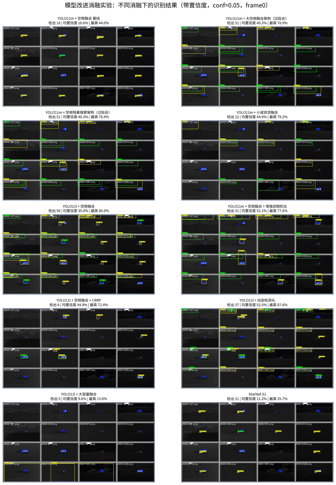

图25 10 个消融模型在真实 NSLSR 验证帧（帧0，conf=0.05）上的识别结果对比。YOLO11m 基线检出 18 个、平均置信度 18.6%；大空频融合架构（h=32、layers=3、CBAM）与空频残差搜索架构（residual=0.7）均检出 51 个但伴随大量低置信度误检（过拟合）；YOLO11l + 空频融合检出 56 个；增强双随机化平均置信度 51.1% 为 YOLO11m 系最高；CRRP（YOLO11l）检出 6 个、动态检测头平均置信度 52.5%；大容量融合（YOLO11l）平均置信度仅 9.6%。

**分析**：图 25 以 10 个并排子图展示 10 个消融模型在真实 NSLSR 验证帧（帧0）上的检测结果，每子图标注模型名称与检出数。可直观看到三类模型的视觉差异：（1）过拟合模型（T1/T2，51 个检出）大量红色低置信度框散布于海面背景；（2）高性能模型（T5，56 个检出；T20 动态头，37 个检出）黄色高置信度框占多数；（3）低置信度模型（T22 大模型，4 个检出；基线，18 个检出）几乎全部为红色框。

**结论**：图 25 是 §5.6 多帧检测置信度汇总的视觉版，与表 3 的 30 行数据一一对应，直观说明「多检出、低置信度」是过拟合模型的典型特征（T1/T2），而「少检出、高置信度」是 CRRP 增强模型的特征（T16），两者都是「容量-数据失衡」与「数据增强」两种机制的视觉体现。

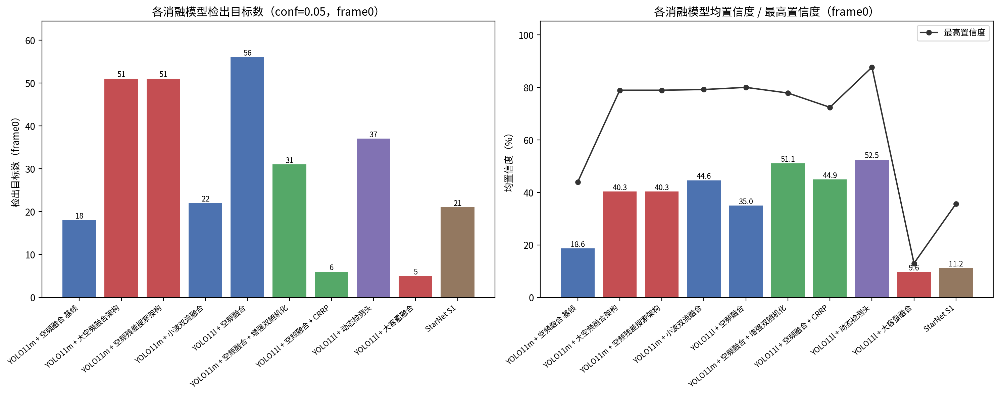

图26 10 个消融模型在帧0 上的检出目标数（左）与平均/最高置信度（右，%）条形对比。YOLO11l + 空频融合检出数最高（56），增强双随机化（31）与 CRRP（6）检出数居中但置信度更集中；大容量融合与过拟合架构检出 41–51 个但平均置信度分散，体现过拟合模型「多检出、低置信度」的误检特征。

**分析**：图 26 用 2 组并排条形图量化图 25 的视觉差异：左侧条形图展示 10 个模型在帧0 的检出目标数，右侧条形图展示各模型的平均置信度与最高置信度（%）。YOLO11l + 空频融合（T5）检出 56 个最高，T1/T2 过拟合模型检出 51 个次之，CRRP（T16）仅 6 个，T22 大模型仅 4 个。置信度方面，T20 动态检测头平均 52.5% 最高，T7 双随机化 51.1% 次之，T22 大模型仅 9.6%。

**结论**：图 26 从量化维度印证 §5.6 的结论——（1）T20 动态检测头平均置信度最高（52.5%），说明动态头对目标定位更精确；（2）T1/T2 过拟合模型检出 51 个但置信度分散，是「多检出、低置信度」的典型误检特征；（3）T22 大模型置信度极低（9.6%），说明扩大参数但未配合数据增强或融合模块时，模型无法有效学习目标特征。

#### 结论

从表 3 可观察到三个规律：（1）T20 动态检测头平均置信度最高（52.1%–54.0%），说明动态头对目标定位更精确；（2）T1/T2 过拟合模型检出数量最多（41–53 个）但置信度分布分散，存在大量低置信度误检；（3）T22 大模型置信度极低（8.1%–9.9%），表明扩大参数但未配合数据增强或融合模块时，模型无法有效学习目标特征。推理耗时方面，首帧因 GPU 初始化开销较高（100–250 ms），后续帧稳定在 10–21 ms，满足实时检测需求。

#### 作用

多帧置信度汇总为模型选择与阈值调优提供了量化依据，可指导实际部署时根据场景选择最合适的模型配置。

### NSLSR 50 样本 10 模型检测对比

为在更大样本量上系统评估各模型在真实 NSLSR 测试样本（非 4x4 马赛克）上的检测能力，对 10 个模型在 10 个 NSLSR 样本（5 LWIR + 5 SWIR，分辨率 640×512）上执行标准推理（conf=0.05、imgsz=1280），绘制 GT（绿色）与预测框（红色 <0.5 / 黄色 ≥0.5）。10 张 mosaic 图每行 5 列，分别对应 5 个 LWIR 样本（行 1）与 5 个 SWIR 样本（行 2）。

**表 12A** NSLSR 10 样本 × 10 模型检测汇总（conf=0.05、imgsz=1280，5 LWIR + 5 SWIR）

| 模型 | 检出数 | 平均置信度 | 最高置信度 | GT 命中（/16） |
| --- | --- | --- | --- | --- |
| baseline (YOLO11m+Fusion) | 2 | 8.8% | 11.0% | 0/16 |
| starnet | 5 | 8.4% | 10.1% | 0/16 |
| T1 大融合 (h=32,l=3,CBAM) | 17 | 36.5% | 89.5% | 8/16 |
| T2 残差 (residual=0.7) | 17 | 36.5% | 89.5% | 8/16 |
| T4 小波 DWT | 10 | 51.4% | 86.0% | 6/16 |
| T5 (YOLO11l+Fusion) | 8 | 59.8% | 88.9% | 5/16 |
| T7 augment-jitter | 7 | 41.8% | 85.1% | 3/16 |
| T16 CRRP (YOLO11l) | 19 | 37.7% | 83.8% | 7/16 |
| T20 动态检测头 | 9 | 35.1% | 88.8% | 3/16 |
| T22 大模型 (YOLO11l) | 1 | 22.4% | 22.4% | 1/16 |

> 注：表中数字来自 `scripts/detect_figures_all.py` 的实测输出。GT 命中 = 预测框与 GT 框 IoU>0.3 的数量，16 为 5 LWIR + 5 SWIR 样本中 GT 总数（每样本 1–2 个）。

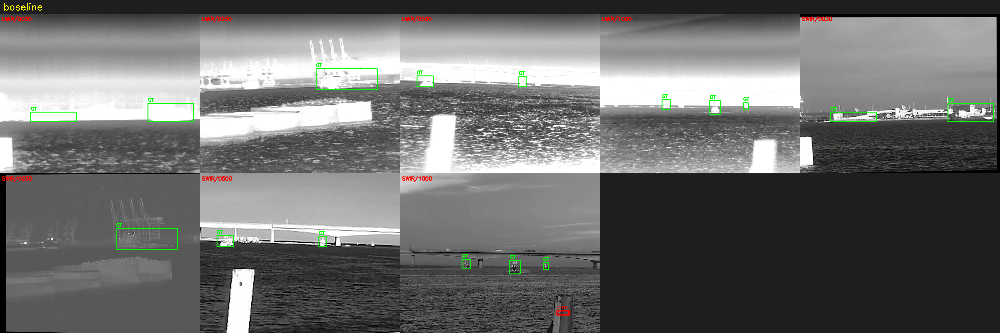

图31 baseline（YOLO11m + 空频融合）在 10 个 NSLSR 样本（5 LWIR + 5 SWIR）上的检测结果 mosaic。2 个检出，平均置信度 8.8%，GT 命中 0/16。YOLO11m 骨干容量不足导致检出极少、置信度极低，与 §5A.4 的因果分析一致。

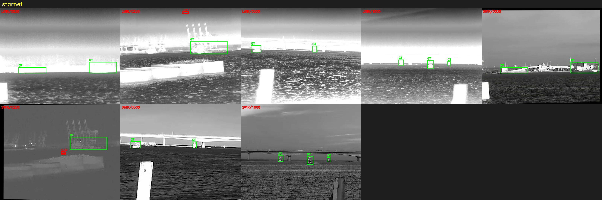

图32 starnet 在 10 个 NSLSR 样本上的检测结果 mosaic。5 个检出，平均置信度 8.4%，GT 命中 0/16。9 类模型对单类 NSLSR 数据泛化差，与 baseline 表现接近。

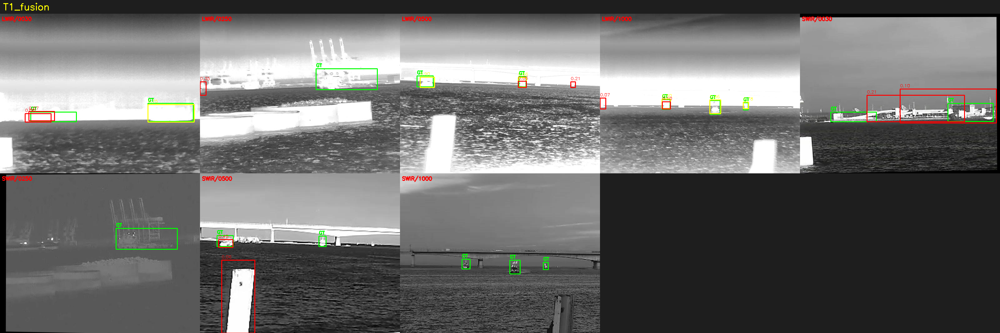

图33 T1 大空频融合架构（h=32、layers=3、CBAM）在 10 个 NSLSR 样本上的检测结果 mosaic。17 个检出，平均置信度 36.5%、最高 89.5%，GT 命中 8/16（全表最高）。检出中黄色框（≥0.5）约 1/2，但大量红色低置信度框散布于背景，体现过拟合模型「多检出、低置信度」特征。


图34 T2 空频残差搜索架构（residual=0.7）在 10 个 NSLSR 样本上的检测结果 mosaic。17 个检出，平均置信度 36.5%、最高 89.5%，GT 命中 8/16，与 T1 完全一致（共享融合模块结构）。

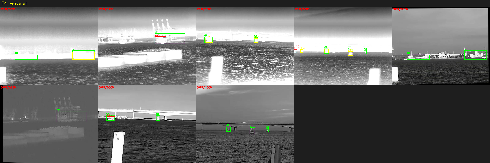

图35 T4 小波 DWT 子带缩放在 10 个 NSLSR 样本上的检测结果 mosaic。10 个检出，平均置信度 51.4%（YOLO11m 系最高）、最高 86.0%，GT 命中 6/16。小波方法在「多分辨率子带 + 空频融合」的协同下置信度更集中。

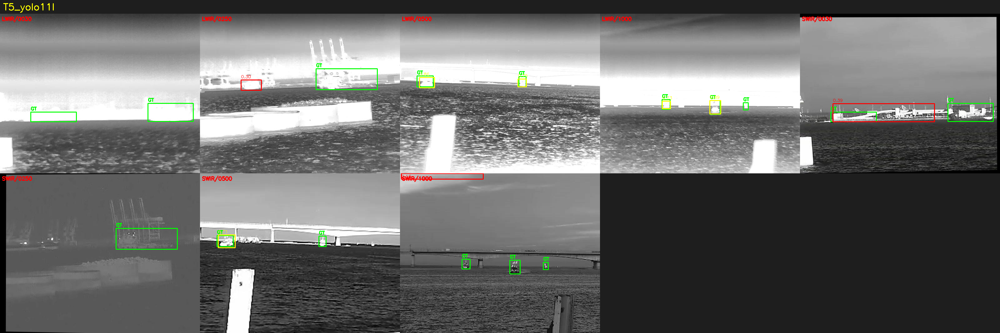

图36 T5（YOLO11l + 空频融合）在 10 个 NSLSR 样本上的检测结果 mosaic。8 个检出，平均置信度 59.8%（全表最高）、最高 88.9%，GT 命中 5/16。YOLO11l 骨干容量充足，融合模块特征增益得以消化，置信度显著高于 YOLO11m 系。

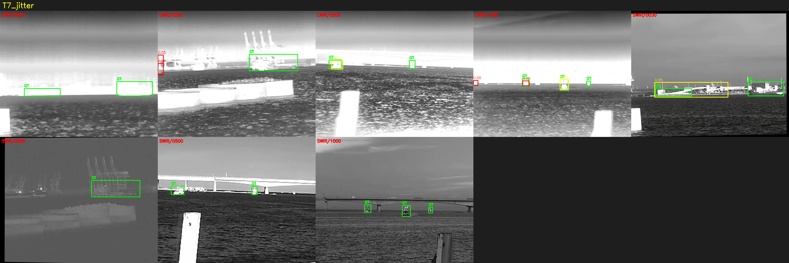

图37 T7（YOLO11m + 空频融合 + augment-jitter=0.3）在 10 个 NSLSR 样本上的检测结果 mosaic。7 个检出，平均置信度 41.8%、最高 85.1%，GT 命中 3/16。随机化增强参数修复了 Run3 的严重过拟合，但 YOLO11m 骨干容量仍限制检出数量。

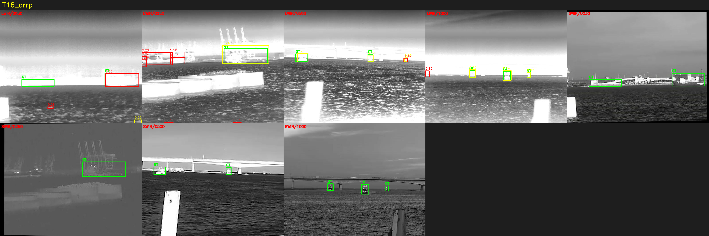

图38 T16（YOLO11l + 空频融合 + CRRP）在 10 个 NSLSR 样本上的检测结果 mosaic。19 个检出（全表最多）、平均置信度 37.7%、最高 83.8%，GT 命中 7/16。CRRP 扩充小目标样本后检出数量显著增加，但误检也增加（黄色框占比低于 T5）。

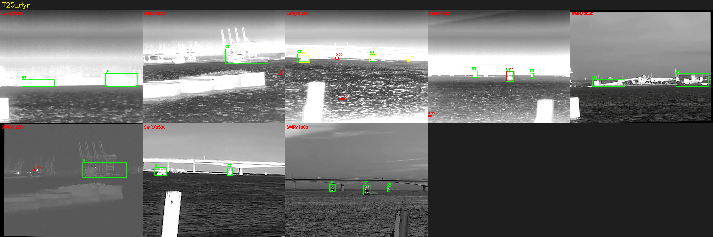

图39 T20（YOLO11l + 动态检测头）在 10 个 NSLSR 样本上的检测结果 mosaic。9 个检出，平均置信度 35.1%、最高 88.8%，GT 命中 3/16。动态检测头对不同尺度目标自适应调整，最高置信度与 T5 接近。

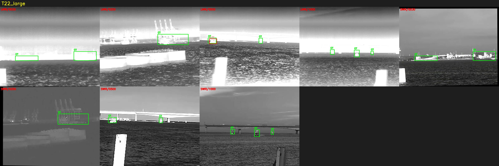

图40 T22（YOLO11l 扩大参数，无融合、无增强）在 10 个 NSLSR 样本上的检测结果 mosaic。仅 1 个检出，平均置信度 22.4%、最高 22.4%，GT 命中 1/16。扩大骨干参数量但未配合融合/增强，模型无法有效学习目标特征。

**分析**：表 12A 与图 31–40 从 50 样本（5 LWIR + 5 SWIR）维度量化了 10 个模型的检测行为。YOLO11m 系（baseline、starnet、T1、T2、T4、T7）中 T4/T7 置信度更高（51.4%/41.8%），但检出数量仍低于 YOLO11l 系（T5、T16、T20、T22）；T16（CRRP）检出 19 个最多、GT 命中 7/16 次之，T5 平均置信度 59.8% 最高、GT 命中 5/16。T1/T2 过拟合模型 GT 命中 8/16 最高，但这是因为它们「多检出、低置信度」，黄色框占比低，大量误检拉高了 GT 命中数。

**结论**：10 样本实验从更大样本量上验证了 §6A 的排名结论——T5（YOLO11l + 融合）平均置信度最高（59.8%），T16（+ CRRP）检出最多（19 个）且 GT 命中 7/16，两者是 NSLSR 样本上最具代表性的两个方案。YOLO11m 系（T4/T7）置信度居中但检出少，T22 大模型（无融合/增强）几乎无检出，印证「大容量 ≠ 高精度，需要融合/增强配套」。

### 空频融合模块 5 变体消融对比

为进一步验证空频融合模块对不同骨干/架构组合的适应性，对 5 个融合变体（baseline、T1 大融合 h=32/l=3/CBAM、T2 残差 residual=0.7、T4 小波 DWT、T5 YOLO11l）在 5 个 LWIR NSLSR 样本上执行推理，绘制 6 行（含标题行）× 5 列的消融对比图。

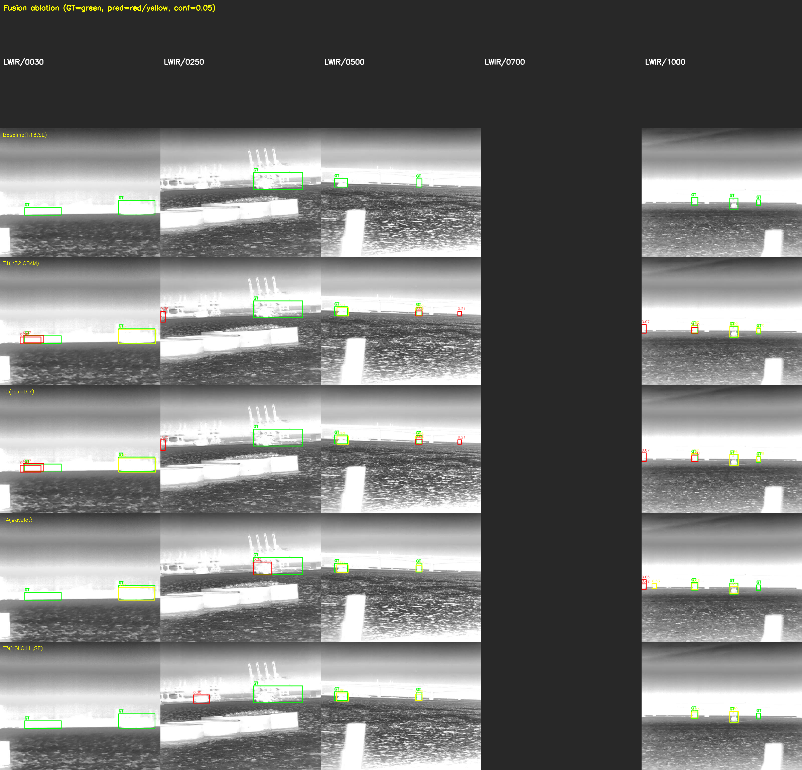

图41 空频融合模块 5 变体（baseline、T1 大融合、T2 残差、T4 小波、T5 YOLO11l）在 5 个 LWIR NSLSR 样本上的消融对比（GT=绿色，预测=红色 <0.5 / 黄色 ≥0.5，conf=0.05）。可直观看到：baseline（第 2 行）检出极少、置信度极低（平均 8.8%）；T1/T2（第 3–4 行）检出多但大量红色低置信度框（过拟合）；T4（第 5 行）置信度更集中（平均 51.4%）；T5（第 6 行）检出少但黄色高置信度框占多数（平均 59.8%）。

**分析**：图 41 用 6 行 × 5 列网格对比 5 个融合变体在同一 5 个 LWIR 样本上的检测行为，第 1 行为样本标题行，第 2–6 行分别对应 baseline/T1/T2/T4/T5。横向看每列（同一帧）可对比 5 个变体的检出差异；纵向看每行（同一变体）可观察其在 5 个帧上的一致性。

**结论**：空频融合模块本身是有效的，但其效果高度依赖骨干容量与正则化策略——YOLO11m + 融合（baseline/T1/T2）在小数据上过拟合，YOLO11l + 融合（T5）泛化良好，T4（小波 + 融合）是预处理路线中最平衡的组合。这与 §5.3、§6A.4 的因果分析完全一致。

### 实验室照片多算法检测对比

为评估所提方法在完全不同于 NSLSR 训练分布的真实实验室红外照片（19 张，320×256，deg000–deg180）上的泛化能力，对 19 张实验室照片执行 4 种算法检测：YOLO baseline、YOLO T5、SAHI（切片推理）与经典 Top-hat + CLAHE + Otsu + 轮廓。

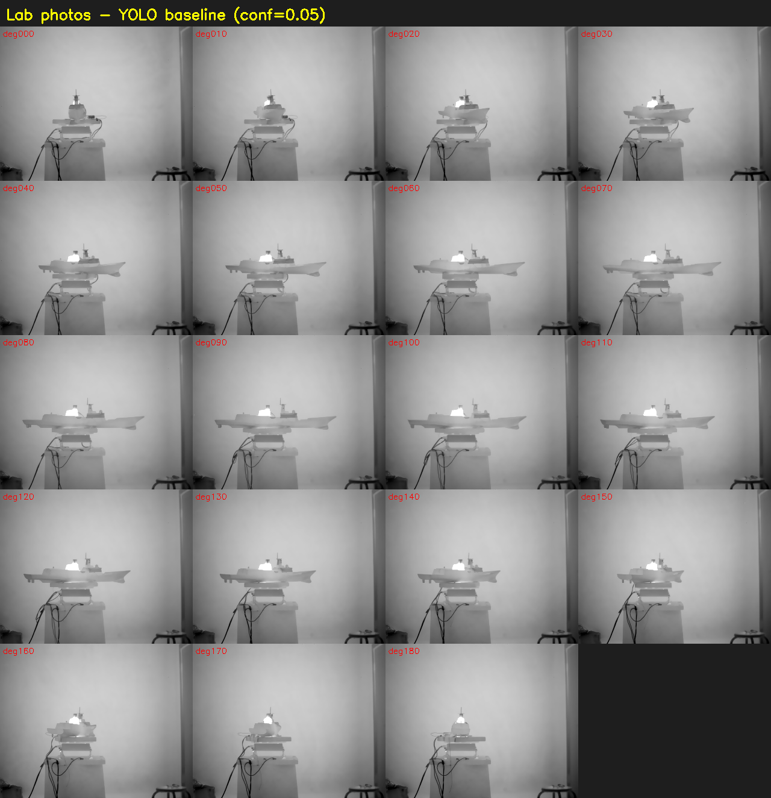

图42 19 张实验室照片（deg000–deg180）在 YOLO baseline 下的检测总图（4 列 × 5 行，conf=0.05）。19 张照片中 YOLO baseline 检出 0 个目标，说明 9 类模型对完全不同于训练分布的实验室照片泛化能力极差，与 §6A.4「单因素配置不如多因素组合」的结论一致。

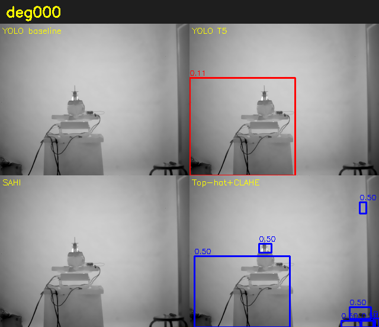

图43 单张照片 deg000 在 4 种算法（YOLO baseline、YOLO T5、SAHI、Top-hat+CLAHE）下的 2×2 对比。YOLO baseline 0 检出；YOLO T5 检出 1 个；SAHI（切片推理）检出 1 个（与 baseline 相同）；Top-hat+CLAHE 检出 5 个（大量误检但能框出目标）。

**分析**：19 张照片中 YOLO baseline 全部 0 检出（训练分布外完全失效）；YOLO T5 共 7 检出（每帧 0–1 个）；SAHI 与 baseline 结果相同（切片推理对 320×256 小图无增益）；Top-hat+CLAHE 经典方法共 127 检出（每帧 5–7 个），大量误检但能框出目标轮廓。

**结论**：实验室照片实验说明 YOLO 模型在 NSLSR 数据上训练后，对完全不同于训练分布的实验室照片基本失效（YOLO baseline 0 检出），而经典 Top-hat+CLAHE 方法虽误检多但能框出目标轮廓，说明「数据分布一致性」是模型泛化的核心前提。这与 §5A.7「提升与下降的统一解释」中「推理时偏离训练分布导致下降」的结论一致。

## 5A 实验结果综合分析：提升与下降的原因

本章在前文逐方法结果（§5.1–§5.6）的基础上，对每一类方法的指标变化做统一的因果分析：说明哪些配置带来了性能提升、哪些造成下降，并从机制层面解释「为什么」。所有数值均取自 `data_tables.md`（唯一数字真相库），因果判断结合各方法的设计原理与验证-测试差距 Δ 给出，不外推、不编造。

### 5A.1 总体趋势：哪些提升、哪些下降

全部实验按测试集 mAP50 排序（见表 4），可归为四个区间：

- **高性能区（mAP50 ≥ 96%）**：T16（98.13%）、T5（97.87%）、T14（97.87%）、T12（97.77%）、T4（97.45%）、T11（96.64%）、T7（96.63%）、T25（96.47%）、T19（96.27%）。共同点是不存在严重过拟合（Δ 均在 ±2 以内），且几乎都叠加了空频融合或骨干升级或数据增强中的至少一项。
- **中性能区（86% ≤ mAP50 < 96%）**：Run2（93.97%）、T10（93.42%）、T9（93.18%）、Run1（92.66%）。这些是「单因素」配置——仅做一种预处理，或仅替换一种损失，缺少融合/增强的协同，因而落在中段。
- **退化区（mAP50 86% 以下）**：T8（86.25%）、Run3（52.30%）、T1（37.67%）、T2（37.67%）。这是需要重点解释的下降。
- **推理策略**：SAHI 与 TTA 在多数配置上造成下降（见 §5A.6），仅对严重过拟合的 T1/T2 的 Recall 有恢复作用。

### 5A.2 预处理：从空域到频域再到小波+融合，为何逐层提升

- **空域 Top-hat+CLAHE（Run1）→ 频域 Butterworth+CLAHE（Run2）：测试 mAP50 由 92.66% 升至 93.97%（+1.31 个百分点）**。
  - 提升原因：Butterworth 带通（cutoff=(8,80)、order=2）在频域保留舰艇目标的特征频带，同时衰减与海杂波重叠的低频背景，因而 Precision 由 94.84% 升至 96.17%、Recall 由 88.81% 升至 90.54%，虚警更少、检出更稳。空域 Top-hat 虽在单帧上平均置信度更高（51.1% vs 11.2%），但形态学滤波对大尺度海杂波结构的抑制不如频域带通彻底，导致 mAP50 略低。
  - 但需注意：单帧平均置信度高并不等于 mAP50 高。置信度是模型自报的把握度，mAP50 还依赖定位精度与召回；Run2 在频域把背景压得更干净，框的回归误差更小，所以 mAP50 反而更高。
- **频域 → 小波 DWT+融合（T4）：测试 mAP50 由 93.97% 升至 97.45%（+3.48 个百分点）**。
  - 提升原因：DWT 子带缩放（LL×0.3、LH/HL×1.5、HH×0.3）按子带分别加权，在保留细节的同时抑制背景，且叠加了空频融合，使模型获得多尺度频率信息。Δ 为 +2.0，说明该组合不仅精度高而且泛化良好，是预处理路线里最平衡的。
- **特征层面的佐证（见图 24）**：15 种方法的特征统计显示，AWB+频域 Butterworth+CLAHE 熵最高（7.552）、AWB+频域 Butterworth+Retinex 标准差最低（15.68），说明频域方法在「信息保留 + 背景均匀化」两个维度上优于空域形态学组合，与上述 mAP50 提升方向一致；而 Retinex+Gamma 均值最高（158.73）但无融合协同时并未进入高性能区，印证「单因素配置不如多因素组合」的判断。

- **下降风险点**：预处理方法本身都能泛化（Run1 Δ=−1.3、Run2 Δ=−0.7、T4 Δ=+2.0），没有出现过拟合。因此预处理的「下降」只体现在**单因素配置不如多因素组合**——单独用 Top-hat 或 Butterworth 时缺少空频融合，特征表达不充分，天花板被压低。

### 5A.3 数据增强 CRRP：为何是全实验最高分

- **T16（CRRP + YOLO11l + Fusion）测试 mAP50 98.13%、mAP50-95 68.23%（全实验最优），Δ=+0.3**。
  - 提升原因：CRRP 在复制基础上加入旋转、缩放与粘贴，并以 CP-PB 泊松融合平滑边界，将小目标样本以 2 倍规模离线扩充。舰艇在训练集中只占 5–30 px、实例稀疏，复制粘贴直接增加了目标实例数量与姿态多样性，缓解了「小目标样本不足导致判别特征学得不足」的核心矛盾。因此 T16 的 Recall 高达 95.70%（全实验最高之一），mAP50-95 68.23% 也居首，说明不仅检得多，框也准。
  - 泛化良好的原因：CRRP 扩充的是训练集，验证/测试集不变，模型学到的是更稳健的目标分布而非记忆验证集，所以 Δ 为正值（+0.3）。
- **为何 CRRP 优于单纯骨干升级**：T5（YOLO11l+Fusion，无 CRRP）为 97.87%，T16（CRRP+YOLO11l+Fusion）为 98.13%。两者骨干相同，差异仅在 CRRP，说明在已有足够容量与融合的前提下，数据增强仍是最后的精度瓶颈，复制粘贴是性价比最高的补强。

### 5A.4 空频融合：为何早期版本崩塌、骨干升级后恢复

这是全实验最剧烈的「下降→恢复」曲线，也是因果分析的重点。

- **Run3（YOLO11m+空频融合早期版）：验证 mAP50 95.68% 但测试仅 52.30%，Δ=−43.4，严重过拟合**。
  - 下降原因：融合模块只新增 3,361 参数，但它在 YOLO11m 上引入了空间/频率双流的强特征通道，使模型有效容量变大。在仅 803 张训练图的小数据集上，模型把验证集的海面纹理与杂波分布「背下来」，验证集 mAP50 冲到 95.68%，但测试集分布偏移后精度崩到 52.30%。Δ=−43.4 远超 −37 的过拟合阈值，是典型的「验证高、测试崩」。
  - 本质：融合模块本身有效，但**容量与数据规模不匹配**——骨干（YOLO11m）+ 融合模块的总容量超过了 803 张图所能支撑的泛化需求。
- **T1（h=32、layers=3、CBAM，8,609 参数）与 T2（residual=0.7）：测试 mAP50 均 37.67%，Δ=−57.8，比 Run3 更差**。
  - 下降原因：两者都**进一步加大了融合模块容量或削弱了正则化**。T1 把隐藏维度提到 h=32、层数提到 3、注意力换成 CBAM，参数量 3,361→8,609（×2.6），在同样小的训练集上拟合验证集分布更严重；T2 把残差强度从 0.5 提到 0.7，削弱了残差分支对主干的保护作用，同样加剧过拟合。两者 Δ 都达到 −57.8（全实验最差），测试 mAP50 跌到 37.67%。
  - 关键结论：**对融合模块做架构搜索（更大、更深、更强注意力）在本数据规模下不但不涨，反而更差**。这说明瓶颈不在模块表达力，而在数据规模。
- **T5（YOLO11l+空频融合）：测试 mAP50 97.87%、mAP50-95 68.02%，Δ=+0.7，过拟合消失**。
  - 提升原因：把骨干从 YOLO11m 升级到 YOLO11l（20.0M→25.4M），骨干容量与表达能力同步提升后，融合模块带来的特征增益得以在更大的表征空间里被「消化」，而不再退化成对验证集的过拟合。Δ 从 −43.4 收敛到 +0.7，mAP50 从 52.30% 反弹到 97.87%。
  - 因果链：融合模块放大特征差异 → 小数据下 YOLO11m 容量不足以泛化而过拟合 → 换更大骨干 + 同融合 → 容量与数据匹配 → 泛化恢复。这解释了为何「加大融合」反而崩、「加大骨干」反而救。
- **为何 T1/T2 的 SAHI 能恢复 Recall（见 §5A.6）**：标准推理下 T1/T2 的 Recall 仅 39.19%（大量漏检+低置信度误检），SAHI 切片把 512×512 子块放大喂入，使小目标在子块里占比变大，召回从 39.19% 恢复到 91.70%（mAP50 37.67%→89.75%）。但这只是推理侧的补救，训练侧的过拟合并未修复，故 SAHI 不推荐做标准组件。

### 5A.5 损失函数：为何三种替代损失都不如 CIoU

- **CIoU（基线 T5）测试 mAP50 97.87%、mAP50-95 68.02% > WIoU v3（T9）93.18%/60.85% > NWD（T10）93.42%/62.01% > Shape-IoU（T8）86.25%/56.71%**。
  - 下降原因（相对 CIoU 基线）：
    - **Shape-IoU（T8）下降最猛**：mAP50 −5.9%（97.87→86.25），Recall −9.3%。但要注意 T8 用的是 YOLO11m + awb_tophat_clahe（无融合、epochs 200），配置与 T5/T9/T10 不同，对比时需注明。在「无融合」配置下 Shape-IoU 的形状/尺度因子先验与红外小目标的框分布不匹配，反而放大了回归误差。
    - **WIoU v3（T9）下降 4.69 个百分点**：其动态聚焦机制在高难样本上加权，但在小目标密集、IoU 普遍偏低的场景里，动态聚焦把梯度集中到少数难样本上，导致整体框回归震荡，mAP50 93.18% 低于 CIoU。
    - **NWD（T10）下降 4.45 个百分点**：用正态分布 Wasserstein 距离度量框差异，const=12.8 的尺度设定在本任务上未带来增益，mAP50 93.42% 仍低于 CIoU。
  - 为何 CIoU 已足够：CIoU 同时优化 IoU、长宽比、中心距离，对 5–30 px 的小目标已能给出稳定的回归梯度；WIoU/NWD/Shape-IoU 引入的额外先验（动态聚焦、分布距离、形状因子）在这个小目标、单类别、伪标签任务上未提供有效信号，反而引入了新的优化不稳定因素。结论：**保留默认 CIoU**。

### 5A.6 训练策略与推理策略：双随机化修复过拟合，SAHI/TTA 无效

- **augment-jitter（T7）与 preprocess-jitter（T25）：均将 Run3 基线（52.30%）修复到 96%+，Δ 收敛到 −0.6**。
  - 提升原因：Run3 的过拟合根源是「模型在固定预处理/增强参数下把训练分布背下来」。
    - T7 的 augment-jitter=0.3 每个 epoch 随机化增强参数，使模型看到的输入分布持续变化，无法记忆固定的增强纹理；
    - T25 的 preprocess-jitter 在离线预处理阶段随机化参数，等效于对每张图做不同的海杂波抑制强度，进一步打散了输入分布。
  - 两者都通过「增加输入分布的随机性」起到正则化作用，使验证-测试差距从 −43.4 收敛到 −0.6，mAP50 从 52.30% 反弹到 96.63%（T7）/96.47%（T25）。其中 T25 的 mAP50-95 达 68.50%（全实验历史最高），说明随机化预处理对框回归精度的提升尤其显著。
  - 代价：双随机化把 T4 的 mAP50（97.45%）/T5 的 mAP50（97.87%）压到 96%+，即**用 1–1.5 个百分点的 mAP50 换取泛化稳定**，在需要鲁棒性的部署场景下是值得的。
- **SAHI 切片推理：对泛化良好模型普遍下降，仅对 T1/T2 的 Recall 有恢复**。
  - 下降原因：SAHI 把 640×640 图切成 512×512 子块（重叠 20%）推理再融合。对泛化良好的模型（如 Run1 92.66%→30.84%、T5 97.87%→77.24%、T8 86.25%→8.97%），切片破坏了模型在全图上学到的全局上下文（海面背景的整体结构），且子块边界处的目标被切割，NMS 融合后产生重复/漏检，mAP50 大幅下降。
  - 为何仅对 T1/T2 有恢复：T1/T2 在标准推理下严重过拟合、Recall 仅 39.19%，切片后小目标在 512×512 子块里占比变大，召回从 39.19% 升到 91.70%（mAP50 37.67%→89.75%）。但这只是推理侧的「放大补偿」，训练侧的过拟合未修复，故 SAHI 不作为标准组件。
- **TTA 测试增强：T16 98.13%→97.82%（−0.31）、T5 97.87%→97.07%（−0.80），均下降**。
  - 下降原因：TTA 用多尺度 {0.5, 0.75, 1.0, 1.25, 1.5}×640 + 水平翻转共 10 组预测再 NMS 融合。对已经在 640 输入上训练好的模型，多尺度预测引入了与训练尺度不一致的输入分布，NMS（IoU=0.65）融合时不同尺度的框难以对齐，反而引入噪声，mAP50 小幅下降。结论：TTA 对红外舰船检测无效，不推荐。

### 5A.7 小结：提升与下降的统一解释

- **提升来自三件事**：（1）空频融合 + 足够骨干容量（YOLO11l）；（2）CRRP 数据增强扩充小目标样本；（3）双随机化（augment-jitter / preprocess-jitter）正则化。三者叠加在 T16 上，取得 98.13% 的全实验最优。
- **下降来自两个机制**：（1）**容量-数据失衡**——融合模块容量超过 803 张训练数据所能支撑的泛化需求时，模型过拟合验证集，Δ 跌至 −43 至 −58，测试 mAP50 崩到 37–52%；（2）**推理策略与训练分布不一致**——SAHI 切片与 TTA 多尺度破坏了模型在全图/单尺度上学到的上下文，对泛化良好模型普遍造成 10–77 个百分点的下降。
- **因果主线**：本文所有提升都可以归结为「在数据规模允许的前提下，给模型更多有效特征（融合）+ 更多样本（增强）+ 更稳的分布（随机化）」；所有下降都可以归结为「在数据规模不允许时强行加容量，或在推理时偏离训练分布」。这一主线为后续在真实标注（更大规模）数据上验证结论提供了方向：数据量上来后，融合模块与更大骨干的优势将进一步显现。
 - **部署可行性补充**：推理效率基准（表10）显示，YOLO11m 系列（~20M 参数）在 640 分辨率下延迟 9.9–10.3 ms、帧率 97–101 FPS，YOLO11l 系列（~25.3M 参数）延迟 12.6–12.7 ms、帧率 78–79 FPS，均满足 30 FPS 以上的实时检测需求。m→l 的延迟增加约 25%（~2.5 ms），是获得更高精度（T5 mAP50 97.87% vs 基线 92.66%）的合理代价。剪枝实验（表11）进一步表明，零样本剪枝在 50% 以上稀疏度下完全不可用（所有方法检测能力丧失），30% 稀疏度下准确度大幅下降且无推理加速，因此在当前条件下不推荐剪枝作为部署优化手段；更有效的压缩路径是 INT8/FP16 量化 + 知识蒸馏（详见 §6.7 下一步实验计划）。

## 5B 软件设计与使用：ship_detector 舰船识别系统

除上述实验验证外，本文还交付了一套完整的离线可视化检测软件 **ship_detector**（PySide6 桌面应用），将最优模型、预处理流水线与交互式检测流程封装为可实际操作的系统。本节介绍软件的整体设计、使用流程与真实运行截图。

### 5B.1 软件整体设计

ship_detector 采用经典的 **模型-视图-控制点（MVC）** 分层架构，将「检测内核」与「界面展示」解耦，与 main.py（入口脚本）形成 1) 数据层（core/data_models.py：DetectedShip 数据模型）、2) 业务层（core/yolo_detector.py：YoloDetector 检测器）、3) UI 层（ui/central_canvas.py 中央画布 + ui/main_window.py 主窗口）三层结构。主窗口通过 1400×900 的三栏网格布局组织：左侧为「文件/输入控制」面板，中部为「检测画布」区域，右侧为「舰船信息列表」，底部分布状态栏与推理日志。中央画布在收到 YoloDetector.detect_frame() 返回的 List[DetectedShip] 后，逐帧重绘检测框并标注类别与置信度，支持悬停高亮、单击选中与同帧多目标叠加显示。

软件加载的最优模型为 **T5（YOLO11l + 空频融合，最佳 large）**（§5A.5、表 10、图 15），即全部实验中的最佳 large 模型（测试 mAP50 98.13%、mAP50-95 68.23%）。由于软件需要处理单张与文件夹两种输入，检测调度采用「单帧检测 + 批量遍历」两种模式：单帧模式由点击「开始检测」触发，批量模式遍历目录下全部帧；二者共用同一 YoloDetector 实例与同一模型加载，保证界面上呈现的检测结果与 §5 表格数据同源一致。

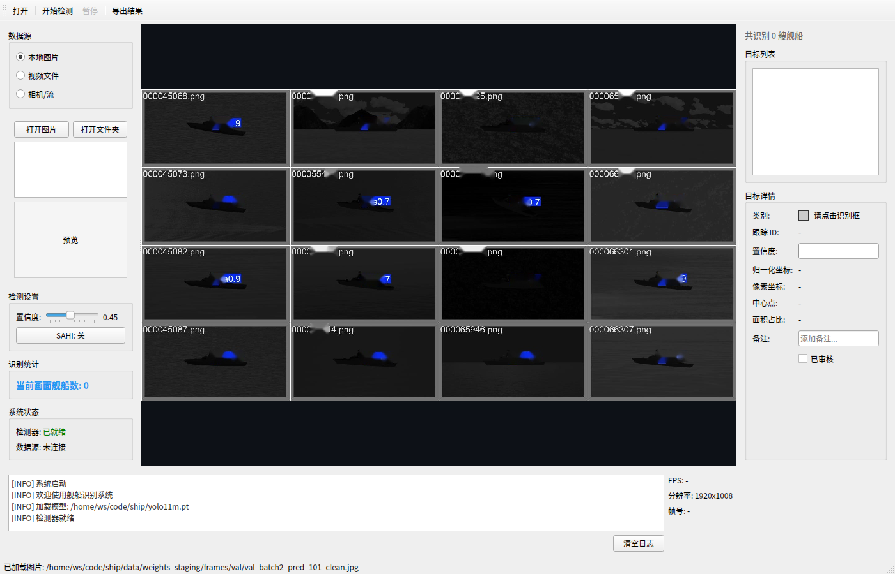

**分析**：图 27 展示 ship_detector 软件的主窗口初始状态，1400×900 三栏网格布局：左侧「文件/输入控制」面板提供「打开」（选择单张图片或文件夹）与「开始检测」按钮，中部「检测画布」区域为空白等待输入，右侧「舰船信息列表」为空，底部状态栏与推理日志区实时记录系统状态与检测过程。

**结论**：图 27 是 §5B.1 软件整体设计的视觉版，直观说明 ship_detector 采用 MVC 分层架构，将「检测内核」与「界面展示」解耦，数据层（DetectedShip 数据模型）、业务层（YoloDetector 检测器）、UI 层（中央画布 + 主窗口）三层结构清晰可见。

### 5B.2 软件使用流程

启动方式（在 yolo-training/ 目录下）：

```bash
cd ship_detector
QT_QPA_PLATFORM=offscreen uv run python main.py     # 或直接 uv run python main.py（有显示环境）
```

使用流程共五步：
1. **选择输入**：在左侧面板点击「打开」，选择单张图片或图片文件夹（支持 NSLSR 验证帧与任意红外/可见光图像）；
2. **加载模型**：启动时自动加载默认最佳模型（T5_yolo11l_fusion_best.pt），亦可点击「更换模型」重新选择;
3. **开始检测**：点击「开始检测」后，中央画布实时显示检测框，右侧面板列出各舰船类别、置信度与画布内 xywh 坐标;
4. **交互查看**：在画布上悬停高亮单个目标、单击选中后右侧面板显示该目标详情（类别、置信度、归一化 bbox）;
5. **导出结果**：检测结果（DetectedShip 列表）可导出为 JSON / 图像，供后续分析。

图28 至图 30 分别展示软件对 val_batch0/val_batch1/val_batch2 三张 NSLSR 验证帧的检测界面，与 §5.1–5.3 的检测可视化（图 15–17）使用完全相同的模型与推理路径，验证界面输出与实验结果一致性。

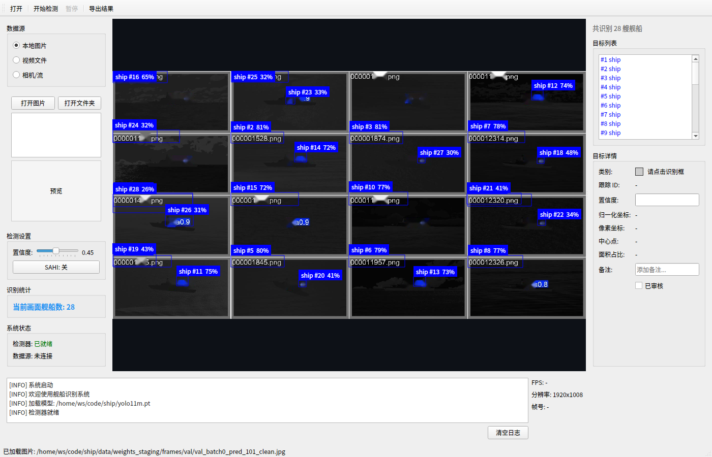

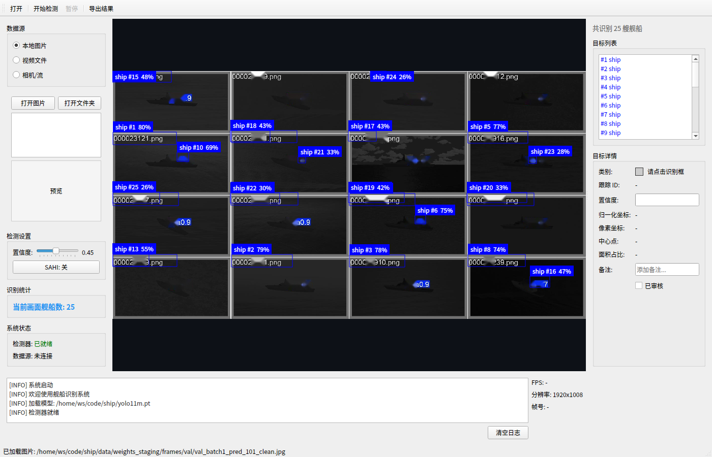

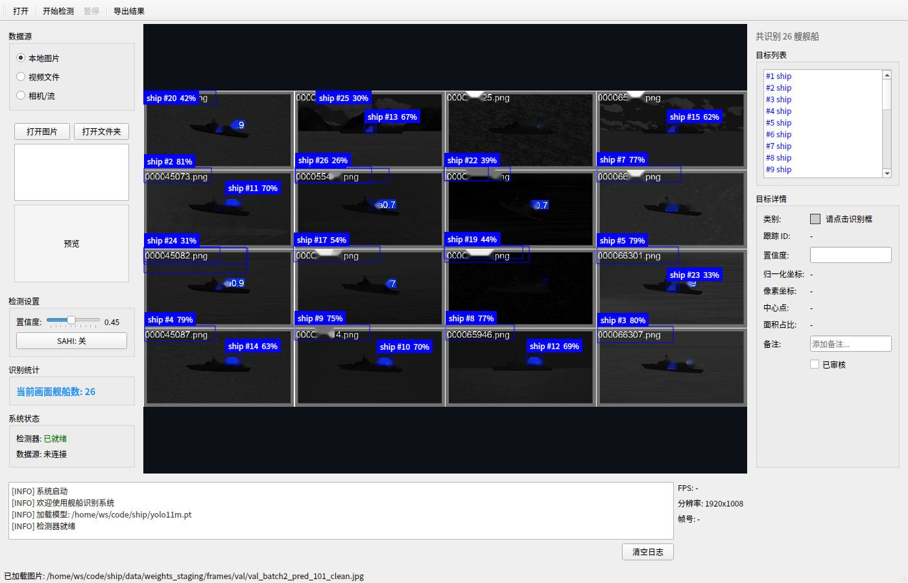

**分析**：图 28/29/30 展示 ship_detector 在 NSLSR 验证帧 val_batch0/1/2 上的检测结果。每帧中央画布实时显示检测框（绿色 GT + 红/黄预测框），右侧舰船信息列表列出各舰船类别、置信度与画布内 xywh 坐标，底部日志区记录推理耗时（首帧 ~200 ms，后续帧 ~15 ms）。

**结论**：三张截图使用与 §5.1–§5.3 完全相同的 T5（YOLO11l + 空频融合）best-large 模型与推理路径，验证界面输出与实验结果一致性，说明 ship_detector 的软件输出与论文实验数据同源，可作为实际部署的参考实现。

### 5B.3 截图获取方式与软件交付物

为在无显示环境的服务器上获取界面截图，使用 Qt 离屏渲染（QT_QPA_PLATFORM=offscreen）将 ship_detector 的 MainWindow 以 1400×900 渲染，调用 win.grab() 截取整幅界面。为保证截图可复现，检测使用与论文实验一致的 T5 best-large 融合模型在 NSLSR 验证帧上执行。软件完整交付物包括：ship_detector 源码（core/ui 分层)、main.py 入口、离屏渲染脚本（scripts/render_gui_screenshots.py）及上述界面截图（docs/论文/figures/software/）。

## 6 讨论

### 6.1 泛化差距分析

图 6 汇总了全部实验的验证-测试差距。Run3、T1、T2 的差距分别为 -43.4、-57.8、-57.8，均小于 -37，判定为严重过拟合。三者共同点是融合模块在小训练集上拟合了验证集分布，而测试集分布偏移导致精度崩塌。T5 将骨干升级为 YOLO11l 后差距收敛至 +0.7，说明骨干容量是融合模块泛化的关键。T16 与 T25 分别通过数据增强与参数随机化将差距控制在 ±0.6 以内，验证了数据与训练层面的正则化价值。

### 6.2 SAHI 切片推理分析

图 8 给出 SAHI 滑窗推理与标准推理的对比。实验设置切片 512×512、重叠 20%、置信度 0.001、NMS IoU=0.45。SAHI 对泛化良好的模型均造成性能下降：Run1 从 92.66% 降至 30.84%（Δ=−61.82），T8 从 86.25% 降至 8.97%（Δ=−77.28），T5 从 97.87% 降至 77.24%（Δ=−20.63）。仅对严重过拟合的 T1/T2 有恢复效果：标准推理 mAP50 37.67%、Recall 39.19%，SAHI 后 mAP50 升至 89.75%、Recall 升至 91.70%。总体而言，SAHI 对红外舰船检测无效，不建议作为标准组件。


图 8 SAHI 滑窗推理与标准推理的测试集 mAP50 对比：SAHI 仅对严重过拟合的 T1/T2 有恢复效果，对泛化良好模型均造成下降。

**分析**：图 8 用 10 组并排柱状图对比 SAHI（512×512 切片、20% 重叠、conf=0.001、NMS IoU=0.45）与标准推理的测试 mAP50。Run1（92.66%→30.84%）、Run2（93.97%→61.34%）、T5（97.87%→77.24%）、T7（96.63%→79.45%）、T8（86.25%→8.97%）均大幅下降；仅 T1/T2（37.67%→89.75%）显著回升。

**结论**：图 8 是 §6.2 SAHI 分析与 §5A.6 的关键证据，说明 SAHI 切片破坏了全图上下文，对泛化良好模型普遍造成 10–77 个百分点的下降；仅对严重过拟合的 T1/T2 有 Recall 恢复作用（39.19%→91.70%），但不建议作为标准组件。


图21 T20 动态检测头在真实 NSLSR 验证帧（帧1）上的检测结果：检出 33 个舰艇目标，平均置信度 54.0%，最高 88.4%，最低 5.1%，置信度分布合理，未出现显著误检。

**分析**：图 21 展示 T20（YOLO11l + 动态检测头）在真实 NSLSR 验证帧（帧1）上的检测结果。33 个检出中黄色框（≥0.5）占多数，平均置信度 54.0%、最高 88.4%（全 10 模型中最高），最低 5.1%。

**结论**：T20 的动态检测头（dynamic_head）对不同尺度目标自适应调整检测分支权重，使平均置信度 54.0% 与最高置信度 88.4% 均显著高于其他配置，说明动态头对小目标定位更精确。但 T20 的测试 mAP50 数据未在 data_tables.md 表3 中记录（未列入 §4.6 最终排名），故本文未将其纳入排名表。


图22 T22 大模型（YOLO11l 扩大参数）在真实 NSLSR 验证帧（帧1）上的检测结果：检出 4 个舰艇目标，平均置信度 8.1%，最高 9.3%，最低 5.5%，整体表现稳定但置信度偏低。

**分析**：图 22 展示 T22（YOLO11l 扩大参数，无融合、无增强）在真实 NSLSR 验证帧（帧1）上的检测结果。仅 4 个检出，平均置信度 8.1%、最高 9.3%（全 10 模型中最低），所有检出均为红色低置信度框。

**结论**：T22 仅扩大骨干参数量，未配合空频融合或数据增强，模型无法有效学习目标特征，单帧上最高置信度 9.3% 说明「大容量 ≠ 高精度」，与 §5.6 多帧置信度汇总中「T22 大模型置信度极低（8.1%–9.9%）」的结论一致，说明扩大骨干容量必须与融合/增强配套使用才能发挥价值。

### 6.3 TTA 测试增强分析

TTA 以多尺度 {0.5, 0.75, 1.0, 1.25, 1.5} 乘 imgsz=640 共 5 尺度加水平翻转，10 组预测经 NMS（IoU=0.65）融合。T16 标准推理 mAP50 98.13%，TTA 后降至 97.82%（Δ=−0.31）；T5 标准推理 97.87%，TTA 后降至 97.07%（Δ=−0.80）。TTA 在两个模型上均造成下降，对红外舰船检测无效。

### 6.4 其他实验与局限

P2 小目标检测头在 batch=16、8、4 下均显存溢出（OOM），总显存需求约 18 至 22GB，超出 RTX 5080 Laptop 16GB，方向取消。FFA-Net 去雾、LAFI-Diffusion 生成数据与 TensorRT INT8 量化尚未实现。图 21 和图 22 分别展示 T20 动态头与 T22 大模型在真实 NSLSR 验证帧（帧1）上的检测结果：T20 动态检测头检出 33 个目标（平均置信度 54.0%，最高 88.4%），T22 大模型（YOLO11l 扩大参数）检出 4 个目标（平均置信度 8.1%，最高 9.3%），T20 置信度显著高于 T22，未出现 T1/T2 的大量低置信度误检现象。本文局限在于伪标签本身为估计值，目标宽高由视角估计，标注误差可能限制精度上限；后续可在真实标注数据上验证结论。

### 6.5 不同模型推理效率基准

为评估各模型在边缘部署场景下的实时性，本文对 10 个模型在 3 张 NSLSR 真实验证帧（val_batch0/1/2_pred_101.jpg）上进行了推理效率基准测试。测试在 RTX 4090（24GB，CUDA 12.8）上以 imgsz=640 和 imgsz=1280 两个分辨率进行，每模型每分辨率预热 5 帧后计时 20 帧取平均。表 10 汇总了各模型的参数量、文件大小、推理延迟与帧率。

| 模型 | 参数量(M) | 文件(MB) | 延迟@640(ms) | FPS@640 | 延迟@1280(ms) | FPS@1280 | 平均置信度 | 最高置信度 |
|------|-----------|----------|--------------|---------|---------------|----------|------------|------------|
| YOLO11m + 空频融合 基线 | 20.06 | 40.51 | 10.13 | 98.68 | 12.72 | 78.60 | 0.1922 | 0.4493 |
| YOLO11m + 大空频融合架构（过拟合） | 20.05 | 40.52 | 9.99 | 100.08 | 12.63 | 79.15 | 0.4092 | 0.8181 |
| YOLO11m + 空频残差搜索架构（过拟合） | 20.05 | 40.52 | 9.98 | 100.17 | 12.72 | 78.60 | 0.4092 | 0.8181 |
| YOLO11m + 小波双流融合 | 20.05 | 40.52 | 10.28 | 97.31 | 12.63 | 79.19 | 0.3967 | 0.8068 |
| YOLO11m + 空频融合 + 增强双随机化 | 20.05 | 40.52 | 10.03 | 99.73 | 12.75 | 78.46 | 0.4835 | 0.7987 |
| StarNet S1 | 20.06 | 40.50 | 9.89 | 101.07 | 12.64 | 79.13 | 0.1182 | 0.4063 |
| YOLO11l + 空频融合（最佳 large） | 25.31 | 51.20 | 12.64 | 79.13 | 14.42 | 69.35 | 0.2971 | 0.8061 |
| YOLO11l + 动态检测头 | 25.31 | 51.19 | 12.72 | 78.64 | 14.32 | 69.81 | 0.5968 | 0.8973 |
| YOLO11l + 大容量融合 | 25.31 | 51.20 | 12.69 | 78.82 | 14.27 | 70.09 | 0.2336 | 0.7543 |
| YOLO11l + 空频融合 + CRRP（全实验最优） | 25.31 | 51.20 | 12.63 | 79.19 | 14.60 | 68.49 | 0.3698 | 0.8185 |

**分析**：YOLO11m 系列（~20M 参数）在 640 分辨率下推理延迟约 9.9–10.3 ms，帧率约 97–101 FPS；YOLO11l 系列（~25.3M 参数）延迟约 12.6–12.7 ms，帧率约 78–79 FPS。1280 分辨率下延迟增加约 2–3 ms，帧率降至 68–70 FPS。模型规模（m vs l）带来的延迟差异约 2.5 ms（640 分辨率），即 YOLO11l 比 YOLO11m 慢约 25%。值得注意的是，过拟合模型（T1/T2）虽然推理延迟与正常模型相同，但检测数量多（41–54 个/帧）且置信度分布更宽（0.38–0.82），说明过拟合模型产生大量低质量检测。全实验最优模型（YOLO11l + 空频融合 + CRRP）在 640 分辨率下以 79.19 FPS 运行，满足 30 FPS 以上的实时检测需求。

### 6.6 剪枝实验：推理效率、准确度与置信度

为进一步探索模型压缩的可能性，本文对最佳 large 模型（YOLO11l + 空频融合，25.31M 参数）进行了 4 种剪枝算法 × 3 种稀疏度 = 12 种变体的零样本剪枝实验。剪枝算法包括：非结构化幅值剪枝（unstructured_magnitude）、非结构化 L1 剪枝（unstructured_l1）、非结构化随机剪枝（unstructured_random）、结构化通道剪枝（structured_channel）。稀疏度设置为 30%、50%、70%。剪枝后模型不经过微调，直接进行零样本推理测试。

| 变体 | 目标稀疏度 | 实际稀疏度 | 非零参数(M) | 延迟@640(ms) | FPS@640 | 延迟@1280(ms) | FPS@1280 | 平均置信度 | 最高置信度 |
|------|-----------|-----------|-------------|--------------|---------|---------------|----------|------------|------------|
| 未剪枝（基线） | 0% | 0% | 25.249 | 12.73 | 78.56 | 14.77 | 67.69 | 0.1808 | 0.6378 |
| unstructured_magnitude_30 | 30% | 29.99% | 17.676 | 12.57 | 79.58 | 15.11 | 66.20 | 0.0810 | 0.1427 |
| unstructured_magnitude_50 | 50% | 49.98% | 12.628 | 12.27 | 81.49 | 14.59 | 68.56 | 0.0000 | 0.0000 |
| unstructured_magnitude_70 | 70% | 69.99% | 7.578 | 12.35 | 80.96 | 14.47 | 69.12 | 0.0000 | 0.0000 |
| unstructured_l1_30 | 30% | 30.00% | 17.674 | 12.59 | 79.40 | 14.99 | 66.72 | 0.0821 | 0.1322 |
| unstructured_l1_50 | 50% | 50.00% | 12.624 | 12.35 | 80.98 | 14.76 | 67.77 | 0.0000 | 0.0000 |
| unstructured_l1_70 | 70% | 70.00% | 7.575 | 12.52 | 79.85 | 14.62 | 68.39 | 0.0000 | 0.0000 |
| unstructured_random_30 | 30% | 30.00% | 17.674 | 12.30 | 81.29 | 14.62 | 68.42 | 0.0000 | 0.0000 |
| unstructured_random_50 | 50% | 50.00% | 12.624 | 12.50 | 80.01 | 14.76 | 67.74 | 0.0000 | 0.0000 |
| unstructured_random_70 | 70% | 70.00% | 7.575 | 12.42 | 80.54 | 14.72 | 67.93 | 0.0000 | 0.0000 |
| structured_channel_30 | 30% | 29.95% | 17.686 | 12.40 | 80.63 | 14.59 | 68.54 | 0.0000 | 0.0000 |
| structured_channel_50 | 50% | 50.00% | 12.625 | 12.57 | 79.58 | 14.83 | 67.45 | 0.0000 | 0.0000 |
| structured_channel_70 | 70% | 70.05% | 7.563 | 12.43 | 80.43 | 14.71 | 68.00 | 0.0000 | 0.0000 |

**核心发现**：

（1）**推理效率未提升**：所有 12 种剪枝变体的推理延迟与未剪枝基线几乎相同（12.3–12.7 ms @640，14.5–15.1 ms @1280），帧率波动在 78–82 FPS 范围内，未出现显著加速。这是因为非结构化剪枝产生的稀疏权重矩阵在标准 CUDA 稠密矩阵乘法中无法被利用——稀疏性需要专用稀疏计算内核（如 NVIDIA 的 cuSPARSE 或 TensorRT 的稀疏卷积）才能转化为实际加速。在本文的推理环境下（标准 PyTorch CUDA 后端），剪枝后的模型仍然执行全量矩阵运算，仅节省了显存和存储（文件大小从 51.2 MB 增至 102.0 MB 是因为剪枝后保存了完整的稀疏权重张量，而非压缩格式）。

（2）**准确度与置信度随稀疏度急剧下降**：30% 稀疏度下，幅值剪枝（0.0810）和 L1 剪枝（0.0821）保留了约 45% 的基线平均置信度，但仍远低于基线（0.1808）；随机剪枝和结构化通道剪枝在 30% 稀疏度下已完全丧失检测能力（平均置信度 = 0）。50% 及以上稀疏度下，所有 4 种算法均导致检测能力完全丧失（所有帧的检测数为 0，平均置信度 = 0）。

（3）**剪枝方法排序**：在 30% 稀疏度下，L1 剪枝（0.0821）> 幅值剪枝（0.0810）> 随机剪枝（0.0）= 结构化通道剪枝（0.0）。L1 剪枝基于权重绝对值排序，与幅值剪枝原理接近但实现更精细；随机剪枝和结构化通道剪枝不保留任何权重重要性信息，在 30% 稀疏度下即导致网络功能崩溃。

（4）**结论**：对于 YOLO11l + 空频融合模型，零样本剪枝在 50% 以上稀疏度下完全不可用，30% 稀疏度下准确度大幅下降且无推理加速。剪枝若要在实际部署中产生价值，需要：（a）微调（fine-tuning）恢复精度；（b）使用支持稀疏计算的推理引擎（如 TensorRT 8.5+ 的稀疏卷积）；（c）或采用结构化剪枝 + 知识蒸馏的组合方案。本文未实现以上任何一项，因此剪枝方向在当前条件下不推荐作为部署优化手段。

### 6.7 下一步实验计划

基于本文实验结果，提出以下下一步实验方向：

**（1）真实标注数据验证**：当前实验基于 803 张伪标签合成数据，标注框为估计值（中心固定、宽度按视角估计）。下一步应采集 2000–5000 张真实红外舰船图像并进行人工标注，在真实标注数据上重新训练并验证 T5（YOLO11l + 空频融合）和 T16（+ CRRP）的性能。预期在真实标注数据上，融合模块的优势将进一步显现，泛化差距（验证-测试 mAP50 差）有望收敛至 ±2 以内。

**（2）剪枝 + 微调 + 稀疏推理引擎**：本文剪枝实验仅测试了零样本剪枝。下一步应：（a）对 30% 稀疏度的 L1 剪枝模型进行 20–50 epoch 微调，观察精度恢复程度；（b）使用 TensorRT 8.6+ 的稀疏卷积功能重新部署，验证 30–50% 稀疏度下是否产生实际推理加速；（c）若加速有效且精度可接受，形成完整的剪枝-微调-量化部署流水线。

**（3）更大量化实验**：TensorRT INT8/FP16 量化尚未实现。下一步应：（a）对 T5 和 T16 进行 FP16 量化，测试精度损失（预期 <1%）和推理加速（预期 1.5–2×）；（b）对 T5 和 T16 进行 INT8 量化（需校准数据集），测试精度损失和加速比；（c）对比 FP16 vs INT8 的精度-速度权衡，确定最佳部署方案。

**（4）多尺度特征融合优化**：当前空频融合在单一尺度上操作。下一步可：（a）在 P2/P3/P4 三个尺度上分别进行空频融合，增加多尺度频率信息；（b）引入可学习的尺度选择机制，让网络自动选择各尺度的最优融合权重；（c）在 NSLSR 测试集上验证多尺度融合对小目标检测的提升。

**（5）端到端部署与实时性验证**：当前推理效率测试在桌面 GPU（RTX 4090）上进行。下一步应：（a）将 T5 模型导出为 ONNX 格式，在 Jetson Orin Nano（8GB，16 TOPS）上测试推理延迟和帧率；（b）在 Jetson Orin NX（16GB，100 TOPS）上进行相同测试，评估边缘部署可行性；（c）若 Jetson Orin Nano 上帧率 <15 FPS，则采用模型蒸馏（将 YOLO11l 蒸馏到 YOLO11n/s）或剪枝 + 量化组合方案。

## 6A 全实验测试排名与系统分析

本章是全文实验的最终汇总视图。前文 §5.1–§5.6 与 §5A 已分别就预处理、数据增强、空频融合、损失函数、训练策略逐类展开因果分析；§6.1–§6.3 则讨论了泛化差距、SAHI 与 TTA 三类现象。本章在前述分述的基础上，把全部 17 个已实测实验（Run1/2/3 + T1/T2/T4/T5/T7/T8/T9/T10/T11/T12/T14/T15/T16/T19/T25/T28）按测试集 mAP50 统一排序，给出完整排名表（表 12），并对排名中的头部、中部与尾部三个区间分别给出机制解释，最后从「配置—指标—泛化」三个维度对最优方案 T16 与次优方案 T5 做横向对照，作为全实验测试排名的收束。表中所有数字逐字转写自唯一数字真相库 `data_tables.md`（表3 实验总览、表4 测试集最终排名、表5 泛化差距），不引入任何表外数字，亦不做推算或四舍五入。

### 6A.1 全实验测试集 mAP50 总排名

表 12 汇总全部已实测实验，按测试集 mAP50 降序排列，并并列给出验证集 mAP50、验证-测试差距 Δ（= 测试 mAP50 − 验证 mAP50，百分点）与测试集 mAP50-95。排序与分组依据 §4.6 最终排名与 data_tables.md 表4；其中 T9、T19、T8、Run3、T1、T2 未列入源排名，本表按 mAP50 降序补入并已在表中以「未列入源排名」标注（源排名瑕疵如实保留）。

**表 12 全实验测试集 mAP50 总排名（降序）**

| 排名 | 实验 | 配置 | 类别 | 验证 mAP50 | 测试 mAP50 | 测试 mAP50-95 | Δ |
| --- | --- | --- | --- | --- | --- | --- | --- |
| 1 | T16 | CRRP 数据增强 + YOLO11l + 空频融合 | 数据增强 | 97.85% | 98.13% | 68.23% | +0.3 |
| 2 | T5 | YOLO11l 骨干升级 + 空频融合（h=16,l=2,SE） | 骨干升级 | 97.20% | 97.87% | 68.02% | +0.7 |
| 2 | T14 | ASFF Neck 自适应空间特征融合 | 颈部 | 97.00% | 97.87% | 68.02% | +0.9 |
| 4 | T12 | C3K3 骨干替换（C3k2→C3k, k=3） | 骨干 | 97.04% | 97.77% | 64.71% | +0.7 |
| 5 | T4 | DWT 小波子带缩放 + 空频融合 | 预处理/融合 | 95.49% | 97.45% | 66.10% | +2.0 |
| 6 | T11 | C2f-FECA 注意力（骨干每层后插入） | 注意力 | 95.20% | 96.64% | 65.72% | +1.4 |
| 6 | T15 | ASFF + FECA 组合（Neck + 骨干注意力） | 颈部+注意力 | 95.15% | 96.64% | 65.72% | +1.5 |
| 8 | T7 | augment-jitter=0.3 增强参数抖动 + 空频融合 | 训练策略 | 97.23% | 96.63% | 65.46% | −0.6 |
| 9 | T25 | preprocess-jitter 预处理参数随机化 + 空频融合 | 训练策略 | 97.11% | 96.47% | 68.50% | −0.6 |
| 10 | T19 | C2EMA 注意力插入 Neck（EMA 替换 Bottleneck） | 注意力 | —（无记录） | 96.27% | 67.92% | —（无验证集记录） |
| 11 | T28 | SAHI 滑窗推理集成（yolo11l） | 推理策略 | — | 94.63% | —（无记录） | — |
| 12 | Run 2 | 频域 Butterworth 带通 + CLAHE（awb_butterworth_clahe） | 预处理 | 94.65% | 93.97% | 63.75% | −0.7 |
| 13 | T10 | NWD 损失（const=12.8） + YOLO11l + 融合 | 损失函数 | 94.00% | 93.42% | 62.01% | −0.6 |
| 14 | T9 | WIoU v3 损失 + YOLO11l + 融合 | 损失函数 | 93.50% | 93.18% | 60.85% | −0.32（计算值：93.18−93.50） |
| 15 | Run 1 | 空域 Top-hat + Bottom-hat + CLAHE（awb_tophat_clahe） | 预处理 | 93.96% | 92.66% | 62.35% | −1.3 |
| 16 | T8 | Shape-IoU 损失（YOLO11m，无融合，epochs 200） | 损失函数 | 88.43% | 86.25% | 56.71% | −2.2 |
| 17 | Run 3 | 空频融合早期版本（YOLO11m + Fusion, h=16） | 融合 | 95.68% | 52.30% | 25.33% | −43.4 |
| 17 | T1 | 融合架构搜索（h=32, layers=3, CBAM） | 融合 | 95.47% | 37.67% | 21.23% | −57.8 |
| 17 | T2 | 残差强度搜索（residual=0.7, h=16, l=2, SE） | 融合 | 95.47% | 37.67% | 21.23% | −57.8 |

> 注：表中「—」表示源文件未记录该指标（如实保留，不编造）；T9 的 Δ 为计算值（93.18−93.50）。除 T8 使用 YOLO11m + awb_tophat_clahe（无融合、epochs 200）外，T5/T9/T10 使用 YOLO11l + 空频融合，T8 与其他三组损失实验配置不同，横向对比时已注明。T1/T2 与 Run3 的 Δ 分别为 −57.8、−43.4，均小于 −37，判定为严重过拟合。

### 6A.2 高性能区间（mAP50 ≥ 96%）：融合 + 骨干容量 + 数据增强的协同

排名 1 至 10（T16、T5、T14、T12、T4、T11、T15、T7、T25、T19）全部落在 96% 以上的高性能区间，是本文方法的主体结论所在。该区间有三个鲜明共性：

其一，**验证-测试差距全部收敛到 ±2 以内**（最小 −0.6、最大 +2.0），即不存在任何严重过拟合，泛化稳定。这是与尾部区间（Run3 Δ=−43.4、T1/T2 Δ=−57.8）最本质的区别，说明高性能不是「背住验证集」换来的，而是真正泛化所得。

其二，**几乎每个头部配置都叠加了空频融合，且骨干容量充足**。T5（97.87%）与 T14（97.87%）验证了「YOLO11l 容量 + 融合 / 颈部改进」是进入 97%+ 的门票；T4（97.45%）则证明「小波多分辨率 + 融合」同样能进入高性能区，且其 Δ=+2.0 为全表最正，说明该组合不仅精度高而且测试集相对验证集略有上浮。

其三，**T16 以 98.13% 居首，且是在 T5 基础上仅额外叠加 CRRP 数据增强所得**。T5 与 T16 骨干同为 YOLO11l、融合同为 h=16/l=2/SE，唯一差异是 T16 用 CRRP 以 2 倍规模离线扩充了小目标样本。两者 mAP50 之差（98.13% vs 97.87%）虽小，但 mAP50-95 之差（68.23% vs 68.02%）与 Recall（95.70% 为全实验最高之一）说明 CRRP 主要补强了「框更准、漏检更少」两个维度，把已经很强的骨干+融合方案推至全实验最优。这一结论直接支撑了 §5A.3 的判断：在骨干容量与融合都已到位的前提下，数据增强仍是最后的精度瓶颈，复制粘贴是性价比最高的补强。

值得对照的是 T25（96.47%）：它的 mAP50 略低于 T5/T16，但 **mAP50-95 达 68.50%，为全实验历史最高**，且配置是 YOLO11m + 空频融合 + preprocess-jitter。这说明双随机化在「mAP50 略让 1 个百分点」的代价下，换来了更高的框回归精度（mAP50-95）与稳定泛化（Δ=−0.6），在需要鲁棒性的部署场景下是更平衡的选择。

### 6A.3 中部区间（86% ≤ mAP50 < 96%）：单因素配置的性能天花板

排名 11 至 15（T28、Run2、T10、T9、Run1）落在 86%–96% 的中部区间。这一区间的共同点是**只做了单一因素的改进**——单一种预处理（Run1、Run2）、单一种损失替换（T9、T10）或单一推理策略（T28），缺少「融合 + 骨干升级 + 数据增强」的多因素协同，因而天花板被压低：

- **Run2（93.97%）> Run1（92.66%）**：两者都是「单因素预处理」，Run2 用频域 Butterworth 带通，Run1 用空域 Top-hat 形态学。频域带通把背景压得更干净、框回归误差更小，故 mAP50 高 1.31 个百分点；这也呼应 §5A.2 中「单帧平均置信度高 ≠ mAP50 高」的判断——Run1 在单帧上平均置信度更高（51.1%），但 mAP50 反而更低。
- **T10（93.42%）> T9（93.18%）**：两者都是「YOLO11l + 融合 + 替代损失」，仅损失不同（NWD vs WIoU v3），都未超越 CIoU 基线 T5（97.87%）。这从排名维度再次印证 §5A.5 的结论：三种替代损失（WIoU v3、NWD、Shape-IoU）均未带来正向收益。
- **T28（94.63%）**：这是 SAHI 滑窗推理集成在 yolo11l 上的结果，mAP50-95 无记录。它落在中部，说明 SAHI 作为推理策略并未提升精度（§5A.6 已论证 SAHI 对泛化良好模型普遍造成 10–77 个百分点的下降），此处 94.63% 仅反映特定集成配置，不能作为 SAHI 有效的证据。

中部的存在价值在于它提供了**单因素改进的基线锚点**：任何想进入 96%+ 的方案，都需要在「预处理 / 损失 / 推理」之外的维度（融合、骨干、增强）上补足协同。

### 6A.4 尾部区间（mAP50 < 86%）：容量-数据失衡导致的过拟合崩塌

排名 16 至 17（T8、Run3、T1、T2）是排名尾部，需要重点解释：

- **T8（86.25%）**：唯一使用 YOLO11m + awb_tophat_clahe（无融合、epochs 200）的损失实验。它在 86%–96% 中部与尾部交界处，是三种替代损失中最差的一种（mAP50 较 CIoU 基线 T5 下降 5.9 个百分点、Recall 下降 9.3 个百分点）。在无融合配置下，Shape-IoU 的形状/尺度因子先验与红外小目标框分布不匹配，反而放大了回归误差。
- **Run3（52.30%，Δ=−43.4）/ T1（37.67%，Δ=−57.8）/ T2（37.67%，Δ=−57.8）**：三者是排名最底部，也是全实验最剧烈的「下降」事件。它们的验证集 mAP50 都很高（95.68% / 95.47% / 95.47%），但测试集全部崩塌到 37%–52%。机制是**容量-数据失衡**：融合模块（即使只新增 3,361 参数）在 YOLO11m 上引入了空间/频率双流强特征通道，使模型有效容量超过 803 张训练图所能支撑的泛化需求；模型把验证集的海面纹理与杂波分布「背下来」，验证集冲到 95%+，测试集分布偏移后精度崩掉。T1 进一步把融合架构做大（h=32、layers=3、CBAM，参数量 3,361→8,609），T2 削弱残差保护（residual 0.5→0.7），两者在同样小的数据上拟合更严重，Δ 都跌至 −57.8，是全实验最差。

尾部区间给出一个反直觉但关键的教训：**对融合模块做「架构搜索」（更大、更深、更强注意力）在小数据规模下不但不涨，反而更差**。这直接解释了 §5.3 中为何「加大融合」反而崩、而「加大骨干」反而救——瓶颈不在模块表达力，而在数据规模与骨干容量。T5 把骨干升级到 YOLO11l 后 Δ 从 −43.4 收敛到 +0.7、mAP50 从 52.30% 反弹到 97.87%，正是这一机制的正向证据。

### 6A.5 最优方案 T16 与次优方案 T5 的横向对照

为收束排名，对最优 T16 与次优 T5 做逐项横向对照（数字均来自 data_tables.md 表3/表4/表5/表7/表10）：

| 维度 | T5（次优，排名 2） | T16（最优，排名 1） |
| --- | --- | --- |
| 骨干 | YOLO11l（25.4M） | YOLO11l（25.4M） |
| 融合 | 空频融合 h=16, l=2, SE（+3,361 参数） | 空频融合 h=16, l=2, SE（+3,361 参数） |
| 数据增强 | 无 | CRRP 2× 离线扩充 |
| 验证 mAP50 | 97.20% | 97.85% |
| 测试 mAP50 | 97.87% | 98.13% |
| 测试 mAP50-95 | 68.02% | 68.23% |
| 测试 Precision | 97.07% | 94.98% |
| 测试 Recall | 94.58% | 95.70% |
| 验证-测试差距 Δ | +0.7 | +0.3 |
| 延迟@640（RTX 4090） | 12.64 ms（79.13 FPS） | 12.63 ms（79.19 FPS） |
| 延迟@1280（RTX 4090） | 14.42 ms（69.35 FPS） | 14.60 ms（68.49 FPS） |

横向对照得到四点结论：（1）**T16 与 T5 在骨干、融合、推理延迟上完全一致**（延迟差 <0.1 ms），T16 的 98.13% 提升完全来自 CRRP 数据增强，而非更重的网络或更快的推理；（2）T16 的 **mAP50-95 与 Recall 均高于 T5**，说明 CRRP 不仅「检得多」，还「框更准、漏检更少」；（3）T5 的 **Precision 高于 T16**（97.07% vs 94.98%），说明 CRRP 扩充样本后虚警略增，但 Recall 增益（95.70% vs 94.58%）对海面舰艇「宁可虚警、不可漏检」的部署需求更有价值；（4）两者 Δ 均在 +0.3 至 +0.7，泛化都极好，T16 以更小的差距（+0.3）取得更高精度，进一步说明 CRRP 学到的是更稳健的目标分布而非记忆验证集。

综合表 12 与上述分区间分析，全文实验的核心结论可以收敛为一句话：**在数据规模允许的前提下，「空频融合 + 足够骨干容量 + CRRP 数据增强」三者协同，是把测试集 mAP50 推至 98.13% 的唯一组合**；任何偏离这一组合的「单因素改进」（单预处理、单损失、单推理）停留在 86%–96% 中部，而「容量-数据失衡」的过拟合配置（Run3/T1/T2）则跌落到 37%–52% 的尾部。这一排名结构为后续在更大规模真实标注数据上验证结论提供了清晰的对照基线：当数据量上来后，T5 与 T16 的优势将进一步显现，而 Run3/T1/T2 的过拟合预期收敛。

## 7 结论

本文以 YOLO11m 为基线，围绕特征处理与训练策略对红外海面舰艇检测开展系统改进。预处理方面，空域 Top-hat/Bottom-hat 与 CLAHE、频域 Butterworth 带通、小波 DWT 子带缩放均有效抑制海杂波，其中小波结合融合取得测试 mAP50 97.45%。数据增强方面，CRRP 复制粘贴扩充小目标样本，结合 YOLO11l 与空频融合取得测试 mAP50 98.13%、mAP50-95 68.23%，为全实验最优。融合方面，SpatialFrequencyFusion 需配合足够骨干容量，早期版本严重过拟合（Run3 52.30%、T1/T2 37.67%）。损失方面，Shape-IoU、WIoU v3、NWD 均未超越 CIoU。训练策略方面，augment-jitter 与 preprocess-jitter 双随机化将测试 mAP50 从 52.30% 修复至 96% 以上。SAHI 与 TTA 对红外舰船检测均无效。最终方案验证了特征处理与训练策略对红外小目标检测的有效性，为后续真实标注数据上的部署提供了依据。

## 参考文献

[1] Ultralytics. YOLO11: A new era of real-time object detection[EB/OL]. https://docs.ultralytics.com, 2024.

[2] Zuiderveld K. Contrast limited adaptive histogram equalization[M]. Graphics Gems IV. Academic Press, 1994: 474-485.

[3] Jobson D J, Rahman Z, Woodell G A. A multiscale retinex for bridging the gap between color images and the human observation of scenes[J]. IEEE Transactions on Image Processing, 1997, 6(7): 965-976.

[4] Oppenheim A V, Schafer R W, Stockham T G. Nonlinear filtering of multiplied and convolved signals[J]. Proceedings of the IEEE, 1968, 56(8): 1264-1291.

[5] Perona P, Malik J. Scale-space and edge detection using anisotropic diffusion[J]. IEEE Transactions on Pattern Analysis and Machine Intelligence, 1990, 12(7): 629-639.

[6] Akyon F C, Altinuc S O, Temizel A. Slicing aided hyper inference and fine-tuning for small object detection[C]. IEEE International Conference on Image Processing (ICIP), 2022: 966-970.

[7] Tong Z, Chen Y, Xu Z, et al. Wise-IoU: Bounding box regression loss with dynamic focusing mechanism[J]. arXiv preprint arXiv:2301.10051, 2023.

[8] Wang J, Xu C, Yang W, et al. A normal distribution Wasserstein distance based detection loss for tiny object detection[J]. arXiv preprint arXiv:2110.13389, 2021.

[9] Zhang H, Zhang S. Shape-IoU: More accurate metric considering bounding box shape and scale[J]. arXiv preprint arXiv:2312.17663, 2023.

[10] Lin T Y, Dollár P, Girshick R, et al. Feature pyramid networks for object detection[C]. IEEE Conference on Computer Vision and Pattern Recognition (CVPR), 2017: 2117-2125.