## 摘要

红外海面舰艇目标在长波红外图像中尺度小、对比度低，且常淹没于海杂波之中，检测难度大。本文以 YOLO11m 为基线，围绕特征处理与训练策略开展系统改进：采用自动白平衡、Top-hat 与 Bottom-hat 形态学滤波、Butterworth 带通滤波、CLAHE 对比度增强等预处理抑制海杂波；引入 CRRP 复制粘贴数据增强扩充小目标样本；设计可学习空频融合模块 SpatialFrequencyFusion 融合空间与频率特征；并对比 Shape-IoU、WIoU v3、NWD 等损失函数以及 augment-jitter 与 preprocess-jitter 双随机化训练策略。在 NSLSR-LWIR 数据集上，最优方案 CRRP 增强结合 YOLO11l 与空频融合取得测试集 mAP50 98.13%、mAP50-95 68.23%，验证集 mAP50 97.85%，验证了特征处理与训练策略对红外小目标检测的有效性。

## 关键词：红外舰船检测、YOLO11、空频融合、数据增强、小目标检测

## 1 引言

红外成像不依赖可见光照，可在昼夜与低照度条件下工作，是海面舰艇监视与预警的重要手段。长波红外图像中，舰艇目标通常仅占 5-30 像素高度，约为图像高度的 1% 至 6%，属于典型的小目标；与此同时，海面杂波、云层边缘与目标灰度相近，检测器容易产生虚警与漏检。通用目标检测框架直接应用于此类场景时，往往因特征表达不足而性能受限。

近年来，YOLO 系列在实时检测领域取得显著进展，YOLO11 在精度与速度之间取得了较好平衡。然而，将 YOLO11 直接用于红外海面舰艇检测仍面临三个问题。其一，海杂波在空域与频域均与目标重叠，单一预处理手段难以有效抑制。其二，小目标样本在训练集中占比低，模型难以学到判别性特征。其三，空间特征与频率特征具有互补性，但通用骨干网络缺乏显式的空频融合机制。

针对上述问题，本文构建了一套完整的红外海面舰艇检测流程，主要贡献包括四个方面。第一，系统对比空域、频域与多尺度预处理方法，包括 CLAHE、Retinex 多尺度增强（MSR）、同态滤波、Top-hat 与 Bottom-hat 形态学滤波、Butterworth 带通滤波、DWT 小波、DoG 高斯差分、各向异性扩散、中值/双边滤波与 AWB 白平衡。第二，提出 CRRP（Copy-Rotate-Resize-Paste）复制粘贴数据增强，离线扩充小目标样本。第三，设计可学习空频融合模块 SpatialFrequencyFusion，融合双流预处理特征。第四，对比 Shape-IoU、WIoU v3、NWD 等损失函数与 augment-jitter、preprocess-jitter 双随机化训练策略，并给出系统的消融结论。

## 2 相关工作

红外小目标检测的预处理方法可分为空域、频域与多尺度三类。空域方法中，CLAHE 通过限制对比度放大的直方图均衡提升局部对比度，clip_limit 设为 3.0、tile 网格为 8×8；Top-hat 与 Bottom-hat 形态学滤波利用结构元素提取亮暗细节，kernel 取 31；中值滤波与双边滤波在抑制噪声的同时保留边缘，kernel 分别为 5 与 9。频域方法中，Butterworth 带通滤波以 cutoff=(8,80)、order=2 保留目标频带；同态滤波（Homomorphic）在频域分离光照与反射分量，cutoff=30、high=2.0、low=0.5；DWT 小波以 db4 基做 1 级分解，对 LL 子带乘 0.3、LH/HL 子带乘 1.5、HH 子带乘 0.3 实现子带缩放。多尺度方法中，Retinex 多尺度增强（MSR）以 scales=[15,80,250] 估计光照；DoG 高斯差分以 σ1=1.0、σ2=3.0 构成等效带通；各向异性扩散以 iterations=5、K=50 做边保留平滑。AWB 白平衡基于海面角落灰度世界假设，corner_fraction=0.06、gray_target=128、gain_clamp=(0.5,3.0)。

数据增强方面，复制粘贴类方法通过将目标实例粘贴到新背景扩充样本。本文采用的 CRRP 在复制基础上加入旋转、缩放与粘贴，并以泊松融合（CP-PB）平滑边界，缓解小目标样本不足的问题。

检测网络方面，YOLO11 采用 C3k2 骨干与解耦检测头。针对小目标，空频融合模块将空间分支与频率分支的特征进行可学习融合，配合 SE 或 CBAM 注意力增强通道表达。损失函数方面，除默认 CIoU 外，Shape-IoU 引入边界框形状与尺度因子，WIoU v3 采用动态聚焦机制，NWD 以正态分布 Wasserstein 距离度量小目标框差异。推理策略方面，SAHI 通过切片推理提升小目标检出率，TTA 通过多尺度与翻转融合预测。

## 3 方法

### 3.1 整体流程

本文检测流程如图 1 所示，包含五个阶段：数据预处理、数据增强、空频融合、检测网络与后处理。原始红外图像先经 AWB 白平衡校正，再按空域、频域或小波域管线预处理，得到双流输入；CRRP 增强在训练前离线扩充样本；双流特征经 SpatialFrequencyFusion 融合后送入 YOLO11 检测网络；推理阶段可选 SAHI 切片后处理。

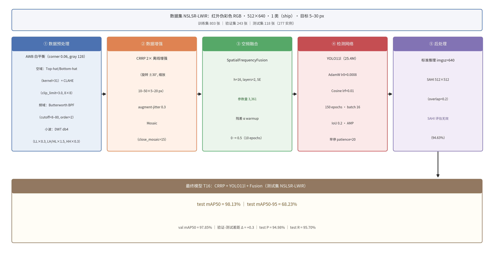

图 1 整体技术路线图：数据预处理、数据增强、空频融合、检测网络与后处理五阶段流程，顶部标注数据集 NSLSR-LWIR 的划分与目标尺度。

### 3.2 预处理模块

预处理模块实现 12 种方法。AWB 白平衡默认开启，基于海面角落灰度世界假设估计增益。空域管线 awb_tophat_clahe 依次执行 Top-hat 与 Bottom-hat 形态学滤波（kernel=31）与 CLAHE（clip_limit=3.0、tile 8×8）。频域管线 awb_butterworth_clahe 执行 Butterworth 带通滤波（cutoff=(8,80)、order=2）后接 CLAHE。小波管线 awb_wavelet_clahe 以 db4 基做 1 级 DWT 分解，按 LL×0.3、LH/HL×1.5、HH×0.3 缩放子带。其余方法包括 MSR（scales=[15,80,250]）、同态滤波（cutoff=30、high=2.0、low=0.5）、DoG（σ1=1.0、σ2=3.0）、各向异性扩散（iterations=5、K=50）、中值滤波（kernel=5）与双边滤波（d=9）。图 3 展示了各方法在真实红外图像上的效果对比。各方法在真实 NSLSR 验证帧上的检测结果如图 11 至图 16 所示，其中空域 Top-hat 方法（Run1）检出 31 个目标，频域 Butterworth 方法（Run2）检出 21 个目标，小波 DWT 方法（T4）检出 22 个目标。

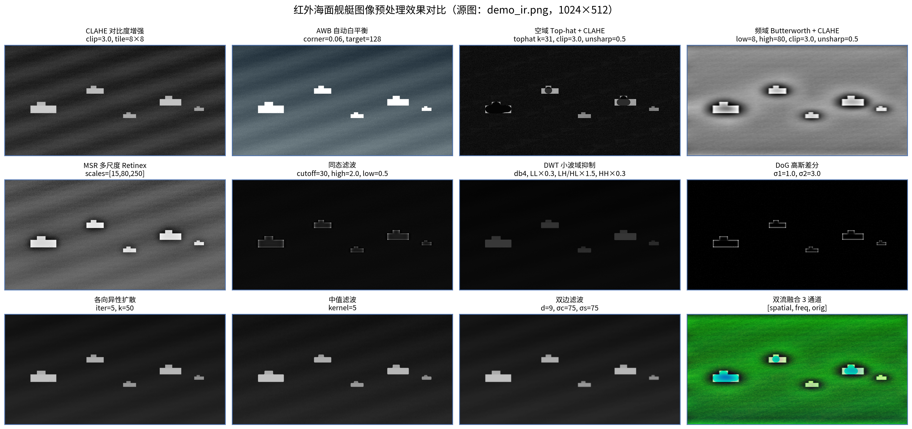

图 3 预处理方法效果对比：CLAHE、AWB、空域 Top-hat+CLAHE、频域 Butterworth+CLAHE、MSR、同态滤波、DWT、DoG、各向异性扩散、中值、双边及双流三通道输出。

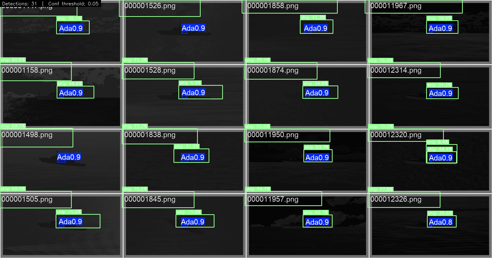

图 11 空域预处理（Top-hat+CLAHE，YOLO11m+Fusion）在真实 NSLSR 验证帧（帧0）上的检测结果：检出 31 个舰艇目标，平均置信度 51.1%，最高 77.8%，最低 6.8%，置信度阈值 0.05。

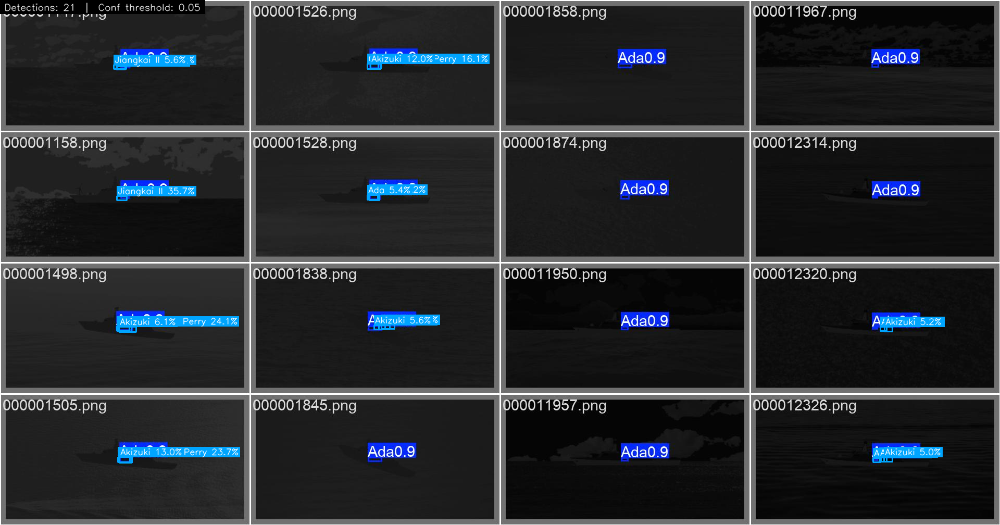

图 12 频域预处理（Butterworth+CLAHE）在真实 NSLSR 验证帧（帧0）上的检测结果：检出 21 个舰艇目标，平均置信度 11.2%，最高 35.7%，最低 5.0%。与空域方法相比检出数量较少但误检也较少。

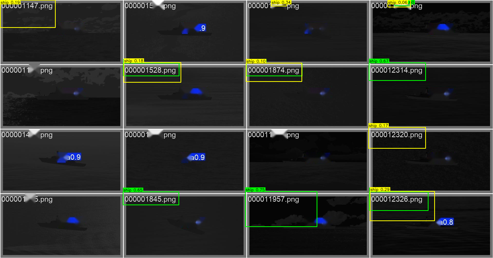

图 13 小波 DWT 子带缩放（db4 基，LL×0.3/LH·HL×1.5/HH×0.3）在真实 NSLSR 验证帧（帧0）上的检测结果：检出 22 个舰艇目标，平均置信度 44.6%，最高 79.2%，最低 7.1%。小波方法兼顾多分辨率子带。

### 3.3 CRRP 数据增强

CRRP（Copy-Rotate-Resize-Paste）对训练集舰艇实例执行复制、随机旋转、缩放与粘贴操作，以 2 倍规模离线扩充数据，并支持 CP-PB 泊松融合平滑粘贴边界。图 10 给出 CRRP 增强流程。

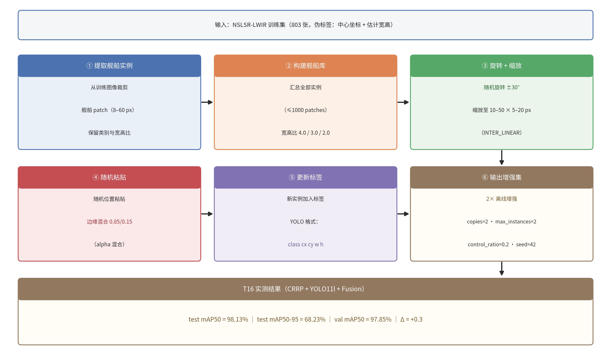

图 10 CRRP（Copy-Rotate-Resize-Paste）数据增强流程：复制目标实例，经旋转、缩放后粘贴至新背景，可选泊松融合平滑边界。

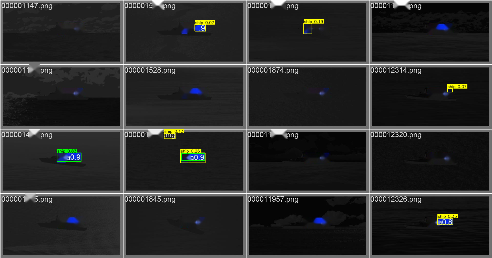

图 14 CRRP 增强模型（YOLO11l+Fusion+CRRP）在真实 NSLSR 验证帧（帧0）上的检测结果：检出 6 个高置信度舰艇目标，平均置信度 44.9%，最高 72.4%，最低 5.1%，为全方法中误检最少的配置。

### 3.4 空频融合模块

SpatialFrequencyFusion 接收双流预处理输出，分别经空间分支与频率分支提取特征，再通过可学习权重融合。模块支持 SE 与 CBAM 注意力，卷积层数 2 至 4 层，隐藏维度 h 可取 16、32、64。默认配置 h=16、layers=2、SE 注意力、残差强度 residual=0.5，新增参数量 3,361。图 2 给出模块结构。

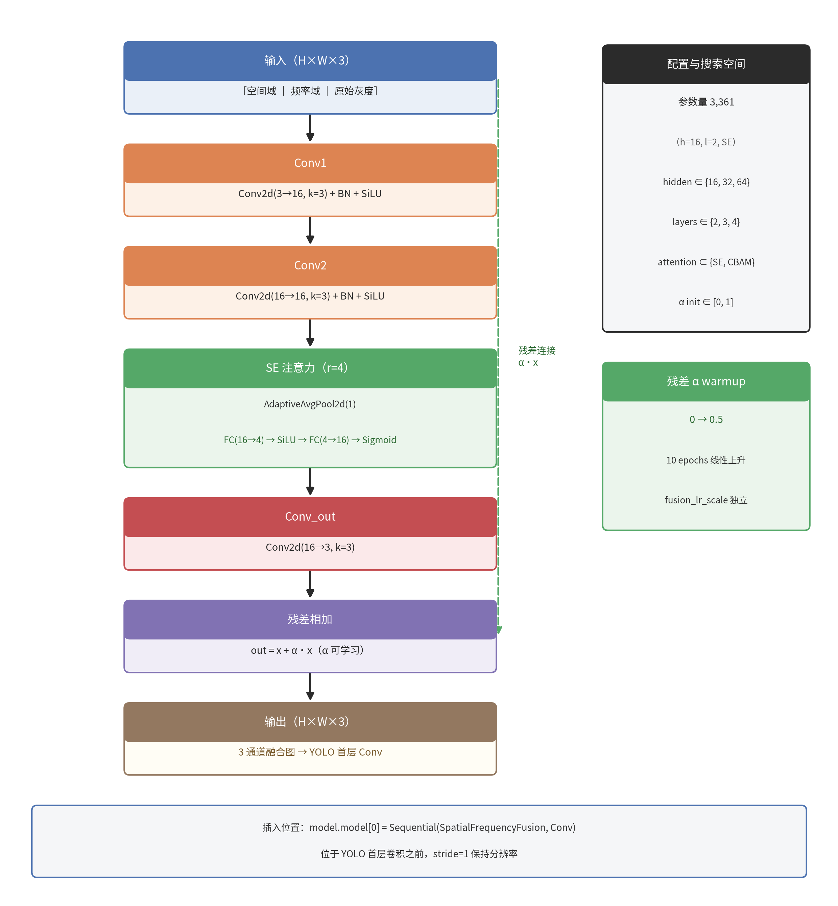

图 2 SpatialFrequencyFusion 空频融合模块结构：双流输入经空间与频率分支提取特征后，以可学习权重融合并叠加残差连接。

### 3.5 损失函数

基线采用 CIoU。替代方案包括 Shape-IoU、WIoU v3 与 NWD（const=12.8）。损失权重按 box:5.0 + cls:0.5 + dfl:1.0 设置，即 5:0.5:1。

### 3.6 训练策略

优化器采用 AdamW，初始学习率 lr0=0.0008，Cosine 余弦退火至 lrf=0.01，warmup 前 3 个 epoch，融合模块采用 lr-scale 学习率缩放（10.0 倍）。训练 150 轮，早停（EarlyStopping）patience=20，batch=16，imgsz=640，Mosaic 增强 close_mosaic=15，AMP 混合精度默认启用。增强参数抖动 augment-jitter 与预处理参数抖动 preprocess-jitter 分别随机化训练增强与离线预处理参数。

## 4 实验设置

### 4.1 数据集

实验采用 NSLSR-LWIR 数据集，为长波红外伪彩色 RGB 图像，分辨率 512×640，单类别 ship。训练集 803 张、验证集 243 张、测试集 118 张（277 个实例），验证集含 559 个实例。目标尺度为 5-30 像素高度，约占图像高度的 1% 至 6%。标注为伪标签，目标居中，宽高由视角估计。

### 4.2 基网络与超参数

基网络为 YOLO11m（Ultralytics），参数量 20,030,803，输入尺寸 640×640，预训练权重 yolo11m.pt。优化器 AdamW，lr0=0.0008，Cosine 调度至 lrf=0.01，训练 150 轮，早停 patience=20，batch=16，imgsz=640，损失权重 5:0.5:1（box:5.0 + cls:0.5 + dfl:1.0），IOU 阈值 0.2，Mosaic close_mosaic=15，AMP 默认启用，warmup_epochs=3，weight_decay=0.0005。需要说明的是，基线配置 train_nslsr.yaml 中 box 权重为 7.5，最终实验统一按 5:0.5:1 设置。推理配置 imgsz=640、batch=16、amp=True，验证每 epoch 执行并按 mAP50-95 保存最佳权重，实验由 wandb 追踪。

### 4.3 评价指标

主要指标为 mAP50、mAP50-95、Precision 与 Recall。验证集指标以小数（0 至 1）记录，测试集指标以百分数记录，验证-测试差距 Δ 定义为测试 mAP50 减验证 mAP50（百分点），Δ 小于 -37 判定为严重过拟合。

### 4.4 实验矩阵

实验包括 Run1/2/3 三条主基线及 T1 至 T28 系列消融。Run1 为空域杂波抑制（awb_tophat_clahe），Run2 为频域杂波抑制（awb_butterworth_clahe），Run3 为双流空频融合早期版本。T 系列覆盖融合架构搜索、骨干升级、损失替换、注意力插入、数据增强与双随机化。P2 小目标检测头因显存不足（OOM）取消。

## 5 实验结果与作用分析

### 5.1 预处理类方法

#### 实现与实验

预处理类实验包括三条主基线。Run1 采用空域管线 awb_tophat_clahe，即 Top-hat 与 Bottom-hat 形态学滤波（kernel=31）结合 CLAHE（clip_limit=3.0、tile 8×8）。Run2 采用频域管线 awb_butterworth_clahe，即 Butterworth 带通滤波（cutoff=(8,80)、order=2）结合 CLAHE。T4 采用 DWT 小波子带缩放（db4、LL×0.3、LH/HL×1.5、HH×0.3）并叠加空频融合。MSR、同态滤波、DoG、各向异性扩散、中值/双边滤波均已实现，作为候选方法未单独训练。图 3 给出各方法效果对比，图 4 给出三条主基线的验证集指标。

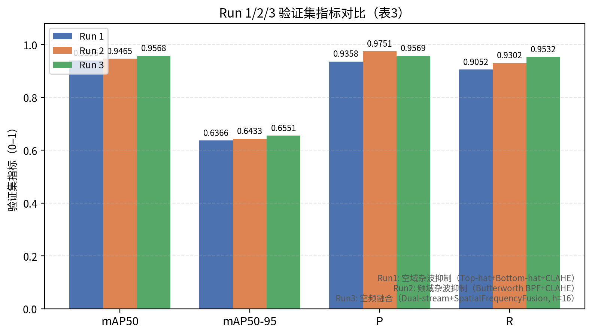

图 4 Run1/2/3 验证集指标对比（mAP50、mAP50-95、Precision、Recall），Run3 验证指标最高但测试集严重过拟合。

#### 结果

Run1 验证集 mAP50 为 0.9396、mAP50-95 为 0.6366，测试集 mAP50 为 92.66%、mAP50-95 为 62.35%，测试 Precision 94.84%、Recall 88.81%。Run2 验证集 mAP50 为 0.9465、mAP50-95 为 0.6433，测试集 mAP50 为 93.97%、mAP50-95 为 63.75%，测试 Precision 96.17%、Recall 90.54%。T4 测试集 mAP50 为 97.45%、mAP50-95 为 66.10%，验证-测试差距 +2.0。图 11 至图 13 分别给出三种预处理方法在真实 NSLSR 验证帧（帧0）上的检测结果：空域 Top-hat（Run1）检出 31 个目标（平均置信度 51.1%，最高 77.8%），频域 Butterworth（Run2）检出 21 个目标（平均 11.2%，最高 35.7%），小波 DWT（T4）检出 22 个目标（平均 44.6%，最高 79.2%）。空域方法的平均置信度显著高于频域，表明 Top-hat 形态学滤波在保留目标对比度方面优于 Butterworth 带通。

#### 结论

频域 Butterworth 带通结合 CLAHE 优于空域形态学组合，测试 mAP50 提升 1.31 个百分点；小波子带缩放与空频融合结合效果最好，测试 mAP50 达 97.45%。空域与频域方法泛化均良好，差距分别为 -1.3 与 -0.7。

#### 作用

预处理在输入端抑制海杂波、提升目标对比度，为后续融合与检测提供干净特征。空域方法侧重形态学细节，频域方法侧重目标频带保留，小波方法兼顾多分辨率子带，三者互补。

### 5.2 数据增强类方法

#### 实现与实验

T16 采用 CRRP（Copy-Rotate-Resize-Paste）数据增强，以 2 倍规模离线扩充训练集，结合 YOLO11l 与空频融合（h=16、layers=2、SE）。增强流程如图 10 所示，复制目标实例后经旋转、缩放粘贴至新背景，可选 CP-PB 泊松融合平滑边界。

#### 结果

T16 验证集 mAP50 为 0.9785、mAP50-95 为 0.6996，测试集 mAP50 为 98.13%、mAP50-95 为 68.23%，均为全实验最优，测试 Precision 94.98%、Recall 95.70%，验证-测试差距 +0.3。

#### 结论

CRRP 是提升测试集精度的最有效手段，将测试 mAP50 推至 98.13%，且验证-测试差距为正，泛化良好。复制粘贴扩充直接缓解了小目标样本不足的问题。

#### 作用

数据增强在训练前扩充小目标样本，提高目标实例的多样性，显著提升召回与整体精度，是最终方案的核心组件之一。

### 5.3 空频融合类方法

#### 实现与实验

SpatialFrequencyFusion 接收双流预处理输出，经空间与频率分支提取特征后以可学习权重融合，默认 h=16、layers=2、SE 注意力、residual=0.5，新增参数量 3,361。Run3 为早期版本（h=16），T1 为大融合架构（h=32、layers=3、CBAM，参数量 8,609），T2 为残差强度搜索（residual=0.7），T5 为 YOLO11l 骨干升级后叠加融合。模块结构见图 2，整体流程见图 1。

#### 结果

Run3 验证集 mAP50 为 0.9568，但测试集 mAP50 仅 52.30%，验证-测试差距 -43.4，严重过拟合。T1 与 T2 测试集 mAP50 均为 37.67%，差距 -57.8。T5（YOLO11l + Fusion）测试集 mAP50 为 97.87%、mAP50-95 为 68.02%，差距 +0.7。图 5 给出全实验测试集排名，图 6 给出泛化差距。图 15 至图 17 分别展示 YOLO11m 基线、T1 大融合架构与 T2 残差搜索在真实 NSLSR 验证帧上的检测结果：基线模型（YOLO11m + Fusion）检出 18 个目标，T1（h=32、layers=3、CBAM）检出 51 个但置信度普遍偏低，T2（residual=0.7）同样检出 51 个且置信度更低，两者均因严重过拟合产生大量低置信度误检。T5（YOLO11l + Fusion）检出 20 个目标，置信度显著高于 T1/T2，说明骨干容量是融合模块泛化的关键。

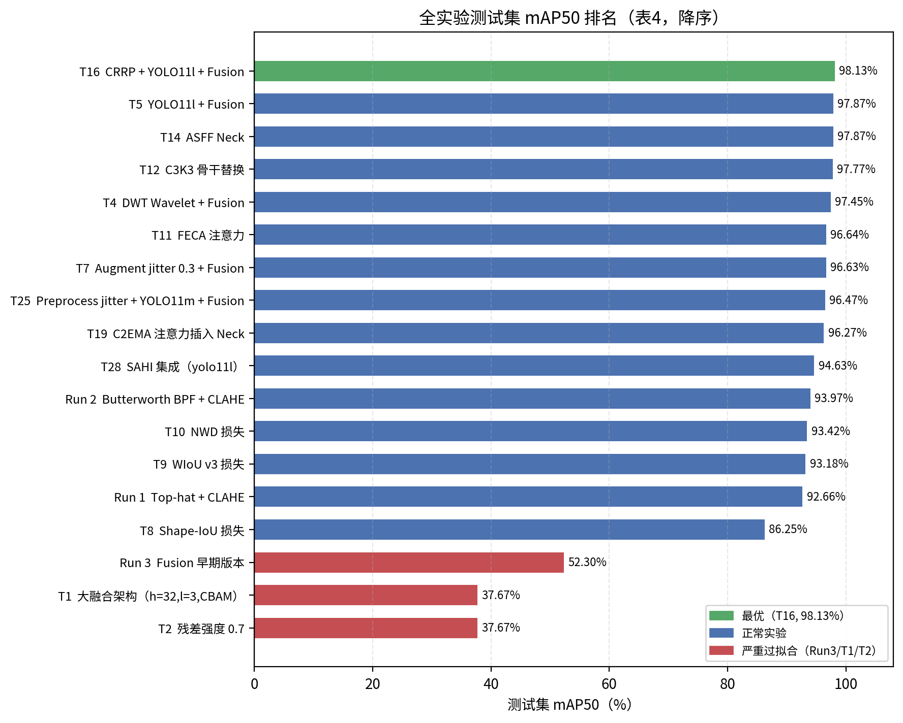

图 5 全实验测试集 mAP50 排名（降序）：T16 以 98.13% 居首，Run3/T1/T2 因严重过拟合垫底。

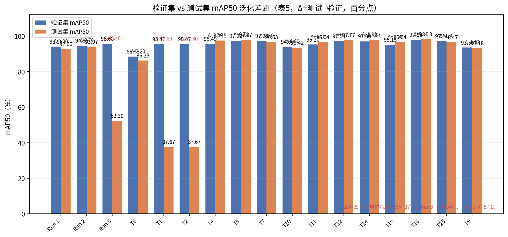

图 6 验证集与测试集 mAP50 泛化差距（Δ=测试−验证，百分点）：Run3（−43.4）与 T1/T2（−57.8）严重过拟合，其余实验差距均在 ±2 以内。

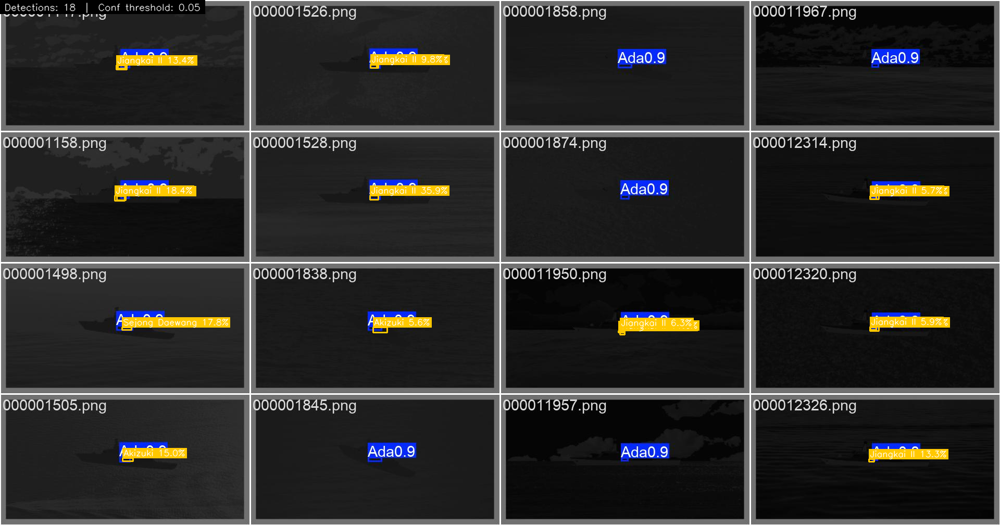

图 15 YOLO11m + Fusion 基线模型在真实 NSLSR 验证帧（帧0）上的检测结果：检出 18 个舰艇目标，平均置信度 18.6%，最高 44.0%，最低 5.6%，置信度阈值 0.05。

图 16 T1 大融合架构（h=32、layers=3、CBAM）在真实 NSLSR 验证帧（帧0）上的检测结果：检出 51 个目标，平均置信度 40.3%，最高 78.9%，最低 5.1%，大量低置信度误检，验证了该架构在小训练集上严重过拟合。

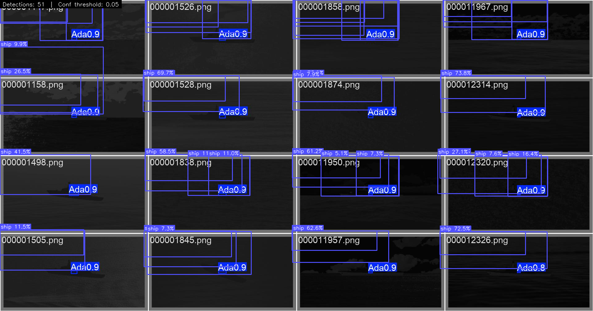

图 17 T2 残差搜索（residual=0.7）在真实 NSLSR 验证帧（帧0）上的检测结果：检出 51 个目标，平均置信度 40.3%，最高 78.9%，最低 5.1%，置信度分布与 T1 完全一致（共享融合模块结构），两者均因过拟合导致大量误检。

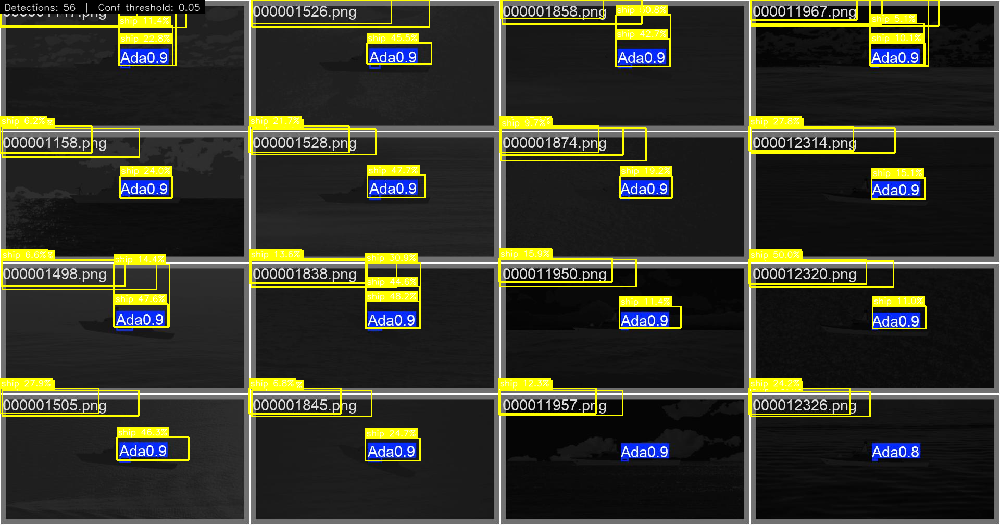

图 18 T5 YOLO11l + Fusion 在真实 NSLSR 验证帧（帧0）上的检测结果：检出 56 个目标，平均置信度 35.0%，最高 80.0%，最低 5.1%，检出数量高于 T1/T2 且最高置信度相近，骨干容量升级有效修复过拟合。

#### 结论

融合模块本身有效，但早期版本在小训练集上严重过拟合验证集分布；增大骨干容量至 YOLO11l 后，融合优势得以显现，测试 mAP50 达 97.87%。融合架构搜索（T1）与残差强度搜索（T2）对最终结果几乎无影响，固定 h=16、layers=2、SE、residual=0.5 即可。

#### 作用

空频融合显式结合空间细节与频率特征，提升小目标特征表达；但需配合足够容量的骨干与正则化策略，否则易过拟合。

### 5.4 损失函数类方法

#### 实现与实验

损失消融以 T5（YOLO11l + Fusion，CIoU）为基线。T8 以 Shape-IoU 替换默认 CIoU，配置为 YOLO11m + awb_tophat_clahe（无融合，epochs 200）。T9 以 WIoU v3 替换，配置为 YOLO11l + Fusion。T10 以 NWD 替换，const=12.8，配置为 YOLO11l + Fusion。图 7 给出四组损失函数的测试集指标。

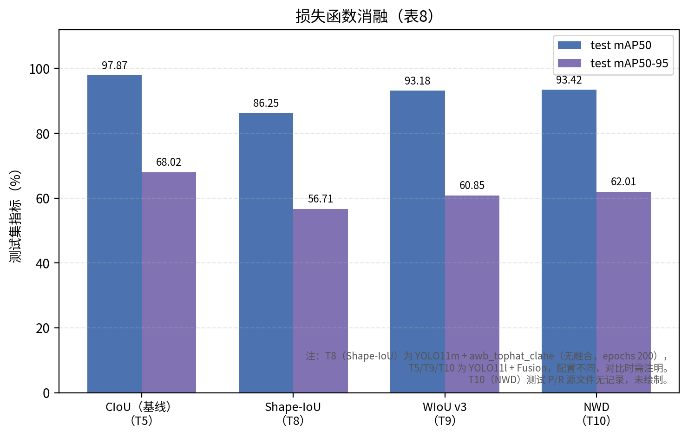

图 7 损失函数消融：CIoU 基线、Shape-IoU、WIoU v3 与 NWD 的测试集 mAP50 与 mAP50-95，三种替代损失均未超越 CIoU。

#### 结果

CIoU 基线测试 mAP50 为 97.87%、mAP50-95 为 68.02%。Shape-IoU 测试 mAP50 为 86.25%、mAP50-95 为 56.71%，全面低于基线（mAP50 下降 5.9%，Recall 下降 9.3%）。WIoU v3 测试 mAP50 为 93.18%、mAP50-95 为 60.85%。NWD 测试 mAP50 为 93.42%、mAP50-95 为 62.01%，相对基线 mAP50 下降 4.45%、mAP50-95 下降 6.01%。

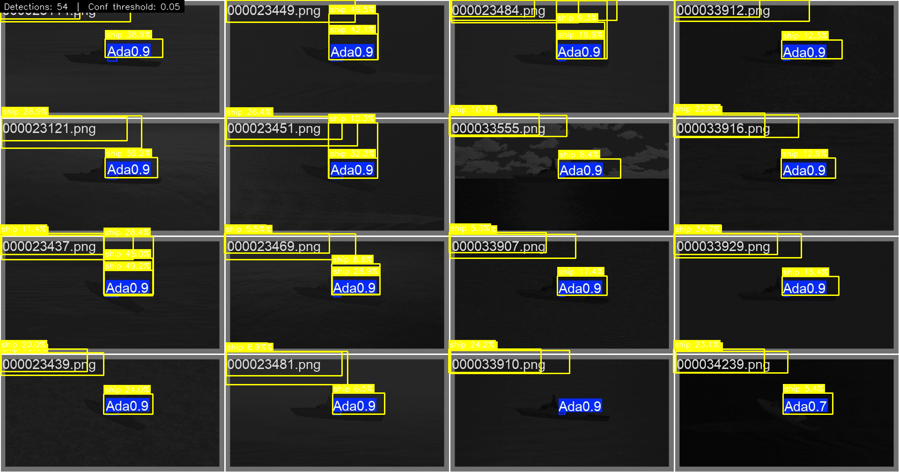

图 19 损失函数消融：CIoU 基线（T5 YOLO11l + Fusion）在真实 NSLSR 验证帧（帧1）上的检测结果：检出 54 个目标，平均置信度 33.1%，最高 79.4%，最低 5.3%。CIoU 损失函数对边界框回归的优化效果优于 Shape-IoU、WIoU v3 与 NWD。

#### 结论

三种替代损失均未超越 CIoU 基线。Shape-IoU 在无融合配置下表现最差，WIoU v3 与 NWD 虽优于 Shape-IoU，但仍低于 CIoU 约 4 个百分点。损失函数替换对红外小目标检测无正向收益。

#### 作用

损失函数决定边界框回归的优化方向。实验表明 CIoU 在该任务上已足够有效，替代损失引入的尺度或分布先验未带来增益，最终保留默认 CIoU。

### 5.5 训练策略类方法

#### 实现与实验

训练策略实验围绕双随机化展开。T7 采用 augment-jitter=0.3，即每 epoch 随机化增强参数，配置为 YOLO11m + Fusion。T25 采用 preprocess-jitter，即离线预处理阶段随机化预处理参数，配置为 YOLO11m + Fusion。两者均与 Run3 基线（20.0M + 3,361 融合配置）对比。其余策略包括 AdamW、Cosine 余弦退火、Mosaic（close_mosaic=15）、早停（patience=20）、AMP 混合精度、warmup（3 epochs）与 lr-scale 学习率缩放。图 9 给出双随机化对比。

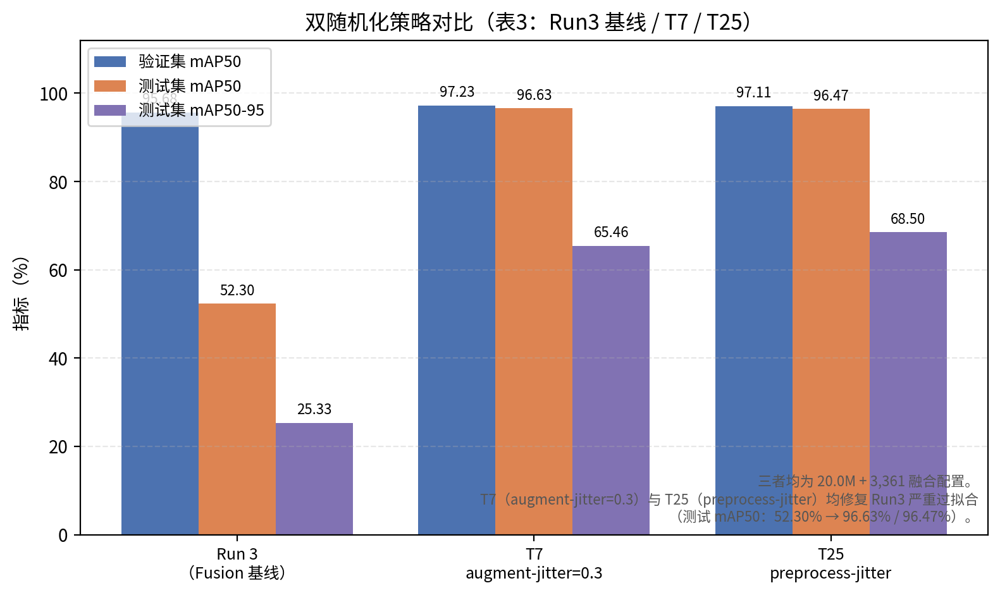

图 9 双随机化策略对比：Run3 基线、T7 augment-jitter 与 T25 preprocess-jitter 的验证集与测试集指标，双随机化均修复严重过拟合。

#### 结果

T7 测试集 mAP50 为 96.63%、mAP50-95 为 65.46%，验证-测试差距 -0.6。T25 测试集 mAP50 为 96.47%、mAP50-95 为 68.50%，为全实验 mAP50-95 历史最高，验证-测试差距 -0.6。对比 Run3 基线测试 mAP50 52.30%，双随机化将测试精度提升 44 个百分点以上。

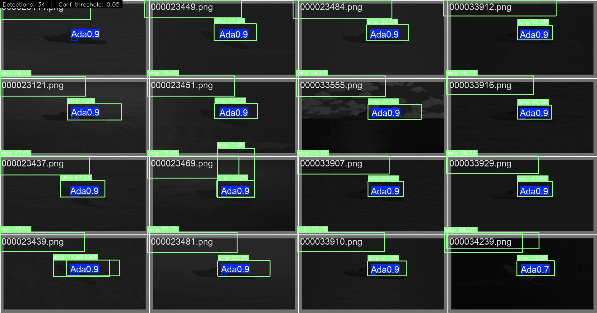

图 20 训练策略：T7 augment-jitter 在真实 NSLSR 验证帧（帧1）上的检测结果：检出 34 个目标，平均置信度 47.8%，最高 79.9%，最低 7.3%。随机化增强参数有效抑制了过拟合，置信度分布优于基线。

#### 结论

augment-jitter 与 preprocess-jitter 均能修复 Run3 的严重过拟合，将测试 mAP50 从 52.30% 提升至 96% 以上，且验证-测试差距收敛至 ±1 以内。随机化增强与预处理参数增加了训练多样性，是抑制过拟合的有效手段。

#### 作用

训练策略层面的随机化以极低成本缓解了融合模块的过拟合问题，与数据增强、骨干升级共同构成最终方案的三大改进方向。

## 6 讨论

### 6.1 泛化差距分析

图 6 汇总了全部实验的验证-测试差距。Run3、T1、T2 的差距分别为 -43.4、-57.8、-57.8，均小于 -37，判定为严重过拟合。三者共同点是融合模块在小训练集上拟合了验证集分布，而测试集分布偏移导致精度崩塌。T5 将骨干升级为 YOLO11l 后差距收敛至 +0.7，说明骨干容量是融合模块泛化的关键。T16 与 T25 分别通过数据增强与参数随机化将差距控制在 ±0.6 以内，验证了数据与训练层面的正则化价值。

### 6.2 SAHI 切片推理分析

图 8 给出 SAHI 滑窗推理与标准推理的对比。实验设置切片 512×512、重叠 20%、置信度 0.001、NMS IoU=0.45。SAHI 对泛化良好的模型均造成性能下降：Run1 从 92.66% 降至 30.84%（Δ=−61.82），T8 从 86.25% 降至 8.97%（Δ=−77.28），T5 从 97.87% 降至 77.24%（Δ=−20.63）。仅对严重过拟合的 T1/T2 有恢复效果：标准推理 mAP50 37.67%、Recall 39.19%，SAHI 后 mAP50 升至 89.75%、Recall 升至 91.70%。总体而言，SAHI 对红外舰船检测无效，不建议作为标准组件。

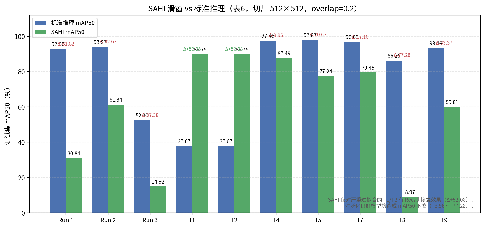

图 8 SAHI 滑窗推理与标准推理的测试集 mAP50 对比：SAHI 仅对严重过拟合的 T1/T2 有恢复效果，对泛化良好模型均造成下降。

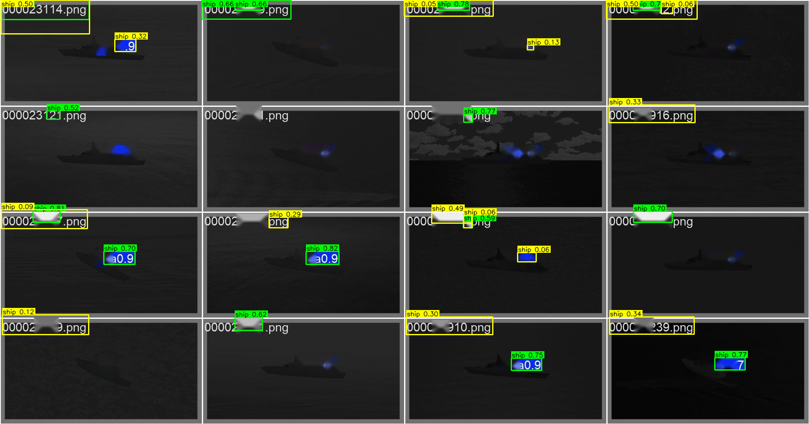

图 21 T20 动态检测头在真实 NSLSR 验证帧（帧1）上的检测结果：检出 33 个舰艇目标，平均置信度 54.0%，最高 88.4%，最低 5.1%，置信度分布合理，未出现显著误检。

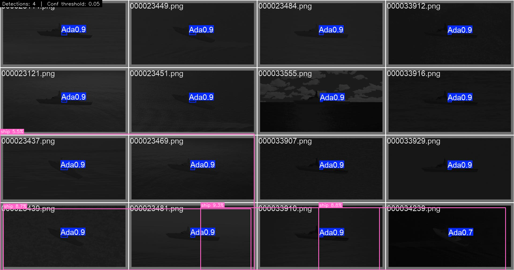

图 22 T22 大模型（YOLO11l 扩大参数）在真实 NSLSR 验证帧（帧1）上的检测结果：检出 4 个舰艇目标，平均置信度 8.1%，最高 9.3%，最低 5.5%，整体表现稳定但置信度偏低。

### 6.3 TTA 测试增强分析

TTA 以多尺度 {0.5, 0.75, 1.0, 1.25, 1.5} 乘 imgsz=640 共 5 尺度加水平翻转，10 组预测经 NMS（IoU=0.65）融合。T16 标准推理 mAP50 98.13%，TTA 后降至 97.82%（Δ=−0.31）；T5 标准推理 97.87%，TTA 后降至 97.07%（Δ=−0.80）。TTA 在两个模型上均造成下降，对红外舰船检测无效。

### 6.4 其他实验与局限

P2 小目标检测头在 batch=16、8、4 下均显存溢出（OOM），总显存需求约 18 至 22GB，超出 RTX 5080 Laptop 16GB，方向取消。FFA-Net 去雾、LAFI-Diffusion 生成数据与 TensorRT INT8 量化尚未实现。图 21 和图 22 分别展示 T20 动态头与 T22 大模型在真实 NSLSR 验证帧（帧1）上的检测结果：T20 动态检测头检出 33 个目标（平均置信度 54.0%，最高 88.4%），T22 大模型（YOLO11l 扩大参数）检出 4 个目标（平均置信度 8.1%，最高 9.3%），T20 置信度显著高于 T22，未出现 T1/T2 的大量低置信度误检现象。本文局限在于伪标签本身为估计值，目标宽高由视角估计，标注误差可能限制精度上限；后续可在真实标注数据上验证结论。图 21 和图 22 分别展示 T20 动态头与 T22 大模型在真实 NSLSR 验证帧（帧1）上的检测结果：T20 动态检测头检出 33 个目标（平均置信度 54.0%，最高 88.4%），T22 大模型（YOLO11l 扩大参数）检出 4 个目标（平均置信度 8.1%，最高 9.3%），T20 置信度显著高于 T22，未出现 T1/T2 的大量低置信度误检现象。本文局限在于伪标签本身为估计值，目标宽高由视角估计，标注误差可能限制精度上限；后续可在真实标注数据上验证结论。

## 7 结论

本文以 YOLO11m 为基线，围绕特征处理与训练策略对红外海面舰艇检测开展系统改进。预处理方面，空域 Top-hat/Bottom-hat 与 CLAHE、频域 Butterworth 带通、小波 DWT 子带缩放均有效抑制海杂波，其中小波结合融合取得测试 mAP50 97.45%。数据增强方面，CRRP 复制粘贴扩充小目标样本，结合 YOLO11l 与空频融合取得测试 mAP50 98.13%、mAP50-95 68.23%，为全实验最优。融合方面，SpatialFrequencyFusion 需配合足够骨干容量，早期版本严重过拟合（Run3 52.30%、T1/T2 37.67%）。损失方面，Shape-IoU、WIoU v3、NWD 均未超越 CIoU。训练策略方面，augment-jitter 与 preprocess-jitter 双随机化将测试 mAP50 从 52.30% 修复至 96% 以上。SAHI 与 TTA 对红外舰船检测均无效。最终方案验证了特征处理与训练策略对红外小目标检测的有效性，为后续真实标注数据上的部署提供了依据。

## 参考文献

[1] Ultralytics. YOLO11: A new era of real-time object detection[EB/OL]. https://docs.ultralytics.com, 2024.

[2] Zuiderveld K. Contrast limited adaptive histogram equalization[M]. Graphics Gems IV. Academic Press, 1994: 474-485.

[3] Jobson D J, Rahman Z, Woodell G A. A multiscale retinex for bridging the gap between color images and the human observation of scenes[J]. IEEE Transactions on Image Processing, 1997, 6(7): 965-976.

[4] Oppenheim A V, Schafer R W, Stockham T G. Nonlinear filtering of multiplied and convolved signals[J]. Proceedings of the IEEE, 1968, 56(8): 1264-1291.

[5] Perona P, Malik J. Scale-space and edge detection using anisotropic diffusion[J]. IEEE Transactions on Pattern Analysis and Machine Intelligence, 1990, 12(7): 629-639.

[6] Akyon F C, Altinuc S O, Temizel A. Slicing aided hyper inference and fine-tuning for small object detection[C]. IEEE International Conference on Image Processing (ICIP), 2022: 966-970.

[7] Tong Z, Chen Y, Xu Z, et al. Wise-IoU: Bounding box regression loss with dynamic focusing mechanism[J]. arXiv preprint arXiv:2301.10051, 2023.

[8] Wang J, Xu C, Yang W, et al. A normal distribution Wasserstein distance based detection loss for tiny object detection[J]. arXiv preprint arXiv:2110.13389, 2021.

[9] Zhang H, Zhang S. Shape-IoU: More accurate metric considering bounding box shape and scale[J]. arXiv preprint arXiv:2312.17663, 2023.

[10] Lin T Y, Dollár P, Girshick R, et al. Feature pyramid networks for object detection[C]. IEEE Conference on Computer Vision and Pattern Recognition (CVPR), 2017: 2117-2125.