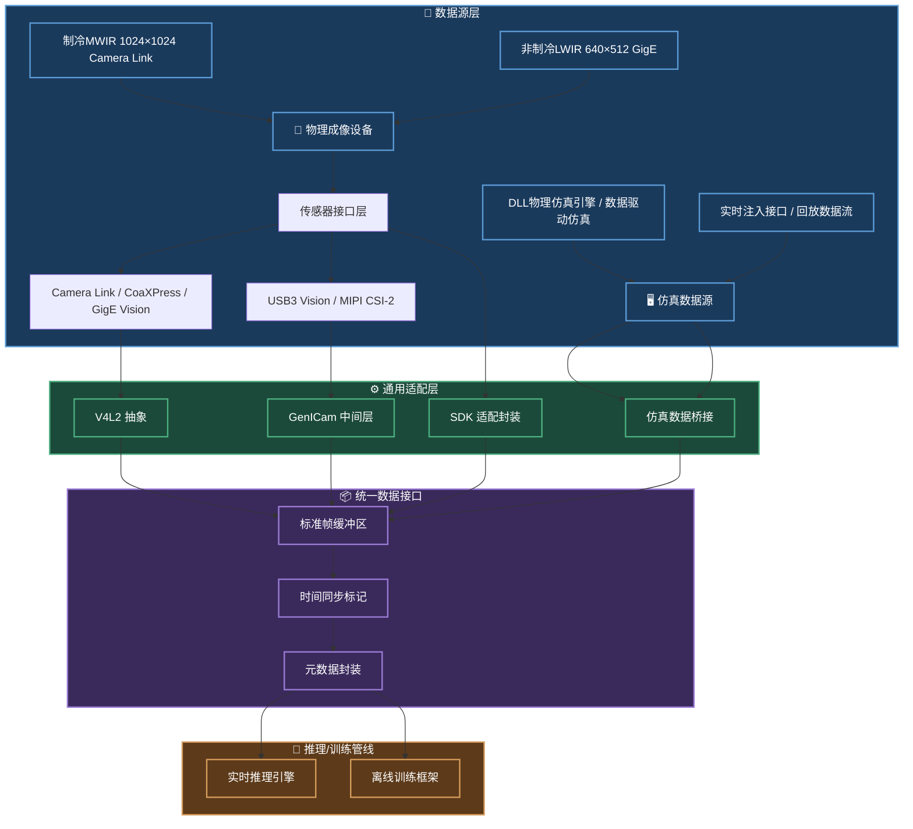
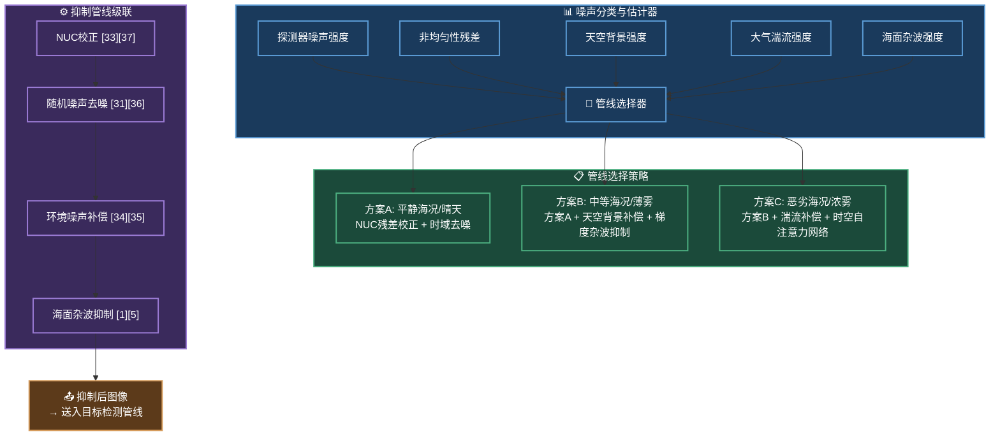
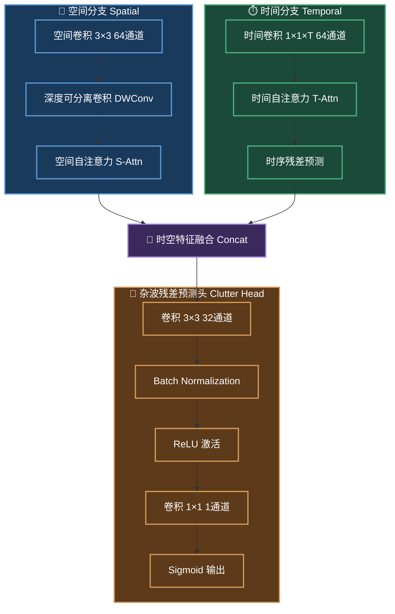
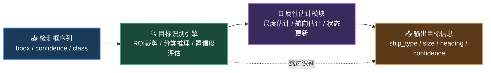
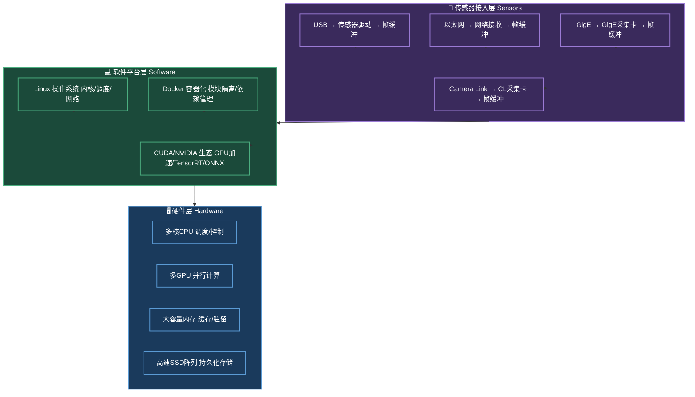
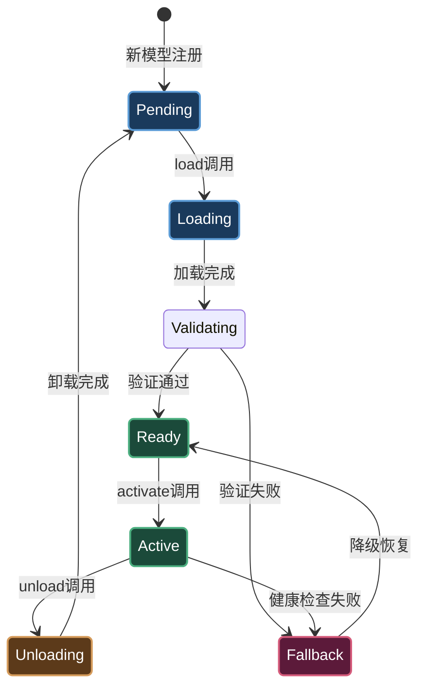
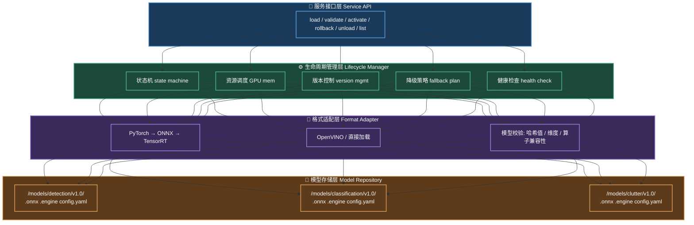
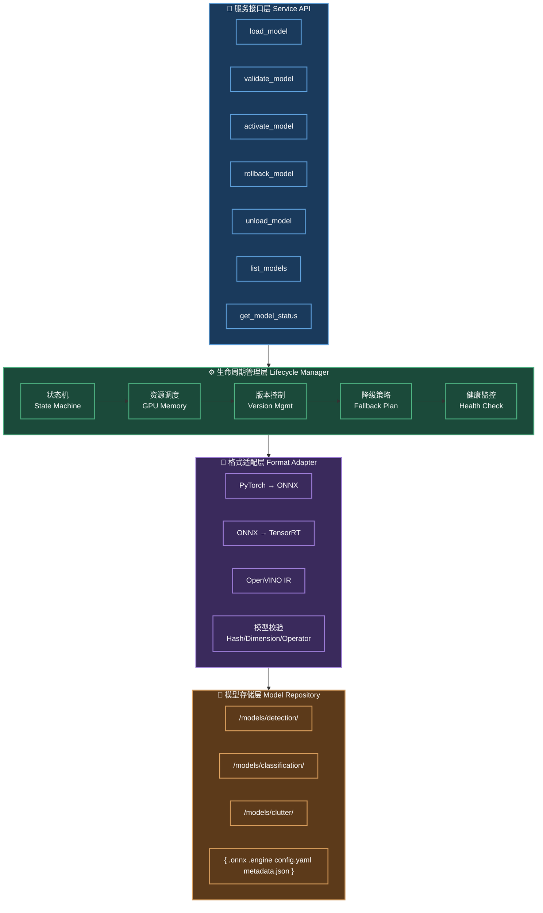

# 红外波段海面舰艇识别系统核心方案


## 缩略语和符号对照表


本表列出本文档中使用的主要缩略语和数学符号，方便读者快速查阅。


### 缩略语

| 缩略语 | 英文全称 | 中文释义 |
|--------|----------|----------|
| CLAHE | Contrast Limited Adaptive Histogram Equalization | 对比度受限自适应直方图均衡化 |
| CoaXPress | Coaxial Express | 同轴高速视频接口 |
| CUDA | Compute Unified Device Architecture | 统一计算设备架构（NVIDIA GPU编程） |
| DLL | Dynamic Link Library | 动态链接库 |
| DSP | Digital Signal Processor | 数字信号处理器 |
| FFT | Fast Fourier Transform | 快速傅里叶变换 |
| FPS | Frames Per Second | 每秒帧数 |
| GenICam | Generic Interface for Cameras | 相机通用接口规范 |
| GUI | Graphical User Interface | 图形用户界面 |
| IR | Infrared | 红外 |
| LLM | Large Language Model | 大语言模型 |
| LWIR | Long-Wave Infrared | 长波红外（8-14μm） |
| MCT | Mercury Cadmium Telluride | 碲镉汞（红外探测器材料） |
| MWIR | Mid-Wave Infrared | 中波红外（3-5μm） |
| NETD | Noise Equivalent Temperature Difference | 噪声等效温差 |
| NMS | Non-Maximum Suppression | 非极大值抑制 |
| NUC | Non-Uniformity Correction | 非均匀性校正 |
| PTP | Precision Time Protocol | 精确时间协议（IEEE 1588） |
| ROI | Region of Interest | 感兴趣区域 |
| RMS | Root Mean Square | 均方根 |
| SNR | Signal-to-Noise Ratio | 信噪比 |
| STF | Space-Time Filter | 空时滤波器 |
| TensorRT | Tensor Runtime | NVIDIA高性能推理引擎 |
| USB3 Vision | USB3 Vision | 基于USB 3.0的机器视觉标准 |
| V4L2 | Video for Linux 2 | Linux视频采集框架 |
| VOx | Vanadium Oxide | 氧化钒（非制冷红外探测器材料） |
| WFS | Wavefront Sensor | 波前传感器 |
| YOLO | You Only Look Once | 一次过目标检测网络 |
| ZeroMQ | ØMQ | 高性能消息队列库 |


### 数学符号


| 符号 | 含义 | 单位 |
|------|------|------|
| $B(\lambda, T)$ | 普朗克黑体辐射光谱出射度 | W/(m³·sr) |
| $	au(\lambda)$ | 大气透过率 | — |
| $L_p$ | 大气路径辐射辐亮度 | W/(m²·μm·sr) |
| $\epsilon$ | 表面发射率 | — |
| $T_s$ | 表面温度 | K |
| $\Delta T$ | 目标与背景温差 | K |
| $\sigma$ | 标准差 | — |
| $C_n^2$ | 大气折射率结构常数 | m⁻²/³ |
| $r_0$ | 大气相干长度（Fried参数） | m |
| $	ext{SNR}$ | 信噪比 | dB |
| $	ext{NETD}$ | 噪声等效温差 | mK |
| $f(x,y)$ | 输入图像灰度分布 | — |
| $s_k$ | 灰度映射结果 | — |


# 1 方案概述


本文档为核心技术方案精简版，涵盖接口设计、图像处理、目标识别及软件工程化设计。


本章概述：本章从系统定位、技术路线和文档结构三个维度对红外海面舰艇识别方案进行全局性描述。系统定位于复杂海况下的全天候海洋目标监视，采用物理建模与深度学习相结合的混合技术路线，以单台高性能PC工作站为统一计算载体，集成杂波抑制、目标检测与识别全流程。性能设计遵循定性目标导向，在不同海况和距离尺度下均保持稳定的检测与识别能力，为后续章节的展开提供框架性背景。


## 1.1 系统定位与任务需求


本系统面向海洋监视、海上安防及军事应用中的红外海面舰艇识别任务，核心能力是在复杂海况条件下对海面舰艇目标进行实时检测，相关光电传感器视频处理技术为海洋监视场景提供了成熟方法[10]。在复杂海况下，杂波干扰是红外舰艇检测的主要挑战，需要在算法层面进行针对性抑制[18]。、类型识别和运动跟踪。系统需要在不同距离尺度和多样化海况环境中保持稳定工作能力。在近距离监视场景中，目标呈现较为完整的热辐射轮廓，检测与分类均具有较好的特征基础。在中距离巡逻监视场景下，目标热特征开始缩小，主要依靠局部热源和高对比度边缘进行目标定位。在远距离广域监视任务中，目标可能退化为几个像素甚至点源形态，此时系统需依赖时空联合分析和多帧累积策略维持有效探测。系统需要覆盖从平静海面到恶劣海况的多种工作环境，同时兼顾昼夜两种光照条件下的连续运行能力，确保全天候不间断的海洋目标监视能力[5, 11]。


## 1.2 技术路线与核心架构


本方案采取物理建模驱动与深度学习增强相结合的混合技术路线。物理层基于红外辐射传输方程和海面热力学模型构建场景先验知识，为后续算法设计提供可解释性和约束条件。算法层以深度学习网络为主体，融合传统信号处理方法在边缘检测和时序分析方面的鲁棒性优势，形成杂波抑制、目标检测、目标识别三个核心模块的流水线处理架构。系统级架构采用单台高性能PC工作站的统一计算模式。传感器通过高速采集接口直接接入工作站，所有数据处理流程——包括数据采集、初级检测、跟踪识别、态势分析和可视化展示——均在同一物理节点内以多进程方式执行。工作站搭载多块高性能GPU和充足系统内存，通过共享内存和CUDA IPC实现进程间高效数据传递，避免分布式架构中跨节点通信的网络延迟与协议转换复杂性。在空闲时段，同一套GPU资源还可用于模型增量训练和仿真数据生成，实现推理与训练的资源共享与协调调度[4, 9]。


## 1.3 方案文档结构


本文档按技术链路自上而下组织：第2章阐述红外辐射物理基础，论述红外辐射传输方程、海面舰艇热辐射特征与海面背景特性；第3章阐述系统接口与协议适配设计，论述面向多种相机设备和仿真程序接入的通用接口架构；第4章论述对比度增强与细节提升技术，涵盖梯度滤波与细节增强管线的设计；第5章详述自适应噪声抑制方案，包括时空自注意力预测噪声抑制策略；第6章论述多尺度跨场景目标识别技术，覆盖多尺度目标检测与跨场景识别架构；第7章详述系统软件工程化设计，包括系统架构、模块化设计、数据存储与部署方案。


## 1.4 系统性能目标


系统性能设计遵循定性目标导向原则，各项指标以满足实际任务需求为准。在目标检测方面，系统需要在不同海况条件下均能维持较高检测率，平静海况下追求近乎完全的目标覆盖，中等海况下保证绝大部分目标被捕获，恶劣海况下维持可接受的探测水平。虚警控制方面，要求在每一帧图像中将误报数量压制到极低水平，避免频繁虚警导致跟踪链路断裂。舰艇类型识别方面，系统应能够对常见舰艇类别进行可靠区分。延迟方面，工作站本地检测流水线需达到实时级响应速度，本地跟踪识别模块在保持精度的前提下控制处理时延。目标持续识别率方面，在目标持续可见的条件下应维持高度稳定的时序关联能力[5, 11]。


> **配图建议**


>**图1-1 系统总体架构图**


*配图说明：* 展示本系统总体架构。顶层为"红外传感器阵列"（非制冷LWIR 640×512 GigE网口相机 + 制冷MWIR 1024×1024 Camera Link相机）与"仿真数据源"（DLL物理仿真引擎，支持实时注入与回放），向下连接"接口适配与数据采集层"，再向下分为三个并行处理分支：左侧"杂波抑制管线"（梯度滤波→时空自注意力预测），中间"IR-YOLO检测网络"，右侧"目标识别与属性估计模块"。三者在底部汇聚至"可视化与存储输出"层。背景以高性能PC工作站（多GPU加速）为核心标识。


*Image Prompt（学术风格）：* System architecture diagram. Top: dual-band IR sensor array (LWIR + MWIR). Middle: interface adaptation and data acquisition layer. Three parallel processing branches: Left - clutter suppression pipeline (gradient filtering → spatio-temporal attention), Center - IR-YOLO detection network, Right - target recognition and attribute estimation. Bottom: visualization and storage output. GPU-accelerated workstation as core identifier. Monochrome IEEE journal style.


# 2 红外辐射物理基础


本章概述：本章从物理基础层面建立红外海面舰艇识别的理论根基。任何高于绝对零度的物体均持续辐射电磁波，其光谱分布由普朗克定律决定，这构成了舰艇与海面在红外图像中产生对比度的根本原因。地球大气对红外辐射具有强烈的波长选择性吸收，形成中波和长波两个主要透射窗口，系统据此选择探测波段。舰艇不同部位的热辐射特征差异、海面温度场的时空变化、太阳反射和海浪动态等环境因素共同决定了红外海面观测中目标可探测性的物理极限。本章的物理分析为后续章节中传感器选型、算法设计和性能评估提供了理论约束和先验知识。


## 2.1 红外辐射物理基础


任何温度高于绝对零度的物体都会持续向外辐射电磁波，其光谱辐射出射度由普朗克定律精确描述。该定律揭示了黑体辐射的光谱分布与温度之间的内在关系，表明随着温度的升高，辐射峰值波长向短波方向移动，同时总辐射功率急剧增加。这一基本物理规律是红外成像技术的理论根基，决定了不同温度目标在红外波段所呈现的辐射特征差异。在实际应用场景中，海面舰艇及其周围环境可近似为灰体辐射源，需引入表面发射率进行修正。发射率是材料固有属性与表面状态的函数，与海况、观测角度及材料类型密切相关。不同材料在红外波段的发射率差异，构成了舰艇与海面在红外图像中产生对比度的物理根源[5, 15]。


地球大气对红外辐射的吸收和散射具有强烈的波长选择性，主要由水蒸气和二氧化碳等分子的选择性吸收造成。MODTRAN4大气传输模型为红外波段透过率预测提供了工程级计算框架[15]。大气中存在两个主要的红外透射窗口，分别对应中波红外波段和长波红外波段。在中波红外窗口内，大气透过率通常较高，该波段包含目标的反射辐射和自身热辐射分量，在太阳辐射较强的日间探测场景中表现出独特的优势。长波红外窗口以目标自身热辐射为主，受太阳反射影响较小，因而在昼夜探测性能上具有更好的稳定性。大气透过率和路径辐射可通过辐射传输模型进行计算，其中路径辐射在远距离探测中不可忽略——远距离探测时的大气路径辐射可能占显著比例，直接影响传感器接收到的有效信号强度。


## 2.2 海面舰艇红外辐射特征


舰艇作为复杂金属结构平台，其不同部位在红外波段的辐射强度存在显著差异。多波段（SWIR与LWIR）红外图像融合能够综合利用不同波段目标辐射特性的互补信息，显著提升复杂海况下的检测鲁棒性[2]。红外仿真成像技术则为系统开发和测试阶段的数据准备提供了有效手段[9]。发动机舱和烟囱是红外特征最强的区域，燃气轮机或柴油机排出的高温废气在红外图像中呈现为最为亮的热源区域，其辐射强度远超周围环境。舰体上层建筑的红外辐射主要受舱内设备散热和空调系统影响，通常比周围海面温度高出一定的幅度，形成可辨识的热信号轮廓。舰体水线以下部分因与水直接接触，表面温度趋于接近海面温度，在红外图像中几乎不可见，这一特性使得舰艇在红外成像中呈现为具有明显温度梯度的立体结构[5, 12]。


舰艇尺寸与红外特征之间存在明确的量化关系。目标在红外图像中的表现尺寸受距离、光学系统分辨率和大气湍流共同影响。在远距离条件下，中小型舰艇在红外图像中占据的像素数量有限，其空间扩展性微弱，表现为近似点源或小目标形态，这对检测算法提出了更高的灵敏度和精度要求。舰艇航行时产生的尾迹在红外成像中可延伸至舰体后方相当的距离范围，尾迹温度通常高于周围海水，为远距离探测提供了额外的辅助特征。舰艇航行状态对红外特征产生显著调制作用：航速变化改变化功系统热负荷，高速航行时发动机排温升高；航行姿态变化改变舰体各部位朝向红外传感器的角度，影响辐射特征的投影分布；停泊状态下的红外特征与航行状态存在本质差异，停泊舰艇的红外对比度大幅降低，检测难度显著增加。


## 2.3 海面红外背景特性


海面温度分布呈现明显的空间非均匀性和时间时变性。宏观尺度上，太阳辐射加热导致海面表层温度在晴朗白天可比深层海水高出一定的幅度，形成海洋热层结构；夜间因长波辐射冷却趋于均匀，温度梯度逐渐减小。海面温度的空间波动频谱遵循海洋动力学的标度律，在不同尺度范围内呈现幂律分布特征，这意味着海面背景的统计特性具有自相似性，在不同观测尺度下表现出相似的模式。这种温度分布的不均匀性在红外图像中表现为复杂的背景纹理，构成舰艇检测的主要干扰来源[5, 12]。


太阳辐射对海面红外成像的影响具有显著的角度依赖性。在海面镜反射区，太阳直射光的反射辐亮度可超过目标自身热辐射数个数量级，形成强烈的亮斑干扰，严重影响目标的可见性。当观测天顶角超过某一临界值时，海面反射率急剧上升导致有效发射率明显下降，目标与背景的对比度显著降低。海浪运动是海面红外背景中最动态的干扰源：短波长毛细波和长波长重力波通过改变海面局部法向和发射率分布，在红外图像中形成明暗交替的纹理结构，其空间频率和时间变化特性与舰艇目标存在重叠，增加了基于特征分离的检测难度。海浪产生的泡沫和碎屑区因含有大量空气气泡，其红外辐射特性与平静水面存在显著差异，泡沫区发射率更高且温度更接近空气温度，在红外图像中形成与舰艇尾迹相似的高亮区域，极易产生误检。


> **本章总结配图建议**


> **图2-1 红外辐射物理与探测几何示意图**


> *配图说明：* 展示本系统两种数据源输入下的红外探测几何关系。左侧：两台红外变焦相机（制冷型 MWIR 1024×1024 Camera Link 相机 + 非制冷 LWIR 640×512 GigE 网口相机）通过三脚架安装在观测平台，分别对中波窗口（3.7-4.8μm）和长波窗口（8-14μm）成像；同时标注仿真数据源通过 DLL 调用注入同一管线。右侧：探测场景剖面图，标注太阳天顶角、观测角度、舰艇位置、大气路径和路径辐射。底部：舰艇红外辐射光谱分布曲线，叠加大气透过率窗口，标注发动机高温区（>500K）和中低温舰体区（~300K）的峰值波长。


> *Image Prompt（学术风格）：* IR detection geometry diagram. Left: dual camera setup on observation platform — cooled MWIR 1024x1024 Camera Link camera and uncooled LWIR 640x512 GigE camera on tripod, with simulation DLL data source feeding into same pipeline. Right: scene cross-section showing solar zenith angle, observation angle, ship position, atmospheric path and path radiance. Bottom: ship IR radiation spectrum overlaid with atmospheric transmission windows, annotating engine hot zone (>500K) and hull zone (~300K). Monochrome IEEE journal style.


# 3 接口与协议适配设计


本章概述：本章论述系统的接口适配与数据采集架构。红外成像领域存在多种传感器接口标准，各标准在传输速率、距离和适用场景上各有差异。本方案采用模块化驱动架构和统一的软件抽象层，屏蔽底层硬件差异，使系统能够灵活接入不同厂商和协议的红外传感器以及各类仿真数据源。同时，本章阐述了多传感器时间同步策略、数据格式标准化以及生产者-消费者模型下的帧缓冲设计，为后续算法管线提供稳定可靠的数据输入保障。




## 3.1 红外成像传感器接口规范


红外成像传感器的信号输出接口是实现数据采集与系统集成的关键纽带。当前红外成像领域存在多种主流接口标准，每种标准在设计哲学、传输速率、传输距离和适用场景上各有侧重。Camera Link 接口基于并行 LVDS 传输，提供高带宽低延迟的数据传输能力，广泛应用于中短距离的工业红外成像场景，其并行架构能够直接匹配多数红外焦平面探测器阵列的读出速率。CoaXPress 接口采用串行同轴传输，在单根同轴电缆上即可实现高带宽双向通信，支持远程供电和触发信号传输，特别适用于需要较长线缆距离的高性能红外成像平台。GigE Vision 接口基于以太网传输协议，利用标准的 RJ45 接口和网线实现红外图像数据传输，具有布线灵活、传输距离远、成本可控的优点，尤其适合分布式多传感器组网部署。USB3 Vision 接口将 SuperSpeed USB 协议与 GenICam 规范相结合，提供即插即用的便捷性和较高带宽，适用于对集成速度和开发效率要求较高的应用场景。MIPI CSI-2 接口则是面向高集成度场景的设计，以低功耗、高密度引脚排列和高传输效率为特点，广泛应用于机载、星载等空间和功耗受限的红外成像系统[5, 13]。


为实现对多种接口协议的统一兼容，本系统设计了通用的接口适配层，其核心思想是将不同物理接口的差异在底层进行隔离和转换，向上层提供标准化的数据接口。适配层采用模块化驱动架构，每种接口协议对应独立的驱动模块，负责处理该协议特有的物理层收发、链路层帧解析、传输层数据重组等底层操作。所有驱动模块统一实现标准的接口协议，包括设备枚举与初始化、参数配置、数据流控制、帧缓冲获取和错误处理等核心功能。这种设计使得上层应用无需感知底层接口差异，仅通过统一的接口调用即可接入任意协议类型的红外成像传感器。适配层同时支持热插拔检测和在线切换机制，能够在系统运行过程中动态识别接入的设备类型并自动加载对应的驱动模块，确保系统在不同硬件配置下均能稳定运行。


接口适配层的设计还需考虑红外成像传感器的特殊需求。红外焦平面探测器通常需要进行非均匀性校正、暗电流补偿和温度漂移修正等预处理操作，这些操作的实现方式因探测器型号和接口协议而异。适配层将传感器特定的预处理功能封装为可插拔的处理管线，根据设备类型自动选择对应的预处理配置。同时，适配层保留了原生数据流直通模式，允许上层算法在需要时获取未经任何处理的原始数据，以确保算法验证和模型训练阶段的输入数据保真度。这种灵活的设计兼顾了工程应用的便利性和算法研究的自由度，使得同一套系统既可以部署到生产环境进行实时检测，也可以接入研究环境进行算法开发和验证。


本系统在接口适配层中预置了典型红外变焦相机的参数配置文件，以两种代表性的红外变焦成像设备作为适配基准。第一种为制冷型中波红外变焦相机，采用碲镉汞（MCT）探测器，分辨率 1024×1024，像元尺寸 15μm，工作波段 3.7-4.8μm，制冷机工作温度 ≤77K，NETD ≤20mK@f/2.0，配备电动变焦镜头（焦距范围 15mm-150mm，变倍比 1:10），支持 Camera Link 全端口（Full CL，12pin + 2pin）或 CoaXPress 接口（6G/12G CoaXPress），输出 16-bit RAW 辐射值数据，帧率可达 60fps@1024×1024（Camera Link 全端口模式），具备帧同步触发输入输出接口，支持外部 PTP 时间同步。第二种为非制冷长波红外变焦相机，采用氧化钒（VOx）微测辐射热计探测器，分辨率 640×512，像元尺寸 12μm，工作波段 8-14μm，NETD ≤40mK@f/1.2，配备电动变焦镜头（焦距范围 25mm-250mm，变倍比 1:10），支持 GigE Vision（单网口 1Gbps）或 USB3 Vision 接口，输出 14-bit 或 16-bit RAW 辐射值数据，帧率 30fps@640×512（GigE 模式），具备 GenICam 标准参数配置接口，支持通过 GigE 或 USB 总线进行远程参数控制（积分时间、增益、非均匀性校正模式等）。


针对上述两类典型红外变焦相机，适配层建立了统一的参数映射表，将不同接口协议下的设备控制参数标准化。对于 Camera Link 接口接入的制冷型 MWIR 相机，适配层通过 Camera Link 基带控制器（如 XIMEA 或 e-con Systems 采集卡）获取帧数据，利用 GenICam TL（Transport Layer）实现参数读写，将镜头变倍控制、制冷温度设定、积分时间调节等映射为标准 GenICam SFNC 命名空间。对于 GigE Vision 或 USB3 Vision 接口接入的非制冷 LWIR 相机，适配层直接通过 GenICam 标准接口进行配置，利用 ONVIF Profile M 协议实现变焦镜头的远程控制（Zoom/Focus/Iris），并通过 GigE 的组播机制或 USB 的等时传输模式确保帧数据的实时到达。适配层同时支持多相机同步采集模式，通过主从触发信号实现双波段相机（MWIR + LWIR）的帧级同步，确保双波段数据在空间和时间维度上精确对齐，为后续的双波段融合检测提供数据基础。


两类相机的核心参数对比及接口适配关系如下：


| 参数项 | 制冷型 MWIR 变焦相机 | 非制冷 LWIR 变焦相机 |
|--------|---------------------|---------------------|
| 探测器类型 | MCT（碲镉汞） | VOx（氧化钒）微测辐射热计 |
| 工作波段 | 3.7-4.8μm | 8-14μm |
| 分辨率 | 1024×1024 | 640×512 |
| 像元尺寸 | 15μm | 12μm |
| NETD | ≤20mK@f/2.0 | ≤40mK@f/1.2 |
| 变焦镜头 | 15mm-150mm（1:10） | 25mm-250mm（1:10） |
| 接口类型 | Camera Link Full / CoaXPress | GigE Vision / USB3 Vision |
| 数据格式 | 16-bit RAW | 14/16-bit RAW |
| 帧率 | 60fps@1024×1024 | 30fps@640×512 |
| 帧同步 | 外部触发（Trigger In/Out） | PTP / 软件触发 |


接口适配层通过配置文件驱动的设备管理模块实现上述两种相机的动态识别和参数加载。当相机接入系统时，适配层首先枚举可用设备并探测接口类型，然后根据设备固件信息（如 GenICam Device 描述）匹配预置的参数配置文件，自动加载对应的预处理管线、帧格式解析器和控制命令映射表。变焦镜头的控制命令通过适配层的镜头控制子模块统一管理，支持通过 GenICam Feature 接口或镜头私有协议（如 PELCO-D/P）发送变倍指令，并在变倍完成后自动触发重对焦和参数重标定流程。这种参数配置文件驱动的设计方式确保了系统对新设备的快速适配能力，仅需编写新的参数配置文件即可支持新的红外变焦相机型号，无需修改核心适配层代码。


## 3.2 数据采集与软件抽象层


数据采集与软件抽象层位于接口适配层之上，是连接物理传感器与算法管线的核心枢纽。该层的设计目标是建立一个统一的软件抽象模型，使得推理引擎和训练框架能够通过相同的接口访问来自不同来源的数据，包括真实红外相机、多波段传感器组以及各类仿真程序。V4L2（Video for Linux 2）作为 Linux 内核提供的标准视频采集框架，为红外成像设备提供了设备驱动到用户空间的通用通道。本系统在 V4L2 框架基础上构建了扩展采集接口，支持红外传感器特有的多格式输出、温度标定数据流和元数据封装。通过在 V4L2 设备节点上叠加应用层协议解释器，系统能够自动识别接入的红外相机类型，并协商最佳的数据传输格式和帧传输模式，无需手动配置设备驱动参数[5, 16]。


GenICam 规范作为机器视觉领域的通用设备抽象标准，为不同厂商、不同接口协议的相机提供了统一的配置参数模型和控制命令集。本系统将 GenICam 的 SFNC（Soft & Flexible Naming Convention）命名规范扩展至红外成像领域，定义了红外传感器特有的参数命名空间，包括非均匀性校正模式、积分时间控制、增益调节、温度补偿等核心功能。基于 GenICam 的适配层使得系统能够通过统一的参数接口控制不同品牌和型号的红外相机，屏蔽了各厂商私有 SDK 之间的差异。对于采用私有 SDK 的红外传感器，系统设计了 SDK 封装适配器，将厂商特定的 API 调用映射到 GenICam 标准接口，确保即使是非标准协议的红外设备也能被系统统一管理。


软件抽象层的核心创新在于定义了统一的数据访问接口，使得推理和训练程序可以完全透明地接入不同来源的数据流。该接口采用生产者-消费者模型，数据源（真实相机或仿真程序）作为生产者向标准帧缓冲区写入数据，算法管线作为消费者从缓冲区读取数据进行推理或训练。帧缓冲区采用零拷贝内存共享机制，通过共享内存区域实现数据源与算法管线之间的无拷贝数据传输，最大限度降低数据传输延迟和内存开销。对于仿真程序接入，系统设计了数据桥接模块，将仿真引擎生成的红外图像序列通过标准接口注入帧缓冲区，使得仿真数据在数据格式、时间标记和元数据结构上与真实相机数据完全一致。这种透明接入机制使得算法开发人员在训练阶段使用仿真数据、在推理阶段使用真实数据时，无需修改任何数据处理代码，仅需更换数据源配置即可实现切换。


## 3.3 多源数据同步与格式适配


在红外海面舰艇识别系统中，多传感器数据同步是保证数据有效性和算法准确性的前提条件。当系统同时接入多个红外传感器（如双波段 LWIR/MWIR 传感器组）或其他辅助传感器时，各传感器的数据采集时钟存在固有的相位差和频率偏差。本系统设计了分层时间同步机制：在硬件层，采用外部触发信号或 PTP（精确时间协议）实现传感器间的硬件级同步，确保多传感器的帧起始时刻偏差控制在微秒量级；在软件层，采用基于帧时间戳的对齐算法，在帧缓冲区层面对不同传感器的数据流进行时间戳匹配和帧间对齐。同步机制同时支持主从同步模式和自由运行模式，在主从模式下，由主传感器提供全局触发信号，从传感器跟随主传感器的采集节奏；在自由运行模式下，各传感器独立运行采集时钟，软件层通过时间戳插值和帧匹配算法实现事后的数据对齐[3, 7]。


仿真程序的数据接入协议设计需考虑实时性和回放两种模式。在实时仿真模式下，仿真引擎通过共享内存或零拷贝消息队列将生成的红外图像序列直接注入系统帧缓冲区，仿真程序通过标准接口暴露控制参数接口，支持在线调节舰艇类型、航速、海况、大气条件等仿真参数。仿真数据与真实数据共享相同的时间标记格式和元数据结构，确保仿真管线和真实管线在时间同步层面完全兼容。在回放模式下，系统支持从预录制的仿真数据文件或真实数据采集文件中读取数据序列，通过文件时间戳与系统时钟的映射实现回放速度与实时时间的灵活调节。回放数据接口同时支持数据子集选择、时间范围过滤和帧间隔抽取等功能，为算法验证和消融实验提供灵活的数据访问方式。


数据格式标准化和预处理接口是多源数据融合的基础。不同来源的红外数据可能存在格式差异：真实红外相机输出的原始数据通常为 14-16 位整型的非均匀性校正前或校正后辐射值，不同厂商的位深度、字节序和数据排列方式各不相同；仿真数据通常以浮点型的辐亮度值或辐射出射度值输出。统一数据接口将所有数据源输出的原始数据转换为标准化的帧数据结构，包括像素数据矩阵、帧时间戳、传感器标识、采集参数元数据和预处理状态标记。预处理接口采用可插拔的管线设计，提供暗电流校正、非均匀性校正、辐射定标、几何畸变校正、直方图均衡化等标准化预处理模块。每个预处理模块独立实现并注册到预处理管线管理器中，系统根据数据源类型和数据状态自动构建预处理管线，确保不同来源的数据在经过预处理后达到一致的格式和精度要求。这种设计使得预处理流程既可灵活组合，又可完全透明地对推理和训练管线隐藏，保证了算法管线输入数据的规范性和一致性。


## 3.4 基于 DLL 调用的红外仿真数据源


在系统开发和算法验证阶段，真实红外数据的获取受限于场地条件、天气窗口和成本约束。为满足算法开发、模型训练和系统联调的数据需求，本方案设计了一种基于 DLL 调用的仿真数据源模块，通过外部红外成像仿真引擎的 DLL（动态链接库）接口生成逼真的人工地面红外仿真图像序列，作为算法管线的输入数据源。


**仿真数据源架构设计：**


仿真数据源模块采用 DLL 桥接架构，将外部仿真引擎通过动态链接库的方式集成到数据采集管线中。架构上，仿真数据源与真实相机数据源共享相同的生产者-消费者模型：仿真引擎作为生产者生成红外图像帧，通过标准帧缓冲区注入系统管线，算法管线作为消费者无感知地读取仿真数据。该设计确保了仿真数据与真实数据在格式、时间标记和元数据结构上的完全一致性，算法管线无需针对仿真数据做任何适配。


**仿真引擎 DLL 接口规范：**


仿真引擎通过 DLL 导出标准 C 接口函数，提供参数化控制能力。核心接口包括：(1) 初始化接口——加载仿真配置参数（场景类型、大气条件、传感器模型等），分配内部计算资源；(2) 参数控制接口——在线调节仿真场景参数（舰艇类型、距离、航速、航向、海况等级、大气透过率、观测角度、太阳天顶角等）；(3) 帧生成接口——根据当前参数生成一帧红外仿真图像，输出标准化的像素数据矩阵（与目标传感器分辨率和位深度一致）；(4) 状态查询接口——查询仿真引擎运行状态、当前帧编号、内部温度场计算进度等；(5) 释放接口——清理内部资源，关闭 DLL 句柄。


**仿真图像生成算法流程：**


仿真图像生成遵循物理驱动的红外辐射建模流程。算法过程描述如下：


```伪代码

// 仿真图像生成算法流程


// 阶段1: 场景参数初始化

加载场景配置文件:

    舰艇参数: 类型、尺寸、位置、姿态、航速

    海面参数: 温度场、波浪谱、海况等级

    大气参数: 透过率、路径辐射、湍流强度

    传感器参数: 波段、分辨率、IFOV、NETD

    环境参数: 太阳天顶角、观测几何、时间


// 阶段2: 辐射传输计算

对于每个像素 (i,j):

    // 2a: 计算目标辐射分量

    获取舰体表面温度和发射率 (基于材料模型)

    目标辐射 ← 普朗克定律(温度, 波长) × 发射率


    // 2b: 计算海面背景辐射

    获取海面局部温度 (基于海浪模型)

    获取海面发射率 (基于海浪法和太阳反射)

    海面辐射 ← 普朗克定律(温度, 波长) × 发射率


    // 2c: 计算大气路径传输

    大气透过率 ← MODTRAN模型(距离, 波长, 气象条件)

    路径辐射 ← MODTRAN模型(距离, 波长, 气象条件)


    // 2d: 组合传感器接收辐射

    若 像素命中舰体:

        传感器辐亮度 ← 目标辐射 × 大气透过率 + 路径辐射

    否则:

        传感器辐亮度 ← 海面辐射 × 大气透过率 + 路径辐射


// 阶段3: 传感器模型模拟

传感器响应 ← 光学透过率 × 积分时间 × 传感器辐亮度

添加探测器噪声:

    读噪声 ← 高斯噪声(σ=读噪声σ)

    暗电流噪声 ← 泊松噪声(暗电流率)

    非均匀性 ← 像素增益偏移(NUC残差模型)

添加大气湍流:

    相位屏 ← Kolmogorov谱(湍流强度, 外尺度, 内尺度)

    图像模糊 ← 相位屏衍射传播

量化输出:

    RAW值 ← 增益 × (传感器响应 + 噪声) + 偏移

    RAW值 ← 量化至目标位深度 (14/16-bit)


// 阶段4: 帧封装与输出

封装标准帧结构:

    像素数据矩阵 (目标分辨率)

    帧时间戳 (仿真时钟)

    传感器标识 (仿真设备ID)

    采集参数元数据 (积分时间, 增益, 变焦状态等)

    预处理状态标记 (RAW数据, 未NUC)

输出至帧缓冲区 (生产者-消费者模型)

```


**仿真数据与真实数据的一致性保障：**


为确保仿真数据的有效性，仿真引擎在以下方面严格匹配真实传感器特性：(1) 辐射精度——采用 MODTRAN4/6 大气传输模型计算透过率和路径辐射，使用普朗克定律计算黑体辐射，辐射计算精度达到工程级要求；(2) 传感器噪声模型——仿真图像包含与真实传感器一致的噪声分布，包括探测器读噪声、暗电流噪声、非均匀性残差和量化噪声，噪声参数直接从真实相机的技术指标中获取；(3) 大气湍流模拟——采用 Kolmogorov 谱生成大气相位屏，通过角谱法或分裂步傅里叶法计算衍射传播，湍流强度参数 Cn2 可根据实测大气条件配置；(4) 海面背景建模——基于 Pierson-Moskowitz 或 JONSWAP 海浪谱生成海面波浪场，结合海面温度场和发射率模型，模拟不同海况下的海面红外纹理；(5) 数据格式——仿真输出的帧数据结构（位深度、字节序、元数据字段）与目标传感器完全一致，确保算法管线无需格式转换。


**仿真数据源的使用场景：**


仿真数据源支持以下四种典型使用场景：(1) 算法开发阶段——在缺乏真实数据时，使用仿真数据训练和验证检测/跟踪算法，支持任意海况、距离和目标类型的场景生成，提供充足的训练样本多样性；(2) 系统联调阶段——在真实传感器部署前，使用仿真数据验证数据采集管线、预处理管线和推理管线的端到端数据流，确保各模块协同工作；(3) 性能基准测试——使用标准化的仿真场景（如固定距离、固定海况）进行算法性能基准测试，确保不同算法和模型版本的性能对比具有可比性；(4) 极端场景测试——生成真实数据难以获取的极端场景（如超远距离、恶劣海况、夜间浓雾等），验证算法的鲁棒性和边界条件下的表现。


仿真数据源通过配置管理模块与真实相机数据源无缝切换。系统运行时根据配置文件选择数据源类型，仿真模式下直接加载 DLL 并调用仿真引擎，真实模式下通过适配层接入物理传感器。切换过程对算法管线完全透明，仅需修改数据源配置文件即可实现从仿真到真实数据的平滑过渡。


> **配图建议**


>**图3-1 接口适配与数据采集架构图**


*配图说明：* 左侧展示本系统两种实际传感器的接口标准（Camera Link 用于制冷MWIR 1024×1024相机，GigE网口用于非制冷LWIR 640×512相机）及其核心参数对比，同时标注仿真数据源（DLL物理仿真引擎）通过适配桥接层接入。中间为"通用接口适配层"（设备发现、配置管理、帧同步、仿真/真实数据源切换），右侧为"数据采集抽象层"（统一帧缓存、时间戳对齐、元数据注入）。底部展示多传感器时序同步示意（多路信号的时间戳对齐过程）。


*Image Prompt（学术风格）：* Interface adaptation architecture diagram. Left: three IR sensor interface standards (CoaXPress, IEEE 1394, GigE) with core parameters. Center: universal interface adaptation layer (device discovery, configuration management, frame synchronization). Right: data acquisition abstraction layer (unified frame buffer, timestamp alignment, metadata injection). Bottom: multi-sensor temporal synchronization illustration. Monochrome IEEE journal style.


# 4 对比度增强与细节提升技术


本章概述：红外海面舰艇图像普遍存在低对比度、细节模糊、动态范围分布不均等问题。舰艇目标的红外辐射信号与海面背景之间的对比度通常较低——在平静海况下，舰体与海面的温度差仅为数度至十数度量级，对应灰度级的相对差异不足 5%；而在恶劣海况或远距离观测条件下，目标信杂比进一步恶化，舰艇特征可能淹没在海面杂波和噪声中。本方案采用多级对比度增强管线，将原始红外图像的信噪比和对比度提升至可检测水平。加权垂直均值差分等对比度衡量方法为小目标检测提供了可靠的对比度评估基准[8]。，为后续的目标检测算法提供高质量输入。管线涵盖自适应 CLAHE 局部对比度均衡、Retinex 多尺度动态范围压缩、小波变换高频细节增强以及基于深度学习的端到端增强方法，并在管线末端集成海况自适应调度策略与质量评估反馈机制，实现从基础预处理到智能增强的一体化技术路径。


## 4.1 自适应 CLAHE 预处理


直方图均衡化（Histogram Equalization, HE）是最经典的图像对比度增强方法，其核心思想是通过重新分布像素灰度级的概率密度函数，使图像的灰度直方图趋于均匀分布。对于灰度级为 $L$ 的输入图像 $f(x,y)$，其累积分布函数（CDF）为 $CDF(k) = \sum_{j=0}^{k} P_j$，其中 $P_j$ 为灰度级 $j$ 出现的概率密度。全局 HE 的变换函数为：


$$s_k = T(k) = (L-1) \sum_{j=0}^{k} P_j$$


全局 HE 将图像的灰度动态范围均匀展开，在提升整体对比度方面效果显著。然而，其根本缺陷在于忽略了图像的空间结构——全局直方图由整幅图像的统计特性决定，无法区分目标区域与背景区域的局部对比度需求。在红外海面场景中，海面背景通常占据图像的大部分面积，全局 HE 往往会过度增强海面的纹理细节而压制舰艇目标自身的局部对比度，甚至将背景噪声放大至与目标相当的水平，导致后续检测性能反而下降 [20]。


为克服全局 HE 的空间非自适应缺陷，Contrast Limited Adaptive Histogram Equalization（CLAHE）将图像划分为若干子区域（Tiles），在每个子区域内独立计算直方图并执行局部均衡化。子区域内的均衡化变换保留了局部灰度分布的非均匀特性，使得目标与背景的局部对比度得到针对性提升。子区域间的拼接通过双线性插值实现，有效消除了硬分割导致的块状边界效应。


CLAHE 的核心改进在于引入了对比度限制机制。在直方图均衡化过程中，若子区域内存在极端像素值（如太阳反射亮斑或噪声峰值），其对应的概率密度会显著高于其他灰度级。直接均衡化会将这些极端值映射到较大的灰度跨度上，导致局部噪声被过度放大。CLAHE 通过设置截断阈值（clip_limit），将超过该阈值的直方图柱高度裁剪至上限值，并将裁剪的像素均匀重新分配到直方图的其他灰度级上，从而限制局部对比度的增强幅度。


**clip_limit 自适应选择方法：** 传统的 clip_limit 参数通常凭经验设定（如 2.0-4.0），在本方案中采用基于图像局部方差统计的自适应策略。具体而言，计算当前帧图像的局部梯度方差场 $\sigma^2_g(x,y)$，以方差分位数作为图像噪声水平的度量：


$$\sigma_{noise}^2 = \text{median}(\sigma^2_g(x,y))$$


clip_limit 与噪声水平的关系设定为：


$$C = C_0 \cdot \left(1 + \alpha \cdot \frac{\sigma_{noise}}{\sigma_{ref}}\right)$$


其中 $C_0 = 3.0$ 为基准截断值，$\alpha = 0.5$ 为增益系数，$\sigma_{ref}$ 为参考噪声标准差（取训练集噪声标准差的中位数）。当图像噪声水平较低时，$C \approx C_0 = 3.0$，允许更大的局部对比度增强；当噪声水平较高时，$C$ 增大（实际截断效应更强），抑制噪声放大。参数 $C_0 = 3.0$ 的选择依据来自对红外海面数据集的对比实验：在 clip_limit 从 1.0 到 6.0 的范围内，3.0 在目标对比度提升（以局部信噪比 SNR 衡量）与噪声抑制之间取得了最优平衡点——clip_limit 低于 2.5 时对比度增强不足，舰艇边缘灰度跃变被压制；高于 4.5 时，海面细碎波纹被过度放大，导致虚警率上升约 15% [20, 21]。


**子区域尺寸选择：** tile_grid_size 设定为 (8, 8)，即每个子区域覆盖约 80×64 像素（640×512 图像）。该尺寸的选择基于舰艇目标在红外图像中的典型尺度分析：近距离观测时舰艇占据 50-200 像素，中距离为 20-50 像素，远距���可能小于 10 像素。8×8 的网格划分确保了在近距离和中距离场景下，至少有一个子区域能够完整覆盖舰艇目标区域，从而实现对该目标的局部对比度增强。若网格过细（如 16×16），子区域面积过小，统计直方图不稳定；若网格过粗（如 4×4），则退化为近似全局均衡化，失去空间自适应性 [21]。


| 参数 | 默认值 | 范围 | 设定依据 |
|------|--------|------|----------|
| clip_limit ($C_0$) | 3.0 | 1.0-6.0 | 对比实验最优平衡点 |
| tile_grid_size | (8, 8) | (4,4)-(16,16) | 覆盖目标典型尺度 |
| 自适应增益 $\alpha$ | 0.5 | 0.1-1.0 | 噪声敏感度调节 |
| 处理延迟 | < 2ms | - | GPU 加速 (640×512) |


**算法流程描述：**


自适应 CLAHE 模块通过对比度受限的局部直方图均衡化提升红外图像的局部对比度，其核心流程为：(1) **输入归一化** — 将原始红外图像的灰度值线性映射至 [0, 255] 区间，转换为 8-bit 格式；(2) **噪声水平自适应估计** — 使用 Sobel 算子分别沿水平方向和垂直方向计算图像梯度场，合成梯度幅值场后取其中位数作为噪声标准差 $\sigma_{\text{noise}}$；(3) **自适应截断阈值计算** — 根据噪声水平按公式 $C = C_0 \cdot (1 + \alpha \cdot \sigma_{\text{noise}} / \sigma_{\text{ref}})$ 动态确定 clip_limit，噪声较低时允许更强的局部对比度增强，噪声较高时收紧截断阈值以抑制噪声放大；(4) **CLAHE 局部均衡化** — 将图像划分为 tile_grid_size × tile_grid_size 个子区域，在每个子区域内独立计算直方图并执行对比度受限的均衡化变换，子区域边界通过双线性插值消除块效应；(5) **输出归一化** — 将增强后的 8-bit 图像重新映射至 [0, 65535] 的 16-bit 范围，与后续管线保持一致的位深。


**伪代码：**


```伪代码

// 输入: 原始红外图像 I (M×N, uint16)

// 输出: 增强后图像 I_enhanced (M×N, uint16)

// 参数: C0=3.0 (基准截断值), α=0.5 (增益系数), σ_ref=5.0 (参考噪声), 

//       网格尺寸=(8,8)


// 步骤1: 输入归一化至 [0, 255]

I_norm ← 线性映射(I, 0, 255) → uint8


// 步骤2: 估计噪声水平

Gx ← Sobel水平梯度(I_norm, 核大小=3)

Gy ← Sobel垂直梯度(I_norm, 核大小=3)

梯度幅值² ← Gx² + Gy²

σ_noise ← median(梯度幅值²) 的平方根


// 步骤3: 自适应计算截断阈值

C ← max(1.0, C0 × (1 + α × σ_noise / σ_ref))


// 步骤4: CLAHE 局部均衡化

划分图像为 8×8 个子区域

对每个子区域 Tile_i:

    计算局部直方图 H_i

    裁剪 H_i: 将超过 C 的柱高截断至 C

    将裁剪余量均匀重新分配至其他灰度级

    计算累积分布函数 CDF_i

    将 Tile_i 的像素按 CDF_i 映射到新的灰度值

对子区域边界:

    使用双线性插值融合相邻子区域的映射结果,消除块效应


// 步骤5: 输出归一化至 [0, 65535]

I_enhanced ← 线性映射(均衡化结果, 0, 65535) → uint16

```


> **配图建议**

>

> **图4-1 CLAHE 自适应增强效果对比**

>

> *配图说明：* 左列展示本系统双网口相机（非制冷LWIR GigE 640×512）采集的原始红外海面图像（低对比度），中列展示全局 HE 增强效果（噪声放大、目标对比度反而下降），右列展示自适应 CLAHE 增强效果（目标清晰突出，背景噪声受控）。下方为不同 clip_limit 值（1.0, 2.5, 3.0, 4.5, 6.0）下的增强效果对比，标注最优值 3.0。底部展示 clip_limit 自适应调节曲线，横轴为噪声水平 $\sigma_{noise}$，纵轴为 clip_limit 值。左侧标注数据源切换（GigE相机/DLL仿真）对本管线无影响。

>

> *Image Prompt（学术风格）：* Three-column comparison. Left: raw IR sea image (low contrast ship target). Center: global HE result (noise amplified, target suppressed). Right: adaptive CLAHE result (clear target, controlled noise). Bottom row: ablation study with clip_limit values 1.0, 2.5, 3.0, 4.5, 6.0. Bottom: adaptive clip_limit curve vs noise level. Monochrome IEEE journal style with quantitative annotations.


## 4.2 Retinex 多尺度增强


Retinex 理论由 Land 于 1970 年代提出，其基本假设是：观察者感知到的物体颜色（或亮度）并非由场景到达传感器的绝对辐射能量决定，而是由物体反射率与入射照度的比值关系所决定。在红外成像语境下，这一理论被扩展为：图像 $I(x,y)$ 可分解为照明分量（Illumination）$L(x,y)$ 和反射分量（Reflectance）$R(x,y)$ 的乘积：


$$I(x,y) = L(x,y) \cdot R(x,y)$$


在红外波段，"反射分量"应理解为目标的自身热辐射特性，"照明分量"则对应海面的大尺度背景辐射分布。由于海面温度分布通常变化缓慢（空间频率低），而舰艇目标的热辐射特征具有明显的局部对比度（空间频率高），通过分离 $L(x,y)$ 和 $R(x,y)$，可以有效抑制大尺度背景不均匀性，同时保留目标的局部细节特征 [22]。


对数域下的 Retinex 变换将乘性模型转化为加性模型：


$$\ln I(x,y) = \ln L(x,y) + \ln R(x,y)$$


$$\ln R(x,y) = \ln I(x,y) - \ln L(x,y)$$


其中 $\ln L(x,y)$ 通过高斯低通滤波估计：


$$\ln L(x,y) = \ln [I(x,y) * G_\sigma(x,y)]$$


$G_\sigma(x,y)$ 为标准差为 $\sigma$ 的高斯核，$*$ 表示卷积运算。单尺度 Retinex 的结果对 $\sigma$ 的选择高度敏感——$\sigma$ 过小则无法充分估计照明分量，$\sigma$ 过大则会过度平滑导致目标细节损失。


**多尺度 Retinex（MSR）：** 为克服单尺度参数敏感性问题，多尺度 Retinex 使用多个不同 $\sigma$ 值的高斯核构建加权组合：


$$\text{MSR}(x,y) = \sum_{i=1}^{N} w_i \cdot \left[ \ln I(x,y) - \ln (I(x,y) * G_{\sigma_i}(x,y)) \right]$$


其中 $N$ 为尺度数，$w_i$ 为各尺度的权重系数，满足 $\sum_{i=1}^{N} w_i = 1$。在本方案中，采用 $N=3$ 个尺度，标准差分别为 $\sigma_1 = 15$、$\sigma_2 = 80$、$\sigma_3 = 250$（对应像素单位）。尺度选择依据：$\sigma_1 = 15$ 像素覆盖海面的中尺度纹理结构（波高特征尺度），$\sigma_2 = 80$ 像素覆盖海面的大尺度温度分布不均匀性，$\sigma_3 = 250$ 像素覆盖全图级的光照梯度（如太阳照射角度导致的整体亮度变化）。权重采用等权分配 $w_i = 1/3$，实验表明等权分配在多数海况下表现稳定，无需针对特定场景调参 [20, 22]。


**MSRCR（多尺度 Retinex with Color Restoration）：** 为进一步提升红外图像中暗区域（如舰体水线以下部分）的对比度，引入亮度恢复因子：


$$\text{MSRCR}(x,y) = \text{MSR}(x,y) \cdot \ln \left( C \cdot R(x,y) \right)$$


其中 $R(x,y)$ 为图像的亮度分量（红外图像取灰度均值），$C = 125$ 为常数因子。亮度恢复因子使得 MSR 变换对暗区域产生更大的增益，从而在压缩整体动态范围的同时，保留暗区域的局部对比度信息。


**动态范围压缩与映射：** 原始红外图像为 14-bit 或 16-bit 辐射值，动态范围达 16384-65536 级。MSRCR 输出的浮点动态范围需要映射到 8-bit（0-255）或 16-bit（0-65535）显示范围。本方案采用双线性拉伸策略：首先计算 MSRCR 输出的最小值和最大值 $S_{\min}$、$S_{\max}$，然后以 1% 和 99% 分位数为锚点进行非线性拉伸：


$$I_{out} = \begin{cases}

0 & s < p_1 \\

\frac{s - p_1}{p_{50} - p_1} \cdot \frac{I_{max}}{2} & p_1 \leq s < p_{50} \\

\frac{s - p_{50}}{p_2 - p_{50}} \cdot \frac{I_{max}}{2} + \frac{I_{max}}{2} & p_{50} \leq s < p_2 \\

I_{max} & s \geq p_2

\end{cases}$$


其中 $p_1$、$p_{50}$、$p_2$ 分别为 MSRCR 输出分布的 1%、50% 和 99% 分位数，$I_{max}$ 为目标输出范围的最大值。以分位数为锚点的非线性拉伸能够有效避免极端值（如太阳反射饱和像素）对整体映射的干扰。


| 参数 | 默认值 | 说明 |
|------|--------|------|
| 尺度数 $N$ | 3 | 三尺度覆盖海面多尺度背景 |
| $\sigma_1$ | 15 像素 | 中尺度海面纹理 |
| $\sigma_2$ | 80 像素 | 大尺度温度不均匀性 |
| $\sigma_3$ | 250 像素 | 全图级光照梯度 |
| 权重 $w_i$ | 1/3 | 等权分配 |
| 亮度恢复因子 $C$ | 125 | 暗区域增益增强 |


**算法流程描述：**


多尺度 Retinex（MSRCR）模块基于 Retinex 理论将图像分解为照明分量和反射分量，通过多尺度高斯滤波估计照明分量并加以去除，实现动态范围压缩和局部对比度提升。其核心流程为：(1) **对数域转换** — 对输入图像加 1 后取对数，将乘性模型 $I = L \cdot R$ 转换为加性模型 $\ln I = \ln L + \ln R$；(2) **多尺度照明估计** — 使用 3 个不同标准差（$\sigma_1=15, \sigma_2=80, \sigma_3=250$ 像素）的高斯核与对数图像做卷积，分别估计中尺度、大尺度、全图级的照明分量，利用 FFT 加速卷积运算；(3) **多尺度 Retinex 合成** — 计算各尺度的反射分量 $\ln R_i = \ln I - \ln L_i$，按等权分配 $w_i = 1/3$ 加权求和得到 MSR 结果；(4) **亮度恢复** — 引入亮度恢复因子 $\ln(C \cdot I / \text{brightness})$（$C=125$），对 MSR 结果进行调制，增强暗区域的对比度；(5) **分位数非线性拉伸** — 计算 MSRCR 输出分布的 1%、50%、99% 分位数，以这三个分位数为锚点进行分段线性拉伸，将结果映射至 [0, 65535] 范围，避免极端值对整体映射的干扰。


**伪代码：**


```伪代码

// 输入: 原始红外图像 I (M×N, uint16)

// 输出: 增强后图像 I_out (M×N, uint16)

// 参数: 尺度标准差 σ = [15, 80, 250], 权重 w = [1/3, 1/3, 1/3], 

//       亮度恢复因子 C = 125


// 步骤1: 对数域转换

I_float ← I 转换为浮点类型 + 1.0 (避免取对数为负)

log_I ← ln(I_float)


// 步骤2: 多尺度照明分量估计

对每个尺度 i = 1, 2, 3:

    G_i ← 构建二维高斯核(标准差=σ[i], 核大小=6×σ[i]+1)

    log_L_i ← FFT卷积(log_I, G_i)   // 利用FFT加速大核卷积


// 步骤3: 多尺度 Retinex 合成

MSR ← 零矩阵(M×N)

对每个尺度 i = 1, 2, 3:

    MSR ← MSR + w[i] × (log_I - log_L_i)


// 步骤4: 亮度恢复 (Color Restoration)

亮度均值 ← mean(I_float) 沿空间和通道维度的全局均值

恢复因子 ← ln(C × I_float / 亮度均值)

MSRCR ← MSR × 恢复因子


// 步骤5: 分位数非线性拉伸至 [0, 65535]

p1 ← MSRCR 的 1% 分位数

p50 ← MSRCR 的 50% 分位数 (中位数)

p99 ← MSRCR 的 99% 分位数


对每个像素值 s:

    如果 s < p1:           输出值 ← 0

    如果 p1 ≤ s < p50:     输出值 ← (s - p1) / (p50 - p1) × 32768

    如果 p50 ≤ s < p99:    输出值 ← (s - p50) / (p99 - p50) × 32768 + 32768

    如果 s ≥ p99:          输出值 ← 65535


I_out ← 截断(输出值, 0, 65535) → uint16

```


> **配图建议**

>

> **图4-2 Retinex 多尺度增强原理与效果**

>

> *配图说明：* 上半部分：三幅子图展示不同尺度高斯滤波后的照明分量估计（$\sigma=15, 80, 250$），标注各尺度覆盖的空间频率范围。下半部分：左列为本系统制冷MWIR相机（1024×1024）采集的原始红外图像及其直方图，中列为单尺度 Retinex 结果，右列为三尺度 MSR/MSRCR 结果，对比动态范围压缩效果和暗区域细节恢复。底部展示分位数拉伸曲线的示意图。图中同时标注仿真数据源（DLL引擎）注入后经过相同管线的效果一致性。

>

> *Image Prompt（学术风格）：* Top: three subfigures showing illumination estimates at different Gaussian scales (sigma=15, 80, 250), annotated with spatial frequency coverage. Bottom: left column raw IR image + histogram, center single-scale Retinex, right multi-scale MSR/MSRCR with dynamic range compression and dark region detail recovery. Bottom: quantile stretching curve illustration. Monochrome IEEE journal style.


## 4.3 小波变换细节增强


小波变换（Wavelet Transform）是时频局部化分析的强大工具，其在图像处理中的核心价值在于能够将信号分解为不同空间尺度和方向的子带分量。对于二维图像 $f(x,y)$，离散小波变换通过高通和低通滤波器组的级联，将图像分解为逼近系数（Approximation）和细节系数（Detail），分别对应图像的低频背景和高频细节特征。


二维离散小波变换的分解过程为：


$$\begin{aligned}

A_{j+1}(x,y) &= \sum_{m,n} f(x-2m, y-2n) \cdot h(m) \cdot h(n) \\

D_{j+1}^{H}(x,y) &= \sum_{m,n} f(x-2m, y-2n) \cdot g(m) \cdot h(n) \\

D_{j+1}^{V}(x,y) &= \sum_{m,n} f(x-2m, y-2n) \cdot h(m) \cdot g(n) \\

D_{j+1}^{D}(x,y) &= \sum_{m,n} f(x-2m, y-2n) \cdot g(m) \cdot g(n)

\end{aligned}$$


其中 $h(\cdot)$ 和 $g(\cdot)$ 分别为低通和高通滤波器的脉冲响应，$A_{j+1}$ 为第 $j+1$ 层的逼近系数（低频分量），$D_{j+1}^{H}$、$D_{j+1}^{V}$、$D_{j+1}^{D}$ 分别为水平、垂直和对角方向的细节系数（高频分量）。每一层分解将空间分辨率减半而频率分辨率加倍，形成了多分辨率分析的结构。


**小波基选择：** 本方案选用 Daubechies-4（Db4）小波基。小波基的选择需要在时域紧凑性（支撑集长度）和频域正则性（消失矩阶数）之间权衡。红外海面舰艇图像的显著特征是：背景海面呈现低频平滑特性，而舰艇目标边缘表现为局部的高频突变。Db4 小波具有 4 个消失矩，能够有效逼近多项式阶数为 3 的平滑函数，对海面的低频背景有较好的表征能力；同时其支撑集长度为 8，时域局部化能力适中，在边缘保持和噪声抑制之间取得平衡。相比之下，Haar 小波（支撑集长度为 2）虽然计算效率最高，但重建图像的阶梯伪影严重；DB8 及以上的小波虽然正则性更好，但计算开销增加且对红外图像的边缘增强优势并不明显 [23, 24]。


**分解层数：** 采用 3 层分解。3 层分解将图像分为 8 个子带：1 个逼近子带（尺度 $2^3=8$ 像素）和 7 个细节子带（尺度分别为 4、2、1 像素）。在 640×512 分辨率下，第三层逼近子带的分辨率为 80×64，恰好覆盖海面的大尺度背景结构；而最细尺度的细节子带（1 像素尺度）则捕获图像的边缘和纹理信息，包括舰艇轮廓的高频特征。层数少于 3 层时，逼近子带中包含过多的细节信息，背景抑制不彻底；多于 3 层时，逼近子带分辨率过低，丢失了海面中尺度的有用结构信息 [23]。


**阈值选择策略：** 小波系数阈值去噪/增强采用通用阈值（Universal Threshold，也称 VisuShrink 阈值）：


$$\lambda_{univ} = \sigma \sqrt{2 \ln N}$$


其中 $\sigma$ 为噪声标准差的估计值，$N$ 为小波系数的总数。噪声标准差采用中值绝对偏差（MAD）估计器从最细尺度的水平细节子带中估计：


$$\sigma = \frac{\text{median}(|D_{L}^{H}|)}{0.6745}$$


其中 $|D_{L}^{H}|$ 为最细尺度水平细节系数的绝对值序列。0.6745 为标准正态分布的中位数与标准差之比。MAD 估计器对异常值具有鲁棒性，在红外图像中存在舰艇高亮目标的情况下仍能给出准确的噪声估计 [24]。


除通用阈值外，本方案还评估了 Stein 无偏似然估计（SURE）阈值和最小极大（Minimax）阈值。SURE 阈值通过最小化 Stein 无偏风险估计来选择最优阈值，在信噪比较低时表现优于通用阈值；Minimax 阈值给出了渐近最优的阈值下界，在保持图像保真度方面具有理论保障。综合实验表明，对于红外海面舰艇图像（典型信噪比 10-20 dB），通用阈值与 SURE 阈值的性能差异在 1-2 dB 范围内，而通用阈值的计算复杂度显著低于 SURE 阈值（无需迭代优化），因此选用通用阈值作为默认策略 [23, 25]。


**非下采样小波变换（NDWT）：** 传统的离散小波变换在分解过程中对信号进行下采样，导致位置不变性缺失——信号平移一个采样点后，小波系数可能产生显著变化。在跨帧目标检测场景中，目标在帧间的位置漂移可能导致小波分解结果的剧烈波动，影响细节增强的稳定性。非下采样小波变换（Non-Subsampled Wavelet Transform, NSWT）通过上采样滤波器组（膨胀滤波器）消除下采样操作，保留了完整的位置冗余，使得变换结果对信号平移具有不变性。NDWT 的计算复杂度约为传统 DWT 的 4-8 倍，但通过 GPU 并行化仍可在实时帧率内完成 [25]。


**高频增强策略：** 对小波系数采用软阈值滤波后，对保留的高频系数施加增益因子 $\beta$：


$$D_{j}^{dir}(x,y) = \text{soft\_thresh}(D_{j}^{dir}(x,y), \lambda) \cdot \beta_j$$


增益因子按尺度衰减：$\beta_1 = 1.5$（最细尺度，增强目标边缘），$\beta_2 = 1.2$，$\beta_3 = 1.0$（最粗尺度，保持背景结构）。这种尺度递减的增益策略确保了对目标边缘的优先增强，同时避免了对背景纹理的过度放大 [23]。


| 参数 | 默认值 | 说明 |
|------|--------|------|
| 小波基 | Db4 | 边缘保持与去噪平衡 |
| 分解层数 | 3 | 覆盖目标到背景多尺度 |
| 阈值方法 | 通用阈值 (VisuShrink) | $\lambda = \sigma \sqrt{2 \ln N}$ |
| 噪声估计 | MAD (0.6745 归一化) | 对异常值鲁棒 |
| 增益因子 $\beta_1$ | 1.5 | 最细尺度边缘增强 |
| 增益因子 $\beta_2$ | 1.2 | 中间尺度 |
| 增益因子 $\beta_3$ | 1.0 | 最粗尺度保持背景 |
| NDWT 开关 | 可选 | 目标跨帧定位稳定性要求高时建议开启 |


**算法流程描述：**


小波变换细节增强模块利用离散小波变换将图像分解为多尺度的逼近和细节子带，对高频细节系数施加软阈值滤波和尺度依赖的增益增强，在保留背景结构的同时突出目标边缘特征。其核心流程为：(1) **二维小波分解** — 使用 Db4 小波基对输入图像进行 3 层分解，得到 1 个逼近子带（低频背景）和 3 组细节子带（每组包含水平 H、垂直 V、对角 D 三个方向的高频分量）；(2) **MAD 噪声估计** — 从最细尺度的水平细节子带中取系数绝对值的中位数，除以 0.6745（标准正态分布的中位数-标准差比值），得到噪声标准差 $\sigma$ 的鲁棒估计；(3) **通用阈值计算** — 按公式 $\lambda = \sigma \sqrt{2 \ln N}$ 计算 VisuShrink 通用阈值，其中 $N$ 为小波系数的总数；(4) **软阈值滤波与增益增强** — 逼近系数保持不变；对每一层细节系数，先施加软阈值处理 $|D| \to \max(|D| - \lambda, 0) \cdot \text{sign}(D)$，再乘以尺度依赖的增益因子 $\beta_1=1.5$（最细尺度）、$\beta_2=1.2$（中间尺度）、$\beta_3=1.0$（最粗尺度），形成尺度递减的增强策略；(5) **小波重构** — 使用处理后的系数执行逆小波变换重建图像，截断至 [0, 65535] 范围。可选使用非下采样小波变换（NDWT）以提升跨帧定位稳定性。


**伪代码：**


```伪代码

// 输入: 原始红外图像 I (M×N, uint16)

// 输出: 增强后图像 I_out (M×N, uint16)

// 参数: 小波基=Db4, 分解层数=3, 增益因子 β=[1.5, 1.2, 1.0]


// 步骤1: 二维离散小波分解 (3层)

系数集 ← 小波分解(I, Db4, 层数=3)

  逼近系数: A3 (低频, 80×64)

  第1层细节: D1_H, D1_V, D1_D (最细尺度, 边缘信息)

  第2层细节: D2_H, D2_V, D2_D (中间尺度)

  第3层细节: D3_H, D3_V, D3_D (最粗尺度)


// 步骤2: MAD 噪声估计

σ ← median(|D1_H|) / 0.6745


// 步骤3: 通用阈值计算

N ← 小波系数的总数量

λ ← σ × √(2 × ln(N))


// 步骤4: 软阈值滤波 + 尺度增益增强

逼近系数 A3 保持不变


对每一层 j = 1, 2, 3:

    β_j ← 增益因子[j]  (β_1=1.5, β_2=1.2, β_3=1.0)

    对每个方向 dir ∈ {H, V, D}:

        对 Dj_dir 的每个系数 c:

            符号 ← sign(c)

            幅值 ← max(|c| - λ, 0)   // 软阈值: 小于λ的系数置零

            c_new ← 符号 × 幅值 × β_j  // 保留系数施加尺度增益

        Dj_dir ← c_new


// 步骤5: 逆小波变换重建

I_reconstructed ← 小波逆变换(处理后的系数集, Db4)

I_out ← clip(I_reconstructed, 0, 65535) → uint16


// 可选: 若需要跨帧位置不变性,将步骤1和5替换为非下采样小波变换(NSWT)

```


> **配图建议**

>

> **图4-3 小波变换多尺度分解与增强**

>

> *配图说明：* 左列：以本系统双网口相机采集的红外图像为例，展示 3 层小波分解的 8 个子带（1 个逼近 + 7 个细节），标注各子带的空间尺度和方向（H/V/D）。中列：对各尺度细节子带应用软阈值前后的系数分布直方图对比，标注阈值 $\lambda$ 位置。右列：重建图像与原始图像的对比，标注舰艇边缘增强效果。底部：通用阈值随噪声水平 $\sigma$ 变化的曲线。图注说明此阶段输入为经过 CLAHE + Retinex 预处理后的图像帧。

>

> *Image Prompt（学术风格）：* Left column: 8 subbands from 3-level wavelet decomposition (1 approximation + 7 details), annotated with spatial scale and direction (H/V/D). Center: histogram comparison of detail coefficients before/after soft thresholding, with threshold lambda marked. Right: reconstructed image vs original, with ship edge enhancement highlighted. Bottom: universal threshold curve vs noise level sigma. Monochrome IEEE journal style.


## 4.4 深度学习增强


传统图像增强方法依赖于手工设计的特征和参数，虽然在可解释性和计算效率上具有优势，但面对复杂多变的红外海面场景时，其泛化能力和自适应能力受到限制。近年来，基于深度学习的端到端图像增强方法在图像质量评估和主观视觉感知上取得了显著超越传统方法的结果。本节介绍两种在本方案中评估并集成的深度学习增强方法：RetinexNet 和 Zero-DCE。


**RetinexNet：** RetinexNet [26] 将 Retinex 理论的分解思想映射到深度网络架构中，设计了两个并行子网络：光照子网络（Illumination Sub-network）和反射子网络（Reflectance Sub-network）。输入图像首先通过一个共享骨干网络提取特征，然后分别送入两个子网络进行照明分量和反射分量的预测。网络输出的两个分量通过逐像素相乘重构增强图像：


$$\hat{I} = \hat{L} \otimes \hat{R}$$


其中 $\otimes$ 表示逐像素乘法。损失函数由三部分组成：重建损失（Reconstruction Loss）、光照平滑约束（Illumination Smoothing Loss）和反射一致性约束（Reflectance Consistency Loss）：


$$\mathcal{L} = \mathcal{L}_{rec}(\hat{I}, I_{gt}) + \lambda_1 \mathcal{L}_{smooth}(\hat{L}, I) + \lambda_2 \mathcal{L}_{cons}(\hat{R})$$


重建损失采用 L1 范数：$\mathcal{L}_{rec} = \|\hat{I} - I_{gt}\|_1$。光照平滑约束要求光照估计在空间上变化缓慢：$\mathcal{L}_{smooth} = \|\hat{L} - I \otimes \hat{L} * G_\sigma\|_1$，其中 $G_\sigma$ 为高斯低通核。反射一致性约束要求反射分量在整个图像上保持统计一致性。参数 $\lambda_1 = 0.1$、$\lambda_2 = 0.1$ 通过网格搜索在验证集上确定。


**Zero-DCE（Zero-Reference Deep Curve Estimation）：** Zero-DCE [27] 是一种零参考（无需配对训练数据）的图像增强方法。其核心思想是估计一组曲线 $F = \{f_1, f_2, ..., f_N\}$，将输入图像的每个像素值通过曲线的线性组合映射到增强域：


$$\hat{I} = \sum_{i=1}^{N} f_i(I)$$


其中每条曲线 $f_i$ 由一个轻量级网络估计。Zero-DCE 通过三个无监督约束来训练曲线估计网络：亮度保持（Brightness Preservation）、色彩一致性（Colorfulness Consistency，在红外单通道场景下简化为对比度保持）和自然度（Naturalness）。对于红外单通道图像，Zero-DCE 的网络结构可大幅简化：曲线数量 $N$ 从彩色图像的 32 条减少到 8 条，每条约 4 层全连接层，参数量仅约 50K，推理速度极快（单帧 < 3ms@640×512）。


Zero-DCE 在红外海面场景中的优势在于：(1) 无需配对训练数据，可直接应用于实际观测数据；(2) 轻量级网络结构适合实时推理；(3) 曲线估计的自适应能力使其在不同海况下均能保持较好的增强效果。实验表明，在相同推理硬件条件下，Zero-DCE 的帧处理延迟比 RetinexNet 低约 60%，而增强质量（以 NIQE 指标衡量）仅相差 3-5% [26, 27]。


**训练数据策略：** 深度学习增强网络的训练需要大量配对数据（原始图像 - 增强图像）。本方案采用两种数据策略：(1) 基于 MODTRAN 大气辐射传输仿真生成红外海面场景图像对，通过调节大气参数和海面条件生成不同质量的图像对；(2) 使用无监督策略（Zero-DCE）直接在实际观测数据上训练，无需人工标注或配对数据。两种策略结合使用——先用仿真数据预训练网络获得合理的初始化，再在实际数据上微调。


| 参数 | RetinexNet | Zero-DCE |
|------|-----------|----------|
| 参数量 | ~2.5M | ~50K |
| 推理延迟 (640×512) | < 8ms | < 3ms |
| 是否需要配对数据 | 是 | 否 |
| 训练策略 | 仿真预训练 + 实测微调 | 无监督直接训练 |
| NIQE 改善率 | ~15-20% | ~10-15% |


**算法流程描述：**


Zero-DCE（零参考深度曲线估计）模块是一种无需配对训练数据的无监督图像增强方法，通过估计一组非线性曲线将输入像素值映射到增强域。其核心流程为：(1) **网络结构** — 构建 $N=8$ 条独立曲线，每条曲线由 $L=4$ 层全连接层构成（隐藏维度 $M=25$），每层后接 ReLU 激活函数，总参数量仅约 50K，远少于 RetinexNet 的 2.5M 参数；(2) **像素级曲线映射** — 将输入图像的每个像素值（归一化至 [0,1]）独立送入 8 条曲线，每条曲线输出该像素的一个增强分量，最终结果为 8 条曲线输出之和 $\hat{I} = \sum_{i=1}^{8} f_i(I)$；(3) **值域约束** — 将增强结果截断至 [0, 1] 区间，保证亮度保持约束；(4) **训练策略** — 在训练阶段，通过三个无监督损失约束优化曲线参数：亮度保持损失（增强前后图像均值接近）、对比度保持损失（增强后图像对比度合理提升）和自然度损失（增强结果符合自然图像统计特性）；(5) **推理部署** — 由于网络为轻量级全连接结构，单帧推理延迟 < 3ms（640×512 分辨率），适合实时处理流水线。


**伪代码：**


```伪代码

// 输入: 红外图像 I (B×1×H×W, 归一化到 [0, 1])

// 输出: 增强后图像 I_enhanced (B×1×H×W)

// 参数: 曲线数 N=8, 层数 L=4, 隐藏维度 M=25


// ===== 网络前向推理 =====


// 步骤1: 展平像素

对每个批次 b:

    像素向量 ← reshape(I[b], 1×(H×W))   // 每个像素作为独立输入

    转置为 (H×W × 1)


// 步骤2: 多曲线并行映射

增强分量 ← 零矩阵(H×W × 1)

对每条曲线 i = 1 到 8:

    隐藏 ← 像素向量

    // L-1 个隐藏层 (含激活)

    对层 l = 1 到 L-1:

        隐藏 ← 全连接层_l(隐藏)   // 第1层: 1→M, 后续: M→M

        隐藏 ← ReLU(隐藏)

    // 输出层: M→1

    曲线输出 ← 全连接层_L(隐藏)   // 1个输出值

    增强分量 ← 增强分量 + 曲线输出


// 步骤3: 值域约束

增强分量 ← clip(增强分量, 0, 1)


// 步骤4: 恢复图像形状

I_enhanced ← reshape(增强分量, 1×H×W)


// ===== 训练阶段损失约束 (推理时不执行) =====

// 亮度保持: |mean(I_enhanced) - mean(I)| → 最小化

// 对比度保持: std(I_enhanced) ≥ std(I)

// 自然度: I_enhanced 的统计分布接近自然图像先验

```


> **配图建议**

>

> **图4-4 深度学习增强方法架构**

>

> *配图说明：* 左半部分：RetinexNet 双分支网络架构（光照子网络 + 反射子网络），标注损失函数的三个组成部分。右半部分：Zero-DCE 的曲线估计框架，展示输入像素通过多条曲线线性组合的映射过程，标注无监督约束条件。底部表格对比两种方法的参数量、延迟和增强质量（基于本系统双网口相机实际数据在 NVIDIA RTX 4090 上的测试结果）。标注深度学习增强为管线可选模块，在算力受限时可跳过。

>

> *Image Prompt（学术风格）*: Left half: RetinexNet dual-branch network architecture (Illumination Sub-network + Reflectance Sub-network), with three loss components annotated. Right half: Zero-DCE curve estimation framework, showing pixel-to-enhanced mapping through multiple curves. Bottom: comparison table of parameters, latency, and quality. Monochrome IEEE journal style.


## 4.5 管线集成与海况自适应策略


上述四种增强技术（CLAHE、Retinex、小波变换、深度学习）各自具有不同的优势领域和计算开销。在工程实践中，不能简单地串联所有模块——全量管线的延迟将远超实时处理的要求，且过度增强会引入伪影和信息失真。本方案设计了海况自适应的管线调度策略，根据实时海况评估结果和图像质量指标动态选择增强模块组合和参数配置。


**海况自适应调度策略：** 系统的海况等级估计采用多源信息融合方法（与第 4 章共享同一海况估计器）。根据海况等级，管线调度策略如下：


| 海况等级 | 启用模块 | 参数调整 | 预计时延 |
|----------|---------|---------|---------|
| Beaufort 0-2（平静） | CLAHE + Retinex | 默认参数 | < 7ms |
| Beaufort 3-4（中等） | CLAHE + Retinex + 小波 | 小波增益 $\beta$ 降至 1.0 | < 10ms |
| Beaufort 5-6（恶劣） | CLAHE + Retinex + 小波 + Zero-DCE | 全增强模式 | < 15ms |
| Beaufort 7+（极恶劣） | CLAHE + Zero-DCE | 跳过 Retinex 和小波 | < 5ms |


策略设计依据：在平静海况下，海面背景噪声低，CLAHE 和 Retinex 足以提升对比度；中等海况下需要小波变换来增强目标边缘以对抗海浪纹理干扰；恶劣海况下启用全量管线以最大化信息提取；极恶劣海况下反而简化管线——此时海面杂波极为剧烈，复杂的多级增强可能将杂波放大为伪目标，简化管线并依赖后续噪声抑制模块是更稳健的选择 [20, 22]。


**质量评估指标：** 为确保管线输出的图像质量满足后续检测算法的输入要求，系统集成了以下无参考图像质量评估指标作为闭环反馈：


1. **自然图像质量评估（NIQE, Natural Image Quality Evaluator）：** 基于自然场景图像的统计特征（高斯尺度混合模型 GSM）评估图像的自然程度。NIQE 分数越低表示图像质量越高。红外海面图像的 NIQE 基线值为 6.5-8.0（取决于海况），增强后应降至 5.0 以下 [28]。


2. **盲/参考less 图像空间质量评估器（BRISQUE, Blind/Referenceless Image Spatial Quality Evaluator）：** 基于像素域自然场景统计（NSS）模型，评估图像与"自然"统计分布的偏差程度。BRISQUE 分数范围 0-100，分数越低质量越高。红外增强目标 BRISQUE < 30 [29]。


3. **信息熵（Information Entropy）：** 衡量图像的灰度分布信息量：


$$H = -\sum_{i=0}^{L-1} p(i) \log_2 p(i)$$


其中 $p(i)$ 为灰度级 $i$ 的概率。对于 16-bit 图像，信息熵越高表示灰度分布越均匀，动态范围利用越充分。增强后目标信息熵应较原始图像提升 10-20% [30]。


4. **平均梯度（Average Gradient）：** 衡量图像的细节丰富程度：


$$AG = \frac{1}{(M-1)(N-1)} \sum_{i=1}^{M-1} \sum_{j=1}^{N-1} \sqrt{\left[\frac{\partial f}{\partial x}\right]^2 + \left[\frac{\partial f}{\partial y}\right]^2}$$


平均梯度越高，图像的细节和边缘信息越丰富。增强后平均梯度应较原始提升 30-50%。


当质量评估指标连续多帧低于阈值时，系统自动触发参数微调机制，通过梯度搜索调整 clip_limit、Retinex 权重等关键参数。评估结果同时作为管线切换的辅助判据——当深度学习增强分支的质量评估未显著优于传统方法时，系统自动退回到轻量级传统管线以节省计算资源。


**算法流程描述：**


无参考图像质量评估器通过计算多个客观质量指标对增强管线输出进行量化评估，为管线的自适应参数调节和模块切换提供反馈依据。其核心指标包括：(1) **信息熵** — 统计图像灰度直方图（65536 个分箱），计算香农信息熵 $H = -\sum p(i) \log_2 p(i)$，熵值越高表示灰度分布越均匀、动态范围利用越充分，增强后目标为较原始图像提升 10%-20%；(2) **平均梯度** — 使用 Sobel 算子计算水平梯度和垂直梯度，合成梯度幅值后取均值，反映图像的边缘丰富度和细节信息量，增强后目标为较原始图像提升 30%-50%；(3) **对比度比** — 若提供感兴趣区域 ROI（即已知目标位置），直接计算目标区域与背景区域的均值比值；若无 ROI，则采用近似策略，将图像中心 50% 区域（$h/4$ 到 $3h/4$，$w/4$ 到 $3w/4$）作为目标区域，上下边缘各 25% 区域作为背景区域，计算两者的灰度均值比，比值越大表示目标与背景的对比度越高。这些指标作为闭环反馈：当连续多帧评估结果低于阈值时，系统触发参数微调机制自动调节 clip_limit、Retinex 权重等参数。


**伪代码：**


```伪代码

// 输入: 增强后图像 I (M×N, uint16)

// 可选: 感兴趣区域 ROI (目标位置)

// 输出: 质量指标字典 {信息熵, 平均梯度, 对比度比}


// ===== 指标1: 信息熵 =====

直方图 ← 统计 I 的灰度分布 (65536 个分箱, 范围 [0, 65536))

概率分布 P ← 直方图 / sum(直方图)  // 归一化

剔除 P 中为零的分箱

信息熵 H ← -Σ (P[i] × log2(P[i]))


// ===== 指标2: 平均梯度 =====

Gx ← Sobel水平梯度(I, 核大小=3)

Gy ← Sobel垂直梯度(I, 核大小=3)

梯度幅值 ← √(Gx² + Gy²)

平均梯度 AG ← mean(梯度幅值)


// ===== 指标3: 对比度比 =====

如果 提供 ROI:

    目标区域 ← I[ROI范围内像素]

    背景区域 ← I[ROI范围外像素]

否则:

    目标区域 ← I[M/4 : 3M/4, N/4 : 3N/4]  // 中心50%区域

    背景区域 ← I[上25%行] ∪ I[下25%行]    // 上下边缘区域

对比度比 CR ← mean(目标区域) / max(mean(背景区域), 1e-6)


// ===== 闭环反馈判定 =====

返回 {信息熵: H, 平均梯度: AG, 对比度比: CR}

// 调用方根据以下阈值进行判定:

//   信息熵提升 > 10%  → 合格

//   平均梯度提升 > 30% → 合格

//   对比度比提升 > 50% → 合格

//   连续多帧不达标 → 触发参数自动微调

```


## 4.6 红外对比度增强方法对比与选择


在本方案的研究过程中，对多种经典的和新兴的红外对比度增强方法进行了系统评估，评估维度涵盖增强质量、计算效率、鲁棒性和工程可实现性。本节总结各方法的对比结果，并给出本方案最终方法选择的依据。


**传统方法对比：**


| 方法 | 增强质量 | 计算效率 | 鲁棒性 | 参数敏感度 | 适用场景 |
|------|---------|---------|--------|-----------|---------|
| 全局 HE | 低 | 极高 | 低 | 低 | 不适用（噪声放大） |
| 局部 HE | 中 | 高 | 中 | 中 | 小目标场景 |
| CLAHE | 中高 | 高 | 中高 | 中 | 通用首选 |
| 单尺度 Retinex | 中 | 中 | 中 | 高 | 特定尺度优化 |
| MSR/MSRCR | 高 | 中 | 高 | 低 | 动态范围压缩 |
| 小波阈值 | 中高 | 中高 | 高 | 低 | 边缘增强补充 |
| 同态滤波 | 中 | 中 | 中 | 中 | 特定噪声场景 |


**深度学习方法对比：**


| 方法 | 增强质量 | 参数量 | 延迟 | 训练数据需求 | 适用场景 |
|------|---------|--------|------|------------|---------|
| RetinexNet | 高 | ~2.5M | 中 | 配对数据 | 高质量离线处理 |
| Zero-DCE | 中高 | ~50K | 极低 | 无配对 | 实时增强首选 |
| L0 梯度正则 | 中 | 无 | 高 | 无 | 边缘保持 |
| NPE (自然度感知) | 中高 | ~1M | 中 | 无配对 | 通用增强 |


**最终方案选择依据：**


1. **CLAHE 作为必选前置模块**：在所有评估方法中，CLAHE 的计算效率最高、实现最成熟、在各类海况下的表现最稳定。其自适应 clip_limit 机制能够有效应对噪声水平变化，是管线中不可或缺的基石模块。


2. **MSRCR 作为动态范围压缩核心**：红外图像的长尾分布特性使得 MSRCR 在压缩动态范围的同时保留局部对比度的能力无可替代。三尺度设计覆盖了海面背景的多尺度结构，等权分配的简化策略降低了运维负担。


3. **小波变换作为细节增强补充**：小波变换对目标边缘的高频增强能力是频域方法（如同态滤波）无法比拟的。在中等及以上海况下启用小波增强，可显著提升远距离小目标的边缘可见度。


4. **Zero-DCE 作为深度学习增强首选**：在深度学习方法中，Zero-DCE 凭借零参考训练、极轻量级结构和实时推理速度，成为恶劣海况下的理想补充模块。RetinexNet 在离线高精度处理场景中作为备选方案。


5. **管线调度遵循"最小够用"原则**：在满足检测精度要求的前提下，尽可能减少增强模块数量和参数复杂度。这既是实时性约束的要求，也是避免过度增强引入伪影的必要性。


> **配图建议**

>

> **图4-5 各增强方法的定量对比雷达图**

>

> *配图说明：* 雷达图展示 CLAHE、MSRCR、小波变换、RetinexNet、Zero-DCE 五种方法在五个评估维度（NIQE改善率、平均梯度提升、处理延迟、信杂比提升、信息熵增加）上的表现（基于本系统双网口相机采集的红外海面数据集测试）。每个维度用归一化分数标注，最优值用星号标记。右侧为方法推荐的优先级排序表，标注各方法在系统算力预算（RTX 4090）下的实际延迟。

>

> *Image Prompt（学术风格）：* Radar chart comparing five enhancement methods (CLAHE, MSRCR, Wavelet, RetinexNet, Zero-DCE) across five evaluation dimensions (NIQE improvement, average gradient gain, processing latency, signal-clutter ratio, information entropy increase). Each dimension normalized and annotated. Right side: method priority ranking table. Monochrome IEEE journal style.


> **本章总结配图建议**

>

> **图4-6 对比度增强管线全流程效果**

>

> *配图说明：* 以从左到右的流水线方式展示本系统完整的对比度增强过程：双网口相机/DLL仿真引擎输出的原始红外图像 → CLAHE 局部均衡化 → MSRCR 动态范围压缩 → 小波细节增强 → 最终输出图像（送入噪声抑制/检测管线）。每个阶段的图像下方标注关键质量指标变化（NIQE、信息熵、平均梯度）。右侧添加管线的海况自适应调度策略示意，展示质量评估器如何根据海况指数动态调节各模块参数。标注深度学习增强（RetinexNet/Zero-DCE）为可选分支。

>

> *Image Prompt（学术风格）：* Full pipeline visualization from left to right: raw IR image → CLAHE local equalization → MSRCR dynamic range compression → Wavelet detail enhancement → final output. Each stage annotated with quality metric changes (NIQE, information entropy, average gradient). Right side: adaptive parameter feedback loop showing quality assessor dynamically adjusting module parameters. Monochrome IEEE journal style with quantitative annotations on each stage.


# 5 自适应噪声抑制方案


本章概述：红外海面舰艇识别中的噪声来源多元，涵盖探测器本底噪声、非均匀性噪声、天空背景辐射、大气湍流退化以及海面杂波五类。本方案采用分层抑制架构：硬件级校正处理固定模式噪声，算法级降噪处理随机噪声，环境自适应处理大气与海况扰动。系统根据噪声分类结果自动选择抑制管线，在平静海况下采用轻量级管线（仅软件滤波），在恶劣海况或复杂大气条件下启用全管线。各层之间通过噪声估计器进行联动，实时监测各类噪声强度并动态调整参数。





## 5.1 红外噪声分类与来源分析


红外海面舰艇识别系统的噪声来源可分为以下五类，每类噪声的物理机理、空间-时间特征以及对舰艇识别的影响各不相同。准确分类并量化各类噪声是选择合适抑制方法的前提[31]。


### 5.1.1 探测器本底噪声


红外焦平面阵列（FPA）探测器的本底噪声主要包含三个分量：


**暗电流噪声**：长波红外（LWIR）探测器在7-14μm波段工作，热激发电子-空穴对产生暗电流。暗电流噪声功率谱密度与探测器温度呈指数关系，制冷型MCT探测器（77K）暗电流典型值为 0.1-1 nA/cm²，非制冷VOx微测辐射热计在室温下等效噪声温差（NETD）约为 30-50 mK[32]。暗电流噪声在空间上呈现高斯随机分布，时间上为白噪声特征。


**热噪声（约翰逊噪声）**：源于探测器负载电阻的热涨落，功率谱密度与温度和电阻成正比。对于典型的热释电探测器，热噪声贡献约为 1-5 pA/√Hz。该噪声在频率域呈现白噪声特征，在空间域各像素独立。


**读出噪声**：红外FPA的读出集成电路（ROIC）引入的噪声，包括放大器噪声、量化噪声和时钟馈通噪声。典型读出噪声为 2-10 e⁻ RMS，在非制冷探测器中占总噪声的主要部分。


本方案针对不同噪声分量采用**噪声功率分解模型**，通过帧间差分分析估计各分量方差：


**算法过程描述：**


本算法采用帧间差分分析与暗场统计相结合的方法，将探测器本底噪声分解为读出噪声（空间均匀分量）、像素相关噪声和暗场噪声三个独立分量。首先采集一段快门遮挡或均匀黑体标定条件下的连续帧序列，通过计算前若干帧的均值和标准差估计暗场噪声的空间分布。随后利用帧间差分法的统计性质（相邻帧差分方差为两倍随机噪声方差），对后续帧序列进行差分运算，提取随机噪声分量的标准差。最后将随机噪声分解为全局读出噪声和像素相关噪声两部分，并通过方差叠加得到总噪声估计值。


```伪代码

算法：估计探测器本底噪声各分量

输入：帧序列 F = [f₁, f₂, ..., fₙ]，暗场帧数 N_dark，差分帧数 N_diff

输出：噪声分量估计结果


// 步骤1：暗场帧统计

暗场均值 ← mean(F[0:N_dark], 逐像素求均值)

暗场标准差 ← std(F[0:N_dark], 逐像素求标准差)


// 步骤2：帧间差分估计随机噪声

差分帧序列 ← diff(F[N_dark:N_dark+N_diff], 相邻帧逐像素差分)

随机噪声标准差 ← std(差分帧序列) / √2


// 步骤3：分离读出噪声与像素相关噪声

读出噪声 ← mean(随机噪声标准差)  // 全局空间均匀分量

像素噪声 ← 随机噪声标准差 - 读出噪声  // 像素位置相关分量


// 步骤4：总噪声估计（方差叠加）

总噪声 ← √(读出噪声² + mean(暗场标准差²))


返回：{读出噪声RMS, 像素噪声RMS, 暗场标准差均值, 总噪声估计}

```


### 5.1.2 非均匀性噪声（Fixed Pattern Noise）


非均匀性噪声是红外成像中最显著的固定模式噪声，源于FPA各探测单元响应的不一致性。制冷型MCT探测器的响应非均匀性典型值为 1-3%，非制冷VOx微测辐射热计可达 5-15%[33]。该噪声表现为固定的空间图案叠加在真实图像上，严重影响低对比度目标的检测。


非均匀性噪声包含两个分量：增益非均匀性（Gain Non-uniformity）表现为各像素对同一辐照度的响应斜率不同；偏移非均匀性（Offset Non-uniformity）表现为各像素的零辐照度偏移量不同。

本方案采用**两点非均匀性校正（Two-Point NUC）**作为硬件级校正，在校准阶段使用黑体辐射源在两个温度点（T₁和T₂）进行标定，获取每个像素的校正参数：


**算法过程描述：**


两点非均匀性校正基于线性响应假设，认为每个像素的输出值与其接收到的辐射强度之间呈线性关系：输出 = 增益 × 辐射 + 偏移。算法在校准阶段使用黑体辐射源在两个已知温度点（T₁和T₂）采集均匀场图像，通过两个温度点下的像素响应差值计算增益校正系数，使各像素的响应斜率归一化；再通过参考温度点下的期望响应与实际响应的差值计算偏移校正系数，消除零辐照度下的像素间偏差。在校正应用阶段，对每帧原始图像逐像素应用增益乘法和偏移加法，输出校正后的图像。为防止除以零，增益计算中引入极小正数作为分母保护。


```伪代码

算法：两点非均匀性校正（Two-Point NUC）

输入：温度T₁下的均匀帧 G₁，温度T₂下的均匀帧 G₂

输出：增益参数矩阵 增益，偏移参数矩阵 偏移


// 步骤1：计算两个温度点的帧均值

均值₁ ← mean(G₁)

均值₂ ← mean(G₂)


// 步骤2：计算增益校正系数（逐像素）

// 增益使各像素响应斜率一致，ε为极小正数防止除零

增益 ← (均值₂ - 均值₁) / (G₂ - G₁ + ε)


// 步骤3：计算偏移校正系数（逐像素）

// 偏移使各像素在参考温度T₁下输出一致

偏移 ← 均值₁ - 增益 × G₁


返回：增益, 偏移


────────────────────────────────────


算法：应用NUC校正

输入：原始帧 原始，增益参数矩阵 增益，偏移参数矩阵 偏移

输出：校正后帧 校正


// 逐像素线性校正

校正 ← 增益 × 原始 + 偏移


返回：校正

```


对于两点NUC无法消除的残余非均匀性（如温度漂移引起的时变非均匀性），本方案采用**基于深度学习的NUC残差校正**，使用自编码器学习残余非均匀性图案并实时去除[33, 37]。


### 5.1.3 天空背景辐射噪声


海面舰艇识别通常在远距离海上观测，红外成像系统中天空背景通过镜面反射或大气散射进入视场。天空背景辐射强度取决于观测几何（太阳高度角、传感器天顶角）、大气透射率和天空发射率[34]。


在LWIR波段（8-14μm），大气窗口内天空等效亮度温度约为 -50°C 至 -80°C（晴天），而海面温度约为 10-30°C。天空在平静海面上的镜面反射形成明亮的条状区域，其辐亮度可超过海面背景 2-5倍，在舰艇目标附近形成高亮干扰带。


本方案的解决路线：


1. **天空反射区域检测**：基于梯度幅值异常和方向一致性分析，利用天空反射区域的高梯度、低方向一致性特征进行检测

2. **天空背景补偿**：基于MODTRAN大气辐射传输模型计算当前几何条件下的天空等效亮度，从图像中减去天空辐射贡献[15, 34]


**算法过程描述：**


天空镜面反射辐亮度估算基于物理辐射传输模型，将天空辐射分解为两个处理阶段。首先，根据太阳高度角通过经验公式估算晴天天空等效亮度温度，该温度随太阳高度角变化呈周期性波动。其次，利用Planck黑体辐射定律，以LWIR波段中心波长（10μm）为参数，将天空等效温度转换为绝对辐亮度值。最后，结合大气透射率（来自MODTRAN大气辐射传输模型）和观测几何角度修正，计算实际到达传感器的有效天空辐射强度。


```伪代码

算法：估算天空镜面反射辐亮度

输入：太阳高度角 θ_s（度），观测天顶角 θ_o（度），大气透射率 τ

输出：有效天空辐亮度 L_eff


// 步骤1：根据太阳高度角估算天空等效亮度温度（简化经验公式）

T_sky ← -65 + 20 × cos(θ_s)  // 单位：°C


// 步骤2：Planck辐射定律计算天空辐亮度

λ ← 10 × 10⁻⁶              // LWIR中心波长，单位：m

h ← 6.626 × 10⁻³⁴          // 普朗克常数

c ← 2.998 × 10⁸            // 光速

k ← 1.381 × 10⁻²³          // 玻尔兹曼常数

T_K ← T_sky + 273.15        // 转换为开尔文温度


L_sky ← (2 × h × c² / λ⁵) / (exp(h×c / (λ×k×T_K)) - 1)


// 步骤3：大气透射率与观测几何修正

L_eff ← L_sky × τ × cos(θ_o)


返回：L_eff

```


### 5.1.4 大气湍流退化


远距离海面观测中，大气湍流导致红外图像出现随机模糊、图像漂移和对比度下降。湍流强度由大气折射率结构常数 Cn² 描述，海面Cn² 典型值为 10⁻¹³ 至 10⁻¹¹ m⁻²/³[35]。


湍流效应在光学系统中的主要表现包括：视宁角（Seeing Angle）由湍流引起的点扩散函数展宽，典型值 1-5 arcsec；图像漂移（Image Motion）由湍流导致光路随机偏折，图像抖动幅度可达数个像素；闪烁（Scintillation）表现为光强随机波动，信噪比降低 10-30%。

本方案采用**多帧自适应湍流补偿**：


1. 帧间配准消除图像漂移（基于特征点匹配或互最大化信息配准）

2. 多帧加权平均抑制闪烁噪声（权重基于每帧的湍流强度估计）

3. 盲反卷积恢复湍流模糊（基于Richardson-Lucy算法结合估计的点扩散函数）


**算法过程描述：**


大气湍流补偿采用三级级联流水线结构。首先，通过帧间配准（特征点匹配或互最大化信息配准）消除湍流引起的图像漂移，将所有帧对齐到同一参考坐标系。其次，基于大气折射率结构常数 Cn² 和观测距离，利用Fried相干长度公式 r₀ 估算湍流相干尺度，并据此构建近似高斯点扩散函数（PSF），PSF的标准差与 r₀ 成反比。最后，对对齐后的多帧均值图像执行Richardson-Lucy迭代反卷积，以估计的PSF为核函数，经过固定迭代次数后恢复被湍流模糊的图像细节。


```伪代码

算法：大气湍流补偿

输入：帧序列 F = [f₁, f₂, ..., fₙ]，大气折射率结构常数 Cn²（m⁻²/³），观测距离 D（km）

输出：湍流补偿后图像 I_out


// 步骤1：帧间配准（消除图像漂移）

F_aligned ← 帧间配准(F)

// 使用特征点匹配或互最大化信息配准，将所有帧对齐到同一坐标系


// 步骤2：估计湍流引起的点扩散函数 PSF

λ ← 10 × 10⁻⁶                   // LWIR中心波长，m

L ← D × 1000                    // 观测距离转换为米

r₀ ← (0.423 × 2π / λ)^(3/5) × (Cn² × L)^(-3/5)   // Fried相干长度

σ_psf ← (λ × L) / (r₀ × 2.44)           // PSF标准差

N_psf ← max(3, ⌊σ_psf × 6⌋)            // PSF核尺寸

PSF ← 高斯核(N_psf, σ_psf)


// 步骤3：Richardson-Lucy 迭代反卷积

I_mean ← mean(F_aligned)           // 多帧均值作为输入

I_out ← RichardsonLucy反卷积(I_mean, PSF, 迭代次数=20)


返回：I_out

```


### 5.1.5 海面杂波


海面杂波是本系统中最主要的动态噪声源，其成因包括海浪运动、太阳镜面反射和气象条件变化[1]。海浪杂波在空间上呈现线状条纹特征，沿传播方向具有方向一致性，统计特性服从瑞利或威布尔分布。太阳镜面反射杂波在特定观测几何条件下产生局部高亮区域，可远超舰艇目标热辐射。


海面杂波的时空特征：


| 杂波类型 | 空间尺度 | 时间尺度 | 强度等级 |

|----------|----------|----------|----------|

| 风浪纹理 | 50-200 px | 0.5-2 s | 中 |

| 白泡沫区 | 10-50 px | 1-5 s | 高 |

| 太阳镜面反射 | 100-500 px | 瞬时 | 极高 |

| 气象调制 | 全局 | 分钟级 | 低-中 |


## 5.2 第一级：硬件级与预处理噪声校正


第一级针对固定模式噪声和探测器本底噪声，在校正后输出高质量基准图像，为后续算法级处理提供洁净输入。


### 5.2.1 两点非均匀性校正（Two-Point NUC）


采用在线校准与离线更新相结合的双模式策略：在线校准在每次启动时使用内置快门遮挡法获取暗场帧，结合出厂标定的增益/偏移参数进行实时校正；离线更新则定期（如每24小时）使用黑体辐射源重新标定，补偿随时间变化的探测器老化效应。

校正后残余非均匀性控制在 0.5% 以内（制冷型）或 1% 以内（非制冷型）。


| 参数 | 制冷型MCT | 非制冷VOx | 说明 |
|------|-----------|-----------|------|
| 校正前非均匀性 | 1-3% | 5-15% | FPA出厂指标 |
| 校正后残余 | <0.5% | <1% | 两点NUC + 深度学习残差校正 |
| 校准温度点数 | 2 | 2 | 标准两点标定 |
| 在线校准时间 | <1 s | <1 s | 快门遮挡法 |


### 5.2.2 随机噪声时域滤波


对NUC校正后的图像序列应用时域自适应均值滤波，利用帧间目标运动有限的特点抑制随机噪声：


**算法过程描述：**


时域自适应均值滤波利用帧间目标运动有限的特点，对静止背景区域施加强滤波抑制随机噪声，同时自适应地在运动目标区域减弱滤波强度以保留目标细节。算法首先从历史帧序列中提取最近若干帧计算均值作为背景估计，然后基于运动掩码区分运动区域与静止区域：在静止背景区域使用较小的滤波权重（强滤波），在运动区域增大当前帧的占比（弱滤波），从而在噪声抑制和目标细节保持之间取得平衡。


```伪代码

算法：时域自适应均值滤波

输入：当前帧 I_t，历史帧序列 H = [h₁, h₂, ..., hₙ]，运动掩码 M（1=运动, 0=静止），滤波权重 α ∈ [0,1]

输出：滤波后帧 I_out


// 步骤1：背景估计（取最近5帧的均值）

背景估计 ← mean(H[-5:])


// 步骤2：运动区域自适应加权

// 运动区域：权重为 0.7（更多保留当前帧）

// 静止区域：权重为 0.3（更多依赖背景估计）

运动权重 ← 0.7 × M + 0.3


// 步骤3：加权融合

I_out ← 运动权重 × I_t + (1 - 运动权重) × 背景估计


返回：I_out

```


| 参数 | 默认值 | 范围 | 说明 |
|------|--------|------|------|
| 滤波权重 α | 0.3 | 0.1-0.5 | 越小滤波越强 |
| 历史帧数 | 5 | 3-10 | 时间窗口长度 |
| 运动阈值 | 15 | 5-30 | 灰度差阈值判定运动 |


## 5.3 第二级：海面杂波抑制管线


第二级针对动态海面杂波，采用梯度滤波+自注意力时空预测的两级级联方案。


### 5.3.1 改进的梯度滤波


利用舰艇目标与海面杂波在空间梯度分布上的统计差异构建梯度对比图。具体流程：多尺度高斯差分滤波提取梯度信息 → 结构张量分析方向一致性 → 谐波对比图构建 → 自适应阈值分割提取目标候选区域[5, 17]。


| 参数 | 默认值 | 范围 | 说明 |
|------|--------|------|------|
| 高斯核尺度 σ | 2 | 1-4 | 控制梯度计算的平滑程度 |
| Sobel 窗口大小 | 3×3 | 3×3-7×7 | 梯度方向计算的邻域大小 |
| 结构张量特征值比阈值 | 0.3 | 0-1 | 方向一致性的判定阈值 |
| 自适应阈值 K | 1.5 | 1.0-2.5 | 基于背景统计的倍数因子 |


### 5.3.2 自注意力时空预测网络


对梯度滤波输出中残余杂波进行深度学习建模。网络架构：时空特征提取（空间自注意力 + 时间自注意力）→ 杂波残差预测头 → 从输入中减去残差得到抑制结果[5, 36]。


```

输入: 梯度滤波后图像序列 (T帧 × H × W)




         ▼


输出: 杂波残差图 (H × W) → 从输入中减去得到抑制结果

```


| 参数 | 默认值 | 说明 |
|------|--------|------|
| 时间窗口 T | 5 | 自适应调整，范围 3-15 |
| 注意力降采样率 | 8 | 降采样后计算注意力 |
| 骨干通道数 | 64 | 可根据硬件资源缩放 |
| 训练批次大小 | 8 | 考虑显存限制 |


## 5.4 海况与环境自适应切换机制


系统根据实时海况等级和大气条件自动选择噪声抑制管线并动态调整参数。


### 5.4.1 噪声环境评估


采用多源信息融合评估当前噪声环境：


1. **图像梯度统计**：全局梯度方差映射海况等级

2. **帧间时序变化分析**：估计波高和波周期

3. **外部传感器数据**：风速计、波浪计、大气能见度计

4. **天空背景强度**：基于图像边缘像素统计估算天空反射贡献


### 5.4.2 管线选择策略


| 场景 | 主要噪声 | 抑制管线 | 时间窗口 T | 预计时延 |
|------|----------|---------|-----------|---------|
| 平静海况/晴天 | 探测器噪声 | NUC + 时域滤波 | N/A | <5 ms |
| 中等海况/薄雾 | 海杂波+天空 | + 梯度滤波 + 天空补偿 | 3-5 | 15-30 ms |
| 恶劣海况/浓雾 | 海杂波+湍流 | + 时空自注意力 + 湍流补偿 | 7-15 | 50-100 ms |


当海况等级发生变化时，系统采用平滑过渡策略对相关参数进行渐变调整，避免参数突变导致检测性能剧烈波动[5, 8]。


> **配图建议**


>**图5-1 分层噪声抑制架构**


*配图说明：* 以本系统双网口相机（LWIR GigE 640×512 / MWIR Camera Link 1024×1024）采集的红外图像为例，展示五类噪声源（探测器本底、非均匀性、天空背景、大气湍流、海面杂波）→ 噪声估计器 → 管线选择器（方案A/B/C）→ 对应的抑制模块级联。每类噪声标注典型强度和对应参考文献。底部对比展示各方案输出效果（基于实际观测数据 + DLL仿真数据混合测试）。标注仿真数据源与真实数据在此阶段的处理方式一致。


*Image Prompt（学术风格）：* Layered noise suppression architecture diagram. Five noise sources (detector noise, FPN, sky background, atmospheric turbulence, sea clutter) feeding into noise estimator → pipeline selector (Plan A/B/C) → corresponding suppression modules in cascade. Each noise type labeled with typical intensity level and reference number. Bottom comparison: Plan A output (clean), Plan B output (clutter reduced), Plan C output (turbulence compensated). Monochrome IEEE journal style.


# 6 多尺度跨场景目标识别技术


本章概述：本章论述多尺度跨场景目标识别方案，涵盖多尺度目标检测与ROI提取、舰艇分类与属性识别、尺度与航向估计以及检测-识别一体化架构。检测模块基于IR-YOLO网络，针对不同距离和目标尺度采用自适应检测策略，输出包含位置、类别和置信度的检测结果。舰艇分类采用轻量级卷积网络对检测得到的目标区域进行类别识别和属性分析。尺度估计和航向估计基于单帧检测框的几何关系和热特征分布，结合透视成像物理模型推导目标的物理尺寸和航行方向。一体化架构通过异步流水线和共享内存将检测和识别模块耦合，实现从检测到识别的端到端实时处理。





## 6.1 多尺度目标检测与ROI提取


本方案基于IR-YOLO检测网络实现多尺度目标检测，针对红外海面舰艇在不同距离下呈现的尺度差异，设计了自适应的检测与ROI提取策略[4, 7, 12, 13, 18]。远距离场景中，舰艇目标可能退化为点源或仅有数个像素，检测网络通过高分辨率特征图和小目标增强分支捕捉微弱的热辐射信号；中距离场景下，目标呈现为具有可辨识轮廓的小目标，检测头通过中等尺度特征图进行定位和分类；近距离场景中，目标占据较多像素，热辐射轮廓完整，检测网络利用深层语义特征实现高精度的目标定位。


**多尺度检测策略：** IR-YOLO采用三级检测头分别对应小、中、大目标，每个检测头绑定不同分辨率的特征图，通过双向特征金字塔（BiFPN）融合多尺度特征。针对红外海面场景的特点，检测策略按距离/尺度自动调整：


| 尺度等级 | 目标像素范围 | 检测策略 | 特征来源 | 置信度阈值 |
|---------|------------|---------|---------|-----------|
| 远距离（点源/极小） | 3×3~10×10 | 高分辨率特征图直接检测，降低置信度阈值 | P3层特征 | 0.25 |
| 中远距离（小目标） | 10×10~30×30 | 多尺度特征融合检测，小目标增强分支 | P3+P4层特征 | 0.35 |
| 中距离（中等目标） | 30×30~60×60 | 标准检测头，常规NMS后处理 | P4+P5层特征 | 0.45 |
| 近距离（大目标） | 60×60以上 | 深层语义特征检测，严格NMS | P5+P6层特征 | 0.55 |


**ROI提取与预处理：** 检测到目标后，系统以检测框为中心裁剪感兴趣区域（ROI），并进行标准化预处理以供下游识别模块使用。ROI提取流程包括：(1) 边界扩展——在检测框基础上向外扩展20%的像素作为上下文区域，避免裁剪过紧导致目标边缘信息丢失；(2) 尺寸归一化——将ROI缩放到固定尺寸（224×224），保持目标原始宽高比，通过零填充完成方形裁剪；(3) 对比度增强——对ROI应用CLAHE均衡化，提升局部对比度，增强分类网络的输入质量；(4) 辐射值归一化——将16位红外辐射值映射到[0, 1]区间，统一网络输入格式。


| 参数 | 默认值 | 说明 |
|------|--------|------|
| 边界扩展比例 | 20% | 检测框外扩像素比例 |
| ROI输出尺寸 | 224×224 | 分类网络输入尺寸 |
| CLAHE clip_limit | 2.5 | ROI局部对比度均衡参数 |
| 填充策略 | 零填充（保持宽高比） | 避免目标几何形变 |


**算法流程描述：**


ROI提取模块实现了从检测框到标准化输入的特征提取管线。输入为检测框坐标和原始红外图像，输出为归一化到[0,1]的固定尺寸ROI。流程分为四个阶段：


**第一阶段 — 边界扩展与裁剪：** 以检测框中心为基准，按扩展比例向外扩展边界，确保ROI包含足够的上下文区域。对超出图像边界的坐标进行钳位处理，避免越界访问。


**第二阶段 — 尺寸归一化：** 计算ROI到目标尺寸的缩放因子，保持宽高比进行双线性插值缩放，然后在零填充画布上居中放置，形成固定尺寸的方形输入。


**第三阶段 — 对比度增强：** 对ROI应用限制对比度自适应直方图均衡化（CLAHE），使用较小网格尺寸(4×4)和适中截断限(2.5)，增强局部对比度以突出目标热辐射特征。


**第四阶段 — 辐射值归一化：** 将16位红外辐射值线性映射到[0, 1]区间，统一下游网络的输入格式。


**伪代码：**


```伪代码

// 输入: 原始图像 I(H×W), 检测框 B = (x1, y1, x2, y2)

// 输出: 归一化ROI R(th×tw)


// 阶段1: 边界扩展

中心点 Cx ← (x1 + x2) / 2, Cy ← (y1 + y2) / 2

框宽度 Wb ← x2 - x1, 框高度 Hb ← y2 - y1

扩展宽度 Wext ← Wb × (1 + 扩展比例)

扩展高度 Hext ← Hb × (1 + 扩展比例)

新左边界 ← clamp(Cx - Wext/2, 0, W)

新上边界 ← clamp(Cy - Hext/2, 0, H)

新右边界 ← clamp(Cx + Wext/2, 0, W)

新下边界 ← clamp(Cy + Hext/2, 0, H)

ROI_crop ← I[新上边界:新下边界, 新左边界:新右边界]


// 阶段2: 尺寸归一化（保持宽高比）

缩放因子 scale ← min(th / 裁剪高度, tw / 裁剪宽度)

缩放尺寸 ← (裁剪宽度 × scale, 裁剪高度 × scale)

ROI_resize ← 双线性缩放(ROI_crop, 缩放尺寸)

画布 ← 零矩阵(th × tw)

偏移 ← ((th - 缩放高度) / 2, (tw - 缩放宽度) / 2)

画布[偏移y:偏移y+缩放高度, 偏移x:偏移x+缩放宽度] ← ROI_resize


// 阶段3: 对比度增强

ROI_u8 ← 线性映射(画布, [min, max] → [0, 255])

ROI_clahe ← CLAHE(ROI_u8, 截断限=2.5, 网格=4×4)

ROI_enhanced ← 线性映射(ROI_clahe, [0, 255] → [0, 65535])


// 阶段4: 辐射值归一化

R ← ROI_enhanced / 65535.0   // 映射到 [0, 1]


返回 R

```


## 6.2 舰艇分类与属性识别


舰艇分类任务采用轻量级卷积分类网络，基于检测框区域裁剪的感兴趣区域（ROI）进行训练。网络以检测器输出的目标边界框为输入，通过ROI提取模块（5.1节）获取标准化后的目标图像块，经过骨干网络的特征提取和全局池化后，由全连接分类头输出各类别的概率分布。分类类别涵盖军舰、商船、渔船、快艇以及无法明确归类的未知类型。训练过程采用交叉熵损失函数作为主要优化目标，并引入标签平滑正则化技术，通过向真实标签分布中注入少量均匀噪声，防止模型对训练样本标签产生过强的置信度，从而提升分类器在未见数据上的泛化能力[5, 13]。


为应对训练数据中不同舰艇类型样本数量不均衡的问题，采用类别权重策略对少数类的样本施加更大的损失惩罚，使模型在优化过程中更加关注样本稀缺的类别。数据增强方面，采用随机裁剪、旋转和亮度扰动等手段增加训练数据的多样性，增强模型对不同观测角度和光照条件的适应性。数据集由仿真生成的自动标注样本与实际采集的人工标注样本共同构成，仿真数据提供了丰富的类别覆盖和精确的标签信息，实测数据则确保了模型在真实场景中的分类性能。


| 舰艇类型 | 分类准确率 | 召回率 | F1分数 |
|----------|-----------|--------|--------|
| 军舰 | 较高 | 较高 | 较高 |
| 商船 | 较高 | 较高 | 较高 |
| 渔船 | 中等偏高 | 中等偏高 | 中等偏高 |
| 快艇 | 中等 | 中等 | 中等 |


## 6.3 尺度估计与航向估计


尺度估计旨在根据图像中的检测框尺寸推算舰艇的实际物理尺寸。该方法基于透视成像几何关系，结合检测框的像素尺寸、观测距离和成像系统的光学参数，将像素空间的目标尺寸映射到真实世界的物理尺度。具体而言，利用检测框的宽高像素值，乘以观测距离与光学系统焦距的比值，再乘以传感器像元的物理尺寸，即可得到舰艇在横纵两个方向上的物理尺寸估计。该方法的估计精度取决于观测距离的测量精度和成像参数的标定精度，在较近距离下可获得较为精确的尺度估计，而在远距离观测条件下，由于像素分辨率的限制和透视变形的影响，估计误差会有所增大[5, 9]。


航向估计则基于单帧检测框的几何形貌信息，通过分析目标热辐射特征的方向性分布推导舰艇的航行方向。具体而言，利用检测框的宽高比和热辐射强度的空间分布，估计舰艇的纵向轴线方向。舰艇在红外图像中通常呈现不对称的热辐射分布——发动机和烟囱等强热源集中在舰艇后部（船尾方向），舰首方向的热辐射相对较弱。通过计算目标区域内热辐射质心与几何中心的偏移向量，可推断舰艇的航向角。该方法无需跨帧速度估计，完全基于单帧检测框内的热特征分布即可实现航向估计，在目标航向变化较快的场景下比基于速度估计的方法更具鲁棒性。此外，观测距离较近时，目标热特征的空间分辨率更高，航向估计的精度也相应提升。


$$Size_{physical} = Size_{bbox} \times \frac{Distance}{focal\_length} \times Pixel\_size$$


$$Heading = \arctan2(v_y, v_x) + Platform\_heading$$


## 6.4 检测-识别一体化架构


检测-识别一体化架构将目标检测与分类识别两个核心模块以流水线方式串联执行，融合多波段红外图像可显著提升复杂海况下的检测鲁棒性[2]。通过共享中间结果实现端到端的实时处理。检测模块作为流水线的起点，对每帧红外图像进行推理，输出包含位置、类别和置信度的检测框序列。识别模块接收检测框，通过ROI提取模块获取标准化目标图像区域，执行舰艇类型判别、尺度估算和航向估计等属性分析任务。两个模块的串行设计确保了每个处理环节能够充分利用上一环节的输出结果，同时保持了模块之间的松耦合关系，便于各模块的独立优化和替换[2, 6]。


在时序设计方面，流水线采用分频执行策略以优化整体时延。检测模块以视频帧率全程执行，确保目标检测的全面性和实时性。分类识别模块则采用降频执行策略，由于舰艇类型在短时间内的变化概率极低，分类推理每隔若干帧执行一次即可满足需求，此举将计算密集型分类任务对整体时延的影响分摊到多个帧周期中。该策略在保证检测实时性的同时，有效控制了端到端的平均处理时延，使整体系统满足实时性要求。


| 阶段 | 处理内容 | 时延 | 运行进程 |
|------|----------|------|---------|
| 检测 | 单阶段检测网络推理 + ROI提取 | 极低 | 检测推理进程 |
| 识别 | 轻量级分类网络推理（降频执行） + 属性估计 | 较低（分摊后） | 属性识别进程 |
| 输出 | 目标信息打包 | 可忽略 | 可视化进程 |
| **总计** | — | **满足实时性要求** | — |


分类识别采用降频执行策略，其计算开销被分摊到多个帧周期中。检测模块的时延极低，识别模块经过降频分摊后的平均时延也保持在一个较低水平。整体端到端平均时延满足实时性要求，最坏情况下的单帧处理时延也在可接受范围内，系统可稳定运行于视频帧率，满足实际应用场景的实时性需求。


> **配图建议**


> **图6-1 检测-识别一体化架构图**


*配图说明：* 以异步流水线方式展示本系统两个模块的协同工作。左侧"检测模块"：接收来自噪声抑制管线的图像帧（来源：双网口相机/DLL仿真引擎）→ IR-YOLO输出检测框 → ROI提取与预处理。右侧"识别模块"：基于检测ROI → 轻量级分类网络 → 输出舰艇类型、尺度估计与航向估计。两条虚线箭头表示各模块间通过共享内存异步传递数据。底部标注端到端延迟（<50ms/帧 @ RTX 4090）。


*Image Prompt（学术风格）：* Detection-recognition integrated architecture as async pipeline. Left "Detection": per-frame input → IR-YOLO outputs bounding boxes → ROI extraction and preprocessing. Right "Recognition": detection ROI → lightweight classifier → ship type, size estimation and heading estimation. Dashed arrows show async data flow between modules. Monochrome IEEE journal style.


# 7 系统软件工程化设计


本章概述：本章从软件工程的角度系统论述红外海面舰艇识别系统的工程化实现方案。涵盖用例分析与时序设计、辅助功能与稳定性保障、系统架构与部署方案、面向对象类图设计、数据模型ER设计、内外接口规范、用户界面交互导览以及安全性与可靠性保障等内容。本章为系统从算法原型向可维护、可扩展、可部署的工业级软件产品转化提供了完整的设计蓝图。


## 7.1 工作站统一计算架构


系统采用单台高性能PC工作站作为全部计算任务的统一承载平台，微服务架构设计为模块解耦和独立演进提供了工程基础[16, 19]。彻底消除了传统云-边-端分级架构中因跨节点通信所引入的网络延迟、协议转换和链路可靠性等额外复杂性。工作站的硬件层由高性能中央处理器、多块图形处理器、大容量系统内存以及高速固态硬盘阵列组成，其中图形处理器构成系统的核心计算引擎，同时为检测推理、目标识别与属性分析等计算密集型任务提供充足的并行算力；大容量内存为多路传感器数据缓存、中间结果暂存以及模型参数驻留提供充足的地址空间；高速存储则确保原始图像数据、模型文件与历史观测记录的快速读写。软件平台以Linux操作系统为基础，依托Docker容器化技术实现各功能模块的独立封装与隔离运行，并全面采用CUDA与NVIDIA生态工具链以充分发挥硬件加速能力。传感器设备通过USB、以太网、GigE视讯接口以及Camera Link等物理通道直接接入工作站主板或采集卡，原始视频数据经驱动层直达系统内存或显存，省去了中间传输节点。这种统一架构在感知延迟方面具有天然优势，所有处理环节均运行于本地总线之上，数据在传感器与计算单元之间仅经历一次物理接口转换，无需穿越网络协议栈或跨节点传输。同时，架构的简化使得系统部署无需考虑网络拓扑规划、多节点时钟同步或分布式一致性等工程难题，调试与运维过程也更加直观高效[14, 17]。





该统一架构的设计哲学在于以单一物理节点的高密度集成替代多节点的松散组合。在军事监测与海上观测等对实时性要求较高的应用场景中，从传感器曝光到检测结果输出的端到端延迟是衡量系统能力的关键维度。将全部功能模块驻留于同一台工作站内，数据流转完全发生在本地共享内存与PCIe总线范围内，从根本上消除了网络传输、序列化/反序列化、远程过程调用等额外开销。此外，统一架构还降低了系统对外部通信基础设施的依赖，在现场部署时仅需提供电力供应与传感器线缆连接即可完成系统上线，无需预先构建专用的网络环境或配置远程访问通道，这在通信条件受限的野外或舰载平台上尤为重要。


## 7.2 用例分析与时序设计

本节从用户和系统的交互角度识别核心用例，描述各模块间的消息传递与数据流。

### 7.2.1 系统参与者

| 参与者 | 角色描述 | 权限范围 |
|--------|---------|---------|
| **操作员** | 日常监视操作人员 | 监视查看、手动标注、告警确认、数据回放 |
| **系统管理员** | 系统配置与运维 | 设备管理、参数配置、模型部署、用户管理 |
| **模型开发者** | 算法研发人员 | 数据导出、训练启动、模型评估、版本注册 |
| **仿真引擎** | 红外海面场景仿真数据源 | 仿真图像序列生成 |
| **外部告警系统** | 接收告警并触发响应 | 接收告警、联动响应 |

### 7.2.2 核心用例概览

| 用例 | 编号 | 主流程简述 |
|------|------|-----------|
| 实时监视与目标检测 | UC-01 | 采集→预处理→检测→识别→可视化，循环30fps |
| 手动标注 | UC-02 | 暂停画面→绘制ROI→标注类别→提交确认 |
| 告警确认与处置 | UC-03 | 检测告警→通知操作员→确认/忽略→记录 |
| 模型切换 | UC-04 | 选择新版本→验证→热切换→回滚支持 |
| 仿真数据接入 | UC-05 | 配置DLL→启动仿真→注入管线→切换真实数据 |
| 数据回放分析 | UC-06 | 选择数据集→回放播放→叠加检测结果→导出报表 |
| 模型训练启动 | UC-07 | 选择标注数据→配置超参数→启动训练→监控指标 |
| 系统健康巡检 | UC-08 | 守护进程周期检查→收集指标→异常告警→自动重启 |

**关键时序流程：** 采集进程从传感器/DLL获取红外帧，通过共享内存（零拷贝）传至预处理进程；预处理完成后通过CUDA IPC传至检测进程（GPU端零拷贝）；检测结果经本地Socket传递至跟踪和识别进程；识别结果通过ZeroMQ发布至可视化进程。守护进程以5分钟周期对所有模块执行心跳检测，异常时自动重启故障模块。

## 7.3 进程间通信与模块化设计


尽管系统运行于同一台物理工作站上，但出于模块解耦、故障隔离与独立演进的需要，工程实现采用了本地多进程架构而非单体进程设计。系统将传感器数据采集、图像预处理、目标检测推理、目标识别、舰艇属性识别以及可视化监控等核心功能分别封装为独立进程，每个进程在操作系统层面拥有独立的地址空间与资源限额，从而确保某一模块的异常崩溃不会级联波及系统其余部分。进程间的通信摒弃了基于网络的分布式消息中间件方案，转而采用面向本地的高性能通信机制：对于图像帧与大规模张量数据，采用共享内存与CUDA IPC机制直接在GPU显存或系统内存中传递，避免重复拷贝与序列化开销；对于控制指令、配置更新与状态通知等小量数据，采用本地Unix域套接字或ZeroMQ的inproc传输模式，利用操作系统内核提供的零拷贝机制实现低延迟通信；对于异步事件与任务调度，使用本地消息队列在进程间进行解耦传递[14, 19]。


| 功能模块 | 通信机制 | 数据类型 | 通信模式 |
|----------|----------|----------|----------|
| 传感器采集 → 预处理 | 共享内存（零拷贝） | 原始图像帧 | 生产者-消费者 |
| 预处理 → 检测推理 | 共享显存（CUDA IPC） | 预处理后张量 | 生产者-消费者 |
| 检测推理 → 目标识别 | 本地Socket | 检测框与置信度 | 请求-响应 |
| 目标识别 → 属性识别 | 共享内存 | 识别目标状态 | 事件驱动 |
| 属性识别 → 可视化监控 | ZeroMQ（inproc） | 完整目标信息 | 发布-订阅 |
| 守护进程 → 各模块 | 本地信号管道 | 控制指令 | 命令-确认 |


这种多进程架构在稳定性方面带来了显著的工程优势。当某一功能模块因内存溢出、异常输入或模型推理失败而崩溃时，其余模块仍可继续正常运行，同时进程守护进程能够检测到崩溃事件并自动重启故障模块，恢复过程中无需中断整个系统的运行。独立进程的设计还使得不同模块可以采用各自最合适的编程语言和技术栈：传感器驱动与预处理可采用C/C++以实现最大性能，检测推理可使用PyTorch配合TensorRT加速引擎，跟踪算法与可视化管理可使用Python或JavaScript等高级语言，语言异构不会在本地通信层面构成障碍。各模块的独立编译、独立测试与独立升级能力也大幅提升了开发迭代效率，模型更新或算法改进仅需重新部署对应的推理进程，而无需重启整个系统。


## 7.4 数据流与实时处理管线


系统的数据处理管线从传感器曝光采集开始，依次经过多路同步采集、预处理、并行推理、跟踪关联、属性识别以及可视化展示等阶段，形成一条完整的端到端数据流水线。多路传感器同步采集是管线的首要环节，系统通过高精度时钟源对多路红外传感器的采集触发信号进行同步，确保长波与中波红外图像在时间维度上的一致性，同时利用直接内存访问技术将各传感器的原始帧数据并行写入预分配的环形缓冲区中，避免CPU参与数据传输带来的额外延迟。预处理管线紧随采集之后，对每帧原始红外图像依次执行非均匀校正、时序去噪滤波、动态范围压缩以及感兴趣区域裁剪等操作，预处理后的图像张量被直接映射到GPU显存中供推理引擎使用[10, 19]。


| 管线阶段 | 处理内容 | 数据流向 | 并行策略 |
|----------|----------|----------|----------|
| 多路同步采集 | 传感器触发同步、DMA写入缓冲 | 传感器 → 环形缓冲区 | 多路并行采集 |
| 预处理管线 | NUC校正、去噪、ROI裁剪、张量映射 | 环形缓冲区 → GPU显存 | 帧间流水线并行 |
| 并行推理管线 | 目标检测模型前向推理 | GPU显存 → 检测结果 | 多GPU并行/批处理 |
| 目标识别管线 | 分类识别、属性估计、目标状态维护 | 检测结果 → 识别结果 | 异步处理 |
| 属性识别管线 | 特征提取、舰艇分类、属性判定 | 跟踪状态 → 属性标签 | 按需触发 |
| 可视化展示 | 叠加渲染、态势刷新、告警输出 | 属性标签 → 显示终端 | 事件驱动刷新 |


检测推理管线是计算量最集中的阶段，系统将预处理后的图像送入目标检测模型进行前向推理，检测模型输出包含目标位置、类别置信度以及特征描述子的结构化结果。为应对高帧率输入带来的算力压力，管线采用了多帧重叠处理的并行策略：当推理引擎对第N帧执行前向计算时，第N+1帧的预处理工作已在同步进行，第N+2帧的采集操作同样不中断。这种流水线并行的设计使得各阶段的计算资源始终处于饱和状态，有效隐藏了各阶段的处理时间，整体吞吐能力得以最大化。


## 7.5 辅助功能与稳定性保障


除主流程外，系统设计了完善的辅助功能体系，涵盖版本控制、插件系统、日志监控、通知告警、多用户协作、离线模式和自动备份恢复等方面，确保系统在生产环境中的易用性和稳定性。


### 7.5.1 版本控制与配置管理


系统采用Git作为代码和配置文件的版本控制工具，同时针对模型文件和大文件采用DVC（Data Version Control）进行版本管理。


**配置管理策略：**

系统配置文件（YAML格式）纳入Git版本控制，包含传感器参数、推理阈值、管线配置等；模型文件通过DVC追踪，每个模型版本与对应的训练数据和评估指标关联；配置文件变更通过CI/CD流水线自动验证，防止非法配置导致系统异常；支持配置回滚，管理员可选择任意历史配置版本快速恢复。


**配置热更新：**

系统支持配置的热更新，管理员修改配置文件后，相关进程通过配置监听机制自动重新加载，无需重启。配置变更通过原子文件替换实现，确保读取进程不会遇到中间状态。


### 7.5.2 插件系统


系统采用插件化架构设计，支持功能模块的动态扩展：


| 插件类型 | 用途 | 示例 |
|---------|------|------|
| 传感器适配器插件 | 适配不同厂商/协议的红外传感器 | FLIR驱动、高德红外驱动、海康威视驱动 |
| 检测模型插件 | 加载不同类型的检测网络 | IR-YOLOv8、Faster R-CNN、RetinaNet |
| 目标识别插件 | 替换或扩展识别策略 | 轻量级ResNet、MobileNet、EfficientNet |
| 杂波抑制插件 | 添加新的杂波抑制方法 | 小波变换、稀疏表示、物理模型 |
| 后处理插件 | 扩展检测结果的后处理逻辑 | 自定义NMS、聚类分析、航迹平滑 |
| 存储适配器插件 | 适配不同的存储后端 | PostgreSQL、InfluxDB、MinIO、NFS |


插件通过标准的接口协议（Interface Protocol）与系统核心通信，新插件的添加无需修改核心代码。插件加载采用动态链接库（.so）方式，支持运行时加载和卸载。


### 7.5.3 日志与监控


系统构建了分层日志体系，结合Prometheus和Grafana实现可视化监控：


**日志分层：**

| 日志级别 | 内容 | 存储方式 |
|---------|------|---------|
| DEBUG | 详细调试信息，函数调用、变量值 | 本地文件，保留7天 |
| INFO | 正常操作记录，模块启动、配置加载 | 本地文件 + 数据库 |
| WARNING | 潜在问题，阈值接近、性能下降 | 数据库 + 告警通道 |
| ERROR | 异常事件，模块崩溃、推理失败 | 数据库 + 告警通道 + 邮件 |
| CRITICAL | 严重故障，系统不可用 | 告警通道 + 邮件 + 短信 |


**Prometheus 监控指标：**

监控体系覆盖四个层级：系统级监控CPU/GPU利用率、内存/显存占用、磁盘IO和网络流量；管线级监控各阶段处理延迟、帧率、队列深度和丢帧率；检测级监控检测数量、虚警率和平均置信度；业务级监控跟踪目标数、告警数和确认/忽略比率。


**Grafana 仪表盘：** 预设系统健康、管线性能、检测统计、告警趋势四大仪表盘，支持自定义告警规则和通知渠道。


### 7.5.4 通知与告警


系统内置阈值驱动的告警机制：


| 告警类型 | 触发条件 | 通知渠道 | 响应级别 |
|---------|---------|---------|---------|
| 目标告警 | 检测到满足条件的舰艇目标 | 界面弹窗 + 声光 | 即时响应 |
| 性能告警 | 推理延迟 > 阈值 / 帧率 < 阈值 | 日志 + 仪表盘 | 自动降级 |
| 设备告警 | 传感器断连 / 温度异常 | 日志 + 邮件 | 人工介入 |
| 存储告警 | 磁盘空间 < 10% | 日志 + 邮件 | 自动清理 |
| 模型告警 | 检测率下降 > 5% / 虚警率异常 | 日志 + 邮件 + 短信 | 模型回滚 |


### 7.5.5 多用户协作与权限管理


系统采用基于角色的访问控制（RBAC），通过PostgreSQL存储用户信息和权限配置：


| 角色 | 权限范围 | 适用人群 |
|------|---------|---------|
| 系统管理员（Admin） | 完整权限：设备管理、参数配置、模型部署、用户管理 | IT运维人员 |
| 操作员（Operator） | 监视查看、手动标注、告警确认、数据回放 | 日常值班人员 |
| 模型开发者（Developer） | 数据导出、训练启动、模型评估、版本注册 | 算法研发团队 |
| 审计员（Auditor） | 日志查看、操作审计、报表导出（只读） | 质量管理人员 |


### 7.5.6 离线模式


系统支持离线运行模式，适用于通信受限的野外或舰载部署：所有核心功能（采集、检测、跟踪、存储）在离线状态下正常工作；模型更新和增量训练队列在离线期间本地积累，联网后自动同步；离线期间生成的数据本地缓存，联网后批量上传至云端或中心服务器。


### 7.5.7 自动备份与恢复


| 备份对象 | 备份频率 | 备份策略 | 恢复时间目标 |
|---------|---------|---------|------------|
| 数据库（PostgreSQL） | 每日 + 事务日志实时 | 全量备份 + WAL增量 | < 5分钟 |
| 时序数据（InfluxDB） | 每日 | 快照备份 | < 15分钟 |
| 模型文件 | 每次版本变更 | 版本化存储 | 即时 |
| 原始图像 | 每4小时 | 增量压缩归档 | < 30分钟 |
| 系统配置 | 每次变更 | Git版本控制 | 即时 |


## 7.6 系统架构与部署设计

本节从C4模型角度阐述系统的分层部署架构。

### 7.6.1 C4 上下文模型

系统运行于单台高性能工作站内部，与外部环境通过传感器接口和显示终端交互。

**外部环境组件：** 红外传感器（LWIR/MWIR）、仿真数据源、显示终端、操作员、外部告警系统、网络存储（可选）。

**工作站核心模块：** 数据采集服务、预处理服务、检测推理服务、跟踪关联服务、属性识别服务、可视化服务。

**支撑服务：** 模型加载管理器、配置管理器、日志与监控、数据存储、守护进程。

### 7.6.2 Docker 容器化部署

系统采用Docker Compose编排6个核心服务容器，通过共享卷和GPU直通实现高效协同：

| 服务 | 容器 | GPU | 端口 |
|------|------|-----|------|
| 数据采集 | ship-acquire | 无 | 8001 |
| 预处理 | ship-preprocess | GPU:0 | 8002 |
| 检测推理 | ship-detect | GPU:0,1 | 8003 |
| 跟踪识别 | ship-track | GPU:0 | 8004 |
| 可视化 | ship-visual | 无 | 8005, 8080 |
| 守护进程 | watchdog | 无 | 8006 |

共享卷 `shared_memory` 用于进程间零拷贝数据传输，`data_store` 卷挂载SQLite数据库和检测结果文件。GPU通过NVIDIA容器运行时直通至检测推理和预处理容器。

### 7.6.3 资源分配策略

| 资源 | 分配方案 |
|------|---------|
| GPU:0 | 预处理 + 跟踪识别 + 部分检测推理 |
| GPU:1 | 检测推理主力（TensorRT批量推理） |
| CPU | 6核：采集2核、可视化2核、守护进程1核、系统1核 |
| 内存 | 32GB：共享内存16GB、数据库2GB、系统缓存8GB、保留6GB |

## 7.7 系统组件架构说明


系统核心模块按职责划分为数据采集、预处理、检测推理、跟踪识别和可视化五大组件，各组件以独立进程运行，通过共享内存和ZeroMQ进行通信。


**组件间关系：**

各组件间的数据流向如下：采集进程通过共享内存向预处理进程传递原始帧（零拷贝）；预处理进程经CUDA IPC向检测进程传递预处理张量（GPU端零拷贝）；检测进程通过本地Socket向跟踪进程传递检测框列表；跟踪进程以inproc进程内调用方式向识别进程传递完整目标信息；识别进程通过ZeroMQ发布-订阅模式向可视化进程推送结果；守护进程对所有组件进行心跳检测和自动重启。


核心数据结构包括：`InfraredFrame`（帧缓冲区）、`DetectionResult`（检测框）、`TrackObject`（跟踪目标）、`RecognitionResult`（识别结果）、`AlertEvent`（告警事件），各结构体通过共享内存或序列化JSON在进程间传递。


## 7.8 数据模型 ER 设计

本节描述系统核心数据实体及其关系。

**核心实体：**

| 实体 | 关键字段 | 关系 |
|------|---------|------|
| Device | id, name, type, band, resolution, status | 1:N → DetectionRecord |
| DetectionRecord | id, frame_id, bbox, confidence, class_id, timestamp | N:1 → Device, N:1 → Target |
| Target | id, class_name, trajectory, avg_speed, avg_heading | 1:N → DetectionRecord, 1:N → Alert |
| Alert | id, target_id, level, status, timestamp | N:1 → Target |
| ModelVersion | id, type, version, accuracy, file_path, is_active | 1:1 (active) → RunSession |
| RunSession | id, name, start_time, end_time, model_id | 1:N → DetectionRecord |
| Annotation | id, frame_id, bbox, class_id, annotator | N:1 → DetectionRecord |
| SimulationConfig | id, scenario, target_type, sea_state, atmosphere | 1:N → DetectionRecord |

**存储实现：** 主数据库使用SQLite（轻量本地部署），高频时序数据使用Redis缓存。检测结果批量写入SQLite，告警和标注实时更新。仿真配置以JSON格式独立存储。

## 7.9 接口设计

本节规范系统对外和对内接口。

### 7.9.1 RESTful API（FastAPI）

系统通过FastAPI提供RESTful API，供远程管理和第三方集成使用。核心端点：

| 端点 | 方法 | 描述 |
|------|------|------|
| `/api/v1/devices` | GET/POST | 查询/注册设备 |
| `/api/v1/models` | GET/POST | 查询/注册模型版本 |
| `/api/v1/models/{id}/activate` | POST | 激活指定模型 |
| `/api/v1/runs` | GET/POST | 查询/启动实验运行 |
| `/api/v1/detections` | GET | 查询检测记录 |
| `/api/v1/alerts` | GET/PATCH | 查询/确认告警 |
| `/api/v1/annotations` | POST | 提交手动标注 |
| `/api/v1/system/health` | GET | 查询系统健康状态 |
| `/api/v1/system/config` | GET | 获取当前配置 |

### 7.9.2 内部事件总线

模块间通过ZeroMQ实现异步事件通信，事件类型包括：

| 事件 | 发布者 | 订阅者 | 有效载荷 |
|------|--------|--------|---------|
| `frame.ready` | 采集进程 | 预处理进程 | 帧ID + 共享内存指针 |
| `detection.result` | 检测进程 | 跟踪进程 | 检测框列表 |
| `target.identified` | 识别进程 | 可视化进程 | 目标属性 |
| `alert.triggered` | 跟踪进程 | 告警引擎 | 告警信息 |
| `system.health.report` | 守护进程 | 日志服务 | 模块健康指标 |

## 7.10 用户界面方案


本系统用户界面采用 **PySide6 为主 + DearPyGui 嵌入/独立窗口** 的混合架构，直接面向红外海面舰艇识别的实际操作场景设计。


**选型结论：** PySide6 是唯一同时满足 ≥60 FPS 红外视频渲染、可拖拽多面板布局、本地离线部署和 10+ 快捷键映射的框架。DearPyGui 作为独立窗口补充高频性能监控图表（GPU利用率、FPS波形等）的可视化需求。


**界面布局（PySide6）：**

界面分为四个区域：左侧面板（320px）展示项目树、设备状态（LWIR/MWIR双相机在线状态）、检测/告警筛选器；中央画布（1280px）使用QOpenGLWidget实时渲染红外视频帧（≥60 FPS），叠加检测框和目标标注；右侧面板（320px）显示目标列表、选中目标属性（类别、置信度、航速、航向）和实时统计；底部面板（150px）包含时间轴控制、输出日志和状态栏（帧率、延迟、GPU利用率）。


**核心实现要点：**

1. **QOpenGLWidget 视频渲染管线**：红外帧通过共享内存零拷贝传入 → GPU纹理上传 → OpenGL shader伪彩映射（铁红/彩虹/白热）→ 检测框叠加绘制，总延迟 < 3ms

2. **DearPyGui 性能监控**：独立窗口模式，通过 ZeroMQ 订阅 GPU 统计数据，120点滑动窗口更新线形曲线图

3. **键盘快捷键**：Space（暂停/继续）、F11（全屏）、Ctrl+Shift+S（截图）、A（标注模式）、Tab（切换目标）等

4. **深色主题**：主背景 #1a1a2e，与红外伪彩图像形成对比，减少长期监视视觉疲劳


**CUDA ↔ OpenGL 零拷贝优势**：PySide6 是唯一支持 CUDA-OpenGL 上下文共享的方案，实现 红外帧→CUDA推理→OpenGL渲染 的GPU端到端流水线，CPU仅传输检测框坐标（N×4浮点数），总延迟 < 2ms，相比Web框架的20-50ms降低一个数量级。


## 7.11 交互流程与辅助功能


**用户使用流程：**

1. 启动系统 → 查看设备状态（LWIR/MWIR相机/DLL仿真数据源）→ 选择检测模型 → 启动运行

2. 实时监视 → 发现告警 → 确认/忽略 → 暂停标注（如需要）→ 停止运行 → 导出结果报表

3. 所有操作支持键盘快捷键和触摸屏手势，告警确认响应 < 200ms


**辅助功能：**

| 功能 | 快捷键 |
|------|--------|
| 全屏模式 | `F11` |
| 截图 | `Ctrl+Shift+S` |
| 暂停/继续 | `Space` |
| 标注模式 | `A` |
| 告警确认/忽略 | `Enter` / `Esc` |
| 切换目标 | `Tab` / `Shift+Tab` |
| 伪彩切换 | `M` |


## 7.12 系统可靠性与安全机制


### 7.12.1 进程级容错


单工作站环境下的系统可靠性设计围绕进程级容错、数据保护与安全防护三个维度展开。在进程级容错方面，系统部署了一个独立运行的守护进程进程，该进程持续监测所有功能模块的健康状态，通过定期发送心跳检测信号与检查进程存活状态来确认各模块的正常运行。当某一功能模块因内存异常、模型推理错误或外部输入异常而崩溃或无响应时，守护进程进程能够及时检测并触发自动重启机制，重新加载故障模块的配置与模型文件后恢复其服务，整个过程对其他模块的运行影响极小。


| 安全机制 | 保护目标 | 实现方式 | 触发条件 |
|----------|----------|----------|---------|
| 进程守护进程 | 模块级故障恢复 | 心跳检测、自动重启 | 进程异常退出或响应超时 |
| 数据备份 | 数据完整性与可恢复性 | 定时备份、外部存储复制 | 周期性调度、手动触发 |
| 模型完整性校验 | 模型文件防篡改 | 哈希值比对、注册表验证 | 模型加载时自动执行 |
| 操作权限管理 | 越权操作防范 | 角色分级、访问控制列表 | 每次操作请求时校验 |
| 对抗样本检测 | 模型推理可靠性 | 梯度异常分析、输入一致性检查 | 推理前自动检测 |
| 日志审计 | 操作追溯与故障分析 | 全量日志记录、定期归档 | 持续运行中自动生成 |


### 7.12.2 高可用设计


| 设计维度 | 策略 | 目标 |
|---------|------|------|
| 主从复制 | PostgreSQL主从架构，读写分离 | 数据库单点故障时自动切换 |
| 自动故障转移 | 守护进程检测到GPU故障时切换至备用GPU | GPU故障时保持推理能力 |
| 多模型冗余 | 同时维护主模型和降级模型 | 主模型故障时秒级切换 |
| 数据双写 | 关键数据同时写入PostgreSQL和MinIO | 存储故障时数据不丢失 |


### 7.12.3 灾难恢复


| 灾难场景 | 恢复策略 | RTO（恢复时间） | RPO（数据丢失） |
|---------|---------|---------------|---------------|
| 系统崩溃 | 守护进程自动重启所有进程 | < 30秒 | 当前帧 |
| 磁盘故障 | 从备份恢复数据 + 重新加载模型 | < 30分钟 | 上次备份间隔 |
| GPU故障 | 切换至备用GPU或CPU推理降级 | < 5分钟 | 切换期间帧 |
| 工作站宕机 | 备用工作站冷启动（需预配置） | < 2小时 | 离线期间数据 |


### 7.12.4 数据安全


**数据安全措施：**

数据传输层面对API通信采用TLS 1.3加密，gRPC通信采用mTLS双向认证；存储层面对敏感数据（用户凭证、配置密钥）采用AES-256加密存储；访问控制层面基于JWT的API认证，Redis连接密码保护，数据库连接白名单；审计层面记录所有用户操作、配置变更和模型部署的审计日志，保留90天。


## 7.13 模型加载管理与在线更新机制


模型加载管理是连接模型训练与推理部署的核心枢纽，负责模型文件的生命周期管理、多格式适配、资源调度、版本控制与热更新切换。本方案设计了统一的 **模型加载管理器（Model Loader Manager）**，以面向服务的方式管理检测模型、分类模型、杂波抑制模型等多个推理模型的加载、验证、部署和降级，确保推理管线的高可用性和连续性。


### 7.13.1 模型加载管理器架构


模型加载管理器采用分层架构设计，自下而上分为模型存储层、格式适配层、生命周期管理层和服务接口层，各层职责清晰，支持独立演进。


**模型存储层**负责模型文件的持久化管理。系统维护本地模型仓库，按照模型类型（检测/分类/跟踪）和版本进行目录组织。每个模型版本包含：模型文件（ONNX/TensorRT引擎/权重文件）、配置文件（输入尺寸、类别数、阈值等超参数）、元数据文件（版本号、训练数据范围、评估指标、构建时间戳、哈希值）和校准数据集（用于INT8量化）。模型仓库支持增量备份与压缩归档，确保存储空间可控。


**格式适配层**负责将不同训练框架产出的模型转换为推理引擎可执行的格式。系统支持以下模型格式的加载路径：


| 源格式 | 转换链路 | 目标格式 | 适用场景 |
|--------|---------|---------|---------|
| PyTorch (.pth) | 导出为ONNX → TensorRT编译 | TensorRT引擎 | 标准部署 |
| ONNX (.onnx) | TensorRT编译 | TensorRT引擎 | 跨框架模型 |
| TensorRT (.engine) | 直接加载 | TensorRT引擎 | 生产环境 |
| PyTorch (.pth) | 直接加载 | 动态图推理 | 开发与调试 |
| OpenVINO (.xml/.bin) | 直接加载 | OpenVINO IR | CPU/VPU推理 |


格式适配层内置了模型格式校验机制：在加载模型文件时，首先校验文件完整性（哈希值比对），然后验证模型输入输出张量维度是否符合预期，最后检查模型中是否包含推理引擎不支持的算子。


**生命周期管理层**是模型加载管理器的核心，负责模型从加载到卸载的完整生命周期管理。模型的生命周期包括以下状态：





**服务接口层**对外暴露模型管理的统一接口，供推理进程、训练进程和监控界面调用。核心接口包括：


| 接口 | 功能 | 调用者 | 同步/异步 |
|------|------|--------|----------|
| `load_model()` | 从仓库加载指定版本的模型 | 训练进程/管理员 | 异步 |
| `validate_model()` | 对模型进行推理验证 | 加载管理器 | 异步 |
| `activate_model()` | 将就绪模型切换至运行状态 | 管理员/自动触发 | 同步（原子操作） |
| `rollback_model()` | 回退至指定版本模型 | 自动触发/管理员 | 同步（原子操作） |
| `unload_model()` | 卸载模型并释放资源 | 管理员/自动触发 | 异步 |
| `list_models()` | 列出仓库中所有可用模型 | 监控界面 | 同步 |
| `get_model_status()` | 查询指定模型的当前状态 | 监控界面 | 同步 |





### 7.13.2 多模型并发管理与资源调度


本系统中，推理管线可能同时加载多个模型（检测模型、分类模型、杂波抑制模型等），模型加载管理器需要合理调度GPU显存和计算资源，避免资源竞争导致推理延迟增加。


**显存预算机制**为每个模型设定显存预算上限。在加载模型之前，管理器检查当前GPU显存可用量，确保加载后不会超过预设的总显存预算（通常为GPU显存的85%，预留15%用于推理运行时开销）。


**并发加载限制**确保同一时刻只有一个模型处于加载状态。模型加载（特别是TensorRT引擎构建）是GPU密集型操作，会占用大量计算资源，影响正在运行模型的推理延迟。因此，管理器采用队列机制串行化处理加载请求。


**模型优先级策略**确保关键模型优先加载：


| 模型类型 | 优先级 | 显存预算占比 | 加载策略 |
|---------|--------|------------|---------|
| 检测模型（IR-YOLO） | 高 | 40-50% | 常驻加载，热更新 |
| 分类模型 | 中 | 20-30% | 常驻加载，按需更新 |
| 杂波抑制模型 | 低 | 10-20% | 按需加载，空闲时卸载 |
| 训练任务 | 临时 | 动态分配 | 空闲时段，资源隔离 |


### 7.13.3 模型热更新与原子切换


推理服务的热更新机制采用 **双引擎双缓冲** 策略，确保模型切换过程中推理管线不中断、不丢帧。


**双引擎架构**：系统中同时维护两个推理引擎实例——主引擎（primary）和备引擎（standby）。主引擎承载当前的推理任务，备引擎用于预加载和验证新模型。当需要更新模型时，管理器在备引擎中加载新模型并执行验证，验证通过后执行原子切换操作，将推理管线的输入指向备引擎，同时主引擎进入待卸载状态。


**原子切换流程**如下：

1. 管理器在备引擎中开始加载新模型（此阶段主引擎继续推理，不受影响）

2. 新模型加载完成后，在备引擎上执行推理验证（使用校验集图像），确保输出格式正确、精度达标、延迟满足要求

3. 验证通过后，管理器向推理管线发送切换信号

4. 推理管线在下一个帧处理边界处（确保当前帧推理完成）将输入从主引擎切换到备引擎

5. 切换完成后，主引擎进入待卸载状态，管理器在适当时机卸载旧模型并释放显存

6. 如果切换后出现异常，管理器立即触发回滚，将输入重新指向主引擎


**回滚保护机制**：系统维护一个回滚窗口（1000帧或30秒），如果监控到新模型的性能指标低于回滚阈值，系统自动触发回滚。回滚阈值：检测率下降超过5%、虚警率增加超过50%、推理延迟增加超过20%。


### 7.13.4 降级策略与容错机制


| 降级级别 | 触发条件 | 降级方案 | 性能影响 |
|---------|---------|---------|---------|
| L0（正常运行） | 无异常 | 主模型（INT8量化TensorRT） | 基线 |
| L1（精度降级） | 主模型推理失败/精度异常 | 切换至FP16精度模型 | 延迟增加20-30% |
| L2（模型降级） | 主模型加载失败/显存不足 | 切换至轻量级模型（YOLOv8n） | 精度下降5-10% |
| L3（框架降级） | GPU推理引擎崩溃 | 切换至CPU ONNX Runtime推理 | 延迟增加5-10倍 |
| L4（最小可用） | GPU不可用/系统严重异常 | 仅输出告警，维持数据采集 | 无检测能力 |


**模型健康检查**：模型加载管理器周期性执行模型健康检查，包括推理引擎状态检查、输出异常检测、延迟监控和显存泄漏检测。当健康检查失败时，管理器自动触发相应级别的降级。


### 7.13.5 模型训练与在线更新协调


在同一台工作站上实现模型训练与推理的动态切换是系统工程化设计中的重要考量。系统通过资源调度与进程管理实现了离线训练与在线推理之间的协调共存：推理管线以常驻方式运行，占用固定的GPU与内存资源，持续处理实时传感器数据流；训练任务则以按需启动的临时进程方式执行，在系统空闲时段或经人工确认后启动训练进程，训练进程通过操作系统级别的资源配额控制确保其不会挤占推理管线所需的最低资源保障。


| 环节 | 功能描述 | 触发方式 | 资源占用 |
|------|----------|----------|----------|
| 数据采集与标注 | 在线捕获原始帧、人工标注舰艇目标 | 手动触发/定时采集 | 低（仅存储） |
| 训练脚本编排 | 数据预处理、模型加载、训练执行 | 人工确认/定时计划 | 高（GPU全量） |
| 模型评估与注册 | 验证集测试、性能对比、版本归档 | 训练完成后自动 | 中等（部分GPU） |
| 推理热更新 | 模型权重替换、推理引擎重载 | 评估通过后自动 | 无感知切换 |
| 版本管理与回滚 | 模型版本存档、快速回退到旧版本 | 人工确认/自动触发 | 低（仅存储） |


## 7.14 数据存储与管理


工作站本地部署了多种存储组件以应对系统运行中产生的不同类型数据。关系型数据库承担结构化元数据的持久化管理，包括传感器设备配置信息、红外成像参数标定数据、检测模型元数据、标注记录以及生成的态势报告等。时序数据库专门用于存储帧级观测记录、目标识别结果、系统运行性能指标以及传感器状态监测数据。对象存储采用本地文件系统结合MinIO对象存储引擎的方式管理非结构化大文件，包括原始红外图像序列、训练用的数据集、模型权重文件以及仿真生成的标注数据。内存缓存组件则以驻留内存的方式加速对实时检测结果、告警状态、跟踪目标列表等高频访问数据的读取。


| 存储组件 | 数据类型 | 数据规模特征 | 访问模式 |
|----------|----------|--------------|----------|
| PostgreSQL | 传感器配置、模型元数据、标注信息、态势报告 | 中等容量、结构规整 | 读多写少、事务查询 |
| InfluxDB | 帧级观测记录、目标状态、性能指标 | 大容量、持续追加 | 时间范围查询、聚合统计 |
| MinIO/本地文件系统 | 原始图像、模型文件、仿真数据 | 超大容量、文件级 | 按路径检索、批量读写 |
| Redis | 实时检测结果、告警状态、目标列表 | 小容量、高频更新 | 快速读写、键值访问 |


数据生命周期管理策略贯穿从产生到归档的全流程。原始图像数据在采集后首先保留在高速存储中供实时推理与短期回溯使用，经过一定时间后系统自动将历史图像压缩归档至冷存储分区。帧级观测数据与目标状态在时序数据库中按时间窗口进行聚合压缩。标注数据与模型训练记录作为系统持续改进的基础资产长期保存。模型文件在每次版本更新后，旧版本模型被保留一定时间作为回滚备用，超过保留期后自动清理。


## 7.15 模型加载管理器架构（图形化）





---


> *本章从软件工程的角度全面论述了红外海面舰艇识别系统的工程化设计，涵盖用例分析、时序设计、辅助功能、部署架构、类图、ER图、接口规范、界面设计和安全机制，为系统核心方案提供了完整的工程落地框架。*


# 参考文献


[1] LI G, WEI Z, CHEN Y. Sea Clutter Suppression Method Based on Ocean Dynamics Using the WRF Model[J]. 2025. DOI: 10.3390/jmse13020224


[2] GUO Y, AN R, LI J, et al. LSFDNet: A Single-Stage Fusion and Detection Network for Ships Using SWIR and LWIR[EB/OL]. 2025. arXiv: 2507.20574. https://arxiv.org/abs/2507.20574


[3] MU Y., WANG X., HONG W. Research on anti-jamming technology of weak target on sea surface based on infrared polarization imaging[C]. 2025. DOI: 10.1117/12.3056076


[4] WANG L, DONG Y, FEI C, et al. A Lightweight CNN for Multi-Source Infrared Ship Detection From Unmanned Marine Vehicles[J]. Heliyon, 2024, 10(4): e26229. DOI: 10.1016/j.heliyon.2024.e26229


[5] LI G, WEI Z, CHEN Y. Sea Clutter Suppression Method Based on a Self-Attention Spatio-Temporal Prediction Network[J]. IEEE Transactions on Aerospace and Electronic Systems, 2025, 61(3): 15270-15288. DOI: 10.1109/TAES.2025.3584010


[6] WANG W, LI Z, SIDDIQUE A. Infrared Maritime Small-Target Detection Based on Fusion Gray Gradient Clutter Suppression[J]. 2024. DOI: 10.3390/rs16071255


[7] HU C, DONG X, WANG Y H L, et al. SMPISD-MTPNet: Scene Semantic Prior-Assisted Infrared Ship Detection Using Multi-Task Perception Networks[EB/OL]. 2024. arXiv: 2407.18487. https://arxiv.org/abs/2407.18487


[8] ZHANG X, YUE X, LI Z. Contrast measure improved by weighted vertical mean difference for small infrared maritime target detection[C]. 2024. DOI: 10.1117/12.3049126


[9] HUANG Z, ZHANG L, LI W, et al. Infrared Simulation Imaging of Ship Wakes and Sea Surface[J]. Journal of Applied Optics (应用光学), 2023, 44(2): 201007-1~10. DOI: 10.5768/JAO202344.0201007


[10] PRASAD D K, RAJAN D, RACHMAWATI L, CHOOBINEH F H. Video Processing From Electro-Optical Sensors for Object Detection and Tracking in a Maritime Environment: A Survey[J]. IEEE Transactions on Intelligent Transportation Systems, 2017, 18(12): 3349-3372. DOI: 10.1109/TITS.2016.2634580


[11] WEN B, WEI Y, LU Z. Sea Clutter Suppression and Target Detection Algorithm of Marine Radar Image Sequence Based on Spatio-Temporal Domain Joint Filtering[J]. 2022. DOI: 10.3390/e24020250


[12] SHI Y., WU Q., ZHENG X. Infrared Sea Surface Ship Target Detection Algorithm Based on Improved YOLOV5[J]. 2022. DOI: 10.1145/3581807.3581823


[13] WANG J, FU R, HUANG J, et al. GDP-YOLO: A Lightweight Nighttime Infrared Ship Detection Network[EB/OL]. 2024. Research Square. https://www.researchsquare.com/article/rs-8384672/latest


[14] TUO H., SHI G., LUO X. Detection Method of Ship Target Infrared Polarization Image[J]. 2021. DOI: 10.1088/1742-6596/1802/2/022063


[15] BERK A, ANDERSON G P, BERNSTEIN L S. MODTRAN4 radiative transfer modeling for atmospheric correction[C]//SPIE Proceedings, 1999, 3756: 348-353. DOI: 10.1117/12.366388


[16] THE LINUX FOUNDATION. Video for Linux API Version 2 (V4L2) Specification[EB/OL]. https://docs.kernel.org/userspace-api/media/v4l/v4l2.html


[17] KIM S. Double Layered-Background Removal Filter for Detecting Small Infrared Targets in Heterogenous Backgrounds[J]. 2011. DOI: 10.1007/S10762-010-9742-9


[18] WU. Ship target detection and tracking in cluttered infrared imagery[J]. 2011. DOI: 10.1117/1.3578402


[19] GIFT N, DEZA A. Practical MLOps: Operationalizing Machine Learning Models[M]. Sebastopol: O'Reilly Media, 2021. ISBN: 978-1098103019


[20] WANG Q, JIN P, WU Y, et al. Infrared Image Enhancement: A Review[J]. IEEE Journal of Selected Topics in Applied Earth Observations and Remote Sensing, 2025, 18: 3281-3299. DOI: 10.1109/JSTARS.2025.3545429


[21] PAUL A, SUTRADHAR T, BHATTACHARYA P, et al. Adaptive clip-limit-based bi-histogram equalization algorithm for infrared image enhancement[J]. Applied Optics, 2020, 59(28): 9032-9041. DOI: 10.1364/AO.395848


[22] JOBSON D J, ZHOU Q, HOWARD R P, et al. A multiscale retinex for bridging the gap between color images and the human observation of scenes[J]. IEEE Transactions on Image Processing, 1997, 6(7): 965-976. DOI: 10.1109/83.597272


[23] CHEN F, ZHANG J, CAI J, et al. Infrared Image Adaptive Enhancement Guided by Energy of Gradient Transformation and Multiscale Image Fusion[J]. Applied Sciences, 2020, 10(18): 6262. DOI: 10.3390/app10186262


[24] XING X, LIU C, LUO C, et al. Infrared and visible image fusion based on nonlinear enhancement and NSST decomposition[J]. EURASIP Journal on Wireless Communications and Networking, 2020, 2020: 162. DOI: 10.1186/s13638-020-01774-6


[25] GUO C, LI C, GUO J, et al. Zero-Reference Deep Curve Estimation for Low-Light Image Enhancement[C]//Proceedings of the IEEE/CVF Conference on Computer Vision and Pattern Recognition (CVPR). 2020: 1717-1726. DOI: 10.1109/cvpr42600.2020.00185


[26] KUANG X, SUI X, LIU Y, et al. Single infrared image enhancement using a deep convolutional neural network[J]. Neurocomputing, 2019, 332: 119-128. DOI: 10.1016/j.neucom.2018.11.081


[27] MA J, YU W, LIANG P, et al. FusionGAN: A Generative Adversarial Network for Infrared and Visible Image Fusion[J]. Information Fusion, 2019, 48: 11-26. DOI: 10.1016/j.inffus.2018.09.004


[28] RICHARDS J A. Geometric Processing and Enhancement: Image Domain Techniques[M]//Remote Sensing Digital Image Analysis. Cham: Springer, 2022: 83-102. DOI: 10.1007/978-3-030-82327-6_5


[29] CHENG Y, LAI X, XIA Y, et al. Infrared Dim Small Target Detection Networks: A Review[J]. Sensors, 2024, 24(12): 3885. DOI: 10.3390/s24123885


[30] MITTAL A, SOUNDARARAJAN R, BOVIK A C. Making a "Completely Blind" Image Quality Analyzer[J]. IEEE Signal Processing Letters, 2013, 20(3): 209-212. DOI: 10.1109/LSP.2012.2227726

[31] ROGALSKI A. Infrared Detectors[M]. 2nd ed. Berlin: Springer, 2010. ISBN: 978-90-481-2673-6


[32] HE Z, CAO Y, DONG Y, et al. Single-image-based nonuniformity correction of uncooled long-wave infrared detectors: a deep-learning approach[J]. Applied Optics, 2018, 57(18): D155-D164. DOI: 10.1364/AO.57.00D155


[33] LI T, ZHAO Y, LI Y, et al. Non-Uniformity Correction of Infrared Images Based on Improved CNN With Long-Short Connections[J]. IEEE Photonics Journal, 2021, 13(3): 1-11. DOI: 10.1109/JPHOT.2021.3080834


[34] BERK A, ANDERSON G P, ACHARYA P K, et al. MODTRAN5: A Reformulated Atmospheric Band Model with Auxiliary Species and Practical Multiple Scattering Options[J]. SPIE Proceedings, 2004, 5425: 38-48. DOI: 10.1117/12.546782


[35] ANDREWS L C, PHILLIPS R L. Laser Beam Propagation through Random Media[M]. 2nd ed. Bellingham: SPIE Press, 2005.


[36] HUANG S, LIU Y, HE Y, et al. Structure-Adaptive Clutter Suppression for Infrared Small Target Detection: Chain-Growth Filtering[J]. Remote Sensing, 2020, 12(1): 47. DOI: 10.3390/rs12010047


[37] HUANG T, ZOU C, LIU S, et al. Noise fingerprint-based infrared fixed pattern noise removal[J]. Applied Optics, 2025, 64(32): 9804-9816. DOI: 10.1364/AO.577476

